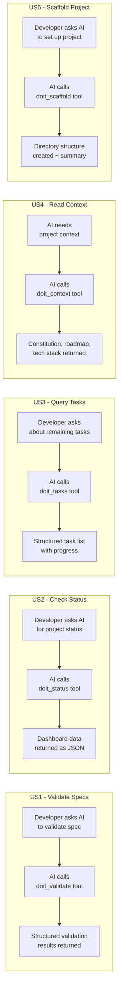
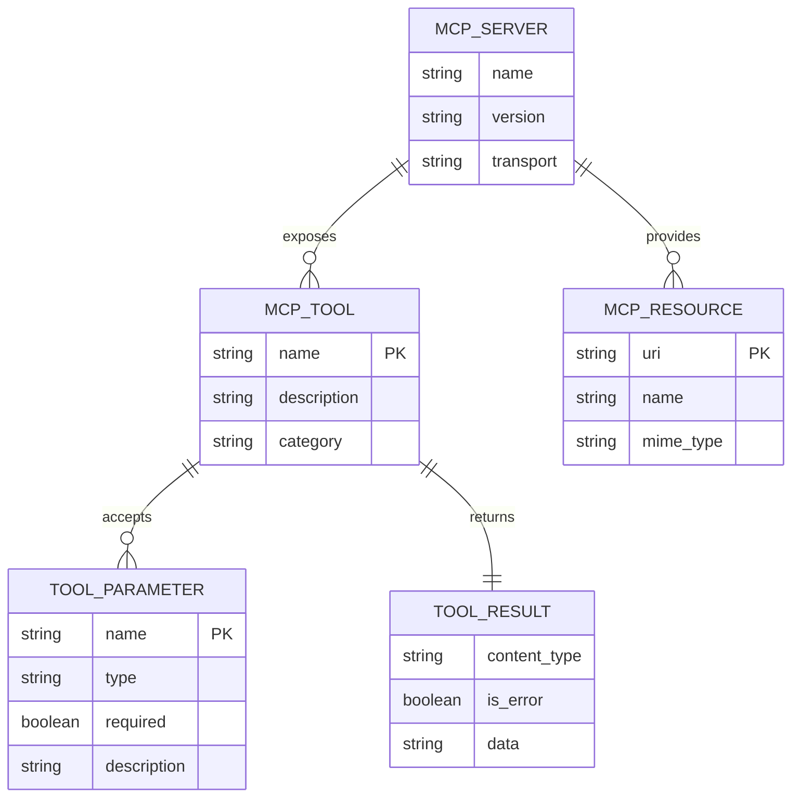

# Feature Specification: MCP Server for doit Operations

**Feature Branch**: `055-mcp-server`
**Created**: 2026-03-26
**Status**: Complete
**Input**: User description: "MCP server for doit operations - Expose doit operations as an MCP server for AI assistant integration"

## User Scenarios & Testing *(mandatory)*

### User Story 1 - Validate Specs from AI Chat (Priority: P1)

A developer using Claude Code or GitHub Copilot wants to validate their specification files without leaving the AI conversation. They ask the AI assistant to "check if my spec is valid" and the AI calls the doit MCP server's `doit_validate` tool directly, returning structured validation results inline.

**Why this priority**: Spec validation is the most frequently used doit operation during development, and enabling it through MCP eliminates context-switching between the AI assistant and the terminal.

**Independent Test**: Can be fully tested by configuring the MCP server in Claude Code settings and asking the AI to validate a spec file. Delivers immediate value by surfacing validation issues directly in the conversation.

**Acceptance Scenarios**:

1. **Given** a project with a valid spec file, **When** the AI assistant calls the `doit_validate` tool, **Then** the tool returns a structured result indicating the spec passes all validation rules.
2. **Given** a project with a spec containing validation errors, **When** the AI assistant calls `doit_validate`, **Then** the tool returns structured findings with severity, line numbers, and recommendations.
3. **Given** a project without any spec files, **When** the AI calls `doit_validate`, **Then** the tool returns an informative message that no specs were found.

---

### User Story 2 - Check Project Status from AI Chat (Priority: P1)

A developer wants to see the current status of their project's specifications, roadmap, and feature progress without running terminal commands. The AI assistant calls the `doit_status` tool and presents the dashboard data conversationally.

**Why this priority**: Status checking is the second most common operation and provides the AI assistant with essential project context for informed recommendations.

**Independent Test**: Can be tested by asking the AI "what's the status of my project?" after MCP server is configured. Delivers value by giving AI full project awareness.

**Acceptance Scenarios**:

1. **Given** a project with multiple specs in various states, **When** the AI calls `doit_status`, **Then** the tool returns structured data with spec counts by status (draft, in-progress, completed).
2. **Given** a project with a roadmap, **When** the AI calls `doit_status` with `include_roadmap=true`, **Then** the tool also returns active roadmap items grouped by priority.
3. **Given** a project with no `.doit/` directory, **When** the AI calls `doit_status`, **Then** the tool returns an error indicating doit is not initialized.

---

### User Story 3 - List and Query Tasks from AI Chat (Priority: P2)

A developer wants to ask the AI assistant "what tasks are remaining for this feature?" The AI calls the `doit_tasks` tool, which parses the current feature's tasks.md and returns structured task data including completion status, dependencies, and priorities.

**Why this priority**: Task querying enables AI assistants to understand implementation progress and make context-aware suggestions about what to work on next.

**Independent Test**: Can be tested by asking "show me remaining tasks" in a feature branch with tasks.md. Delivers value by enabling AI-driven task management.

**Acceptance Scenarios**:

1. **Given** a feature branch with a tasks.md file, **When** the AI calls `doit_tasks`, **Then** the tool returns a structured list of tasks with their IDs, status (complete/pending), priorities, and descriptions.
2. **Given** a tasks.md with dependency markers, **When** the AI calls `doit_tasks` with `include_dependencies=true`, **Then** the tool includes dependency relationships between tasks.
3. **Given** no tasks.md in the current feature directory, **When** the AI calls `doit_tasks`, **Then** the tool returns an informative message that no tasks file was found.

---

### User Story 4 - Read Project Context from AI Chat (Priority: P2)

A developer wants the AI assistant to understand their project's constitution, tech stack, and roadmap priorities without manually loading files. The AI calls the `doit_context` tool to retrieve project memory, enabling informed responses aligned with project principles.

**Why this priority**: Project context is foundational for AI assistants making code suggestions, but currently requires manual `/doit.context` command execution. MCP makes this automatic.

**Independent Test**: Can be tested by asking the AI a question about the project's tech stack or principles. Delivers value by eliminating manual context loading.

**Acceptance Scenarios**:

1. **Given** a project with constitution and tech-stack files, **When** the AI calls `doit_context`, **Then** the tool returns structured project context including principles, tech stack, and deployment info.
2. **Given** a project with a roadmap, **When** the AI calls `doit_context` with `sources=["roadmap"]`, **Then** the tool returns only roadmap data.
3. **Given** a project without `.doit/memory/` files, **When** the AI calls `doit_context`, **Then** the tool returns available context with clear indicators of what's missing.

---

### User Story 5 - Scaffold Project Structure from AI Chat (Priority: P3)

A developer starting a new project asks the AI to "set up the project structure for a Python FastAPI app." The AI calls the `doit_scaffold` tool which generates the directory structure based on the tech stack, without requiring terminal command execution.

**Why this priority**: Scaffolding is a one-time operation per project, making it lower priority than recurring operations. However, it demonstrates the full power of MCP tool integration.

**Independent Test**: Can be tested by asking the AI to scaffold a new project in an empty directory. Delivers value by enabling fully conversational project setup.

**Acceptance Scenarios**:

1. **Given** an empty project directory with a constitution, **When** the AI calls `doit_scaffold`, **Then** the tool creates the standard directory structure based on the tech stack and returns a summary of created files.
2. **Given** an existing project with some structure, **When** the AI calls `doit_scaffold`, **Then** the tool only creates missing directories and files, preserving existing content.
3. **Given** a scaffold request without a constitution, **When** the AI calls `doit_scaffold` with a `tech_stack` parameter, **Then** the tool uses the provided tech stack to generate appropriate structure.

---

### Edge Cases

- What happens when the MCP server is called from a directory that isn't a doit project? The server returns a clear error with instructions to run `doit init`.
- What happens when multiple AI assistants connect to the same server simultaneously? The server handles concurrent requests safely since all operations are read-only or file-write with proper locking.
- What happens when doit CLI is not installed but the MCP server is running? The server uses its own Python imports directly, not CLI subprocess calls.
- What happens when the project has custom validation rules? The server loads rules from `.doit/config/validation-rules.yaml` just like the CLI does.

## User Journey Visualization

<!-- BEGIN:AUTO-GENERATED section="user-journey" -->

<!-- END:AUTO-GENERATED -->

## Entity Relationships *(include if Key Entities defined)*

<!-- BEGIN:AUTO-GENERATED section="entity-relationships" -->

<!-- END:AUTO-GENERATED -->

## Requirements *(mandatory)*

### Functional Requirements

- **FR-001**: System MUST expose a `doit_validate` tool that accepts an optional spec path and returns structured validation results with severity, line numbers, and recommendations.
- **FR-002**: System MUST expose a `doit_status` tool that returns project status data including spec counts by state, active feature branches, and optionally roadmap priorities.
- **FR-003**: System MUST expose a `doit_tasks` tool that parses a feature's tasks.md and returns structured task data with completion status, dependencies, and priorities.
- **FR-004**: System MUST expose a `doit_context` tool that returns project memory (constitution, tech stack, roadmap) as structured data with source filtering support.
- **FR-005**: System MUST expose a `doit_scaffold` tool that creates project directory structure based on tech stack configuration and returns a summary of operations performed.
- **FR-006**: System MUST use the standard Model Context Protocol (MCP) via the official Python SDK, supporting stdio transport for local AI assistant integration.
- **FR-007**: System MUST expose project memory files (constitution, roadmap, tech-stack) as MCP resources that AI assistants can read directly.
- **FR-008**: System MUST return all tool results as structured JSON data (not formatted terminal output) suitable for programmatic consumption by AI assistants.
- **FR-009**: System MUST handle errors gracefully, returning MCP-compliant error responses with actionable messages when operations fail.
- **FR-010**: System MUST be invocable via `doit mcp serve` CLI command, starting the MCP server with stdio transport.
- **FR-011**: System MUST reuse existing service classes (validator, spec_scanner, task_parser, context_loader, scaffolder) without duplicating business logic.
- **FR-012**: System MUST work without requiring any external services or network connectivity (fully local operation).
- **FR-013**: System MUST provide a `doit_verify` tool that checks project structure completeness and reports missing required directories or files.

### Key Entities

- **MCP Server**: The doit MCP server instance that registers tools and resources, handles incoming requests via stdio transport, and delegates to existing doit services.
- **MCP Tool**: An operation exposed to AI assistants (validate, status, tasks, context, scaffold, verify). Each tool has typed parameters, a description, and returns structured JSON results.
- **MCP Resource**: A read-only project file exposed to AI assistants (constitution.md, roadmap.md, tech-stack.md). Resources use `doit://` URI scheme.
- **Tool Result**: The structured JSON response from a tool invocation, containing either data or error information with actionable messages.

## Success Criteria *(mandatory)*

### Measurable Outcomes

- **SC-001**: AI assistants can invoke all 6 doit tools (validate, status, tasks, context, scaffold, verify) without any terminal commands.
- **SC-002**: Tool responses are returned within 2 seconds for typical project sizes (up to 50 spec files).
- **SC-003**: All existing doit service functionality is accessible through MCP tools with equivalent coverage to CLI commands.
- **SC-004**: The MCP server can be configured in Claude Code and GitHub Copilot using standard MCP server configuration (3 lines of JSON).
- **SC-005**: Zero business logic duplication — all tools delegate to existing service classes.
- **SC-006**: Error messages from tools are clear enough that AI assistants can suggest corrective actions to the user.

## Assumptions

- The official MCP Python SDK (`mcp` package) will be added as a dependency.
- stdio transport is sufficient for local AI assistant integration (SSE/HTTP not needed for MVP).
- AI assistants (Claude Code, GitHub Copilot) support MCP server configuration via JSON settings files.
- The MCP server runs as a subprocess spawned by the AI assistant, not as a persistent daemon.
- All doit operations are fast enough for synchronous tool responses (no async streaming needed for MVP).

## Out of Scope

- HTTP/SSE transport (only stdio for MVP).
- Authentication or authorization (local-only tool).
- Real-time file watching or push notifications to AI assistants.
- MCP prompt templates (using existing slash commands/skills for interactive workflows).
- Custom MCP client implementation (using standard SDK client capabilities).
