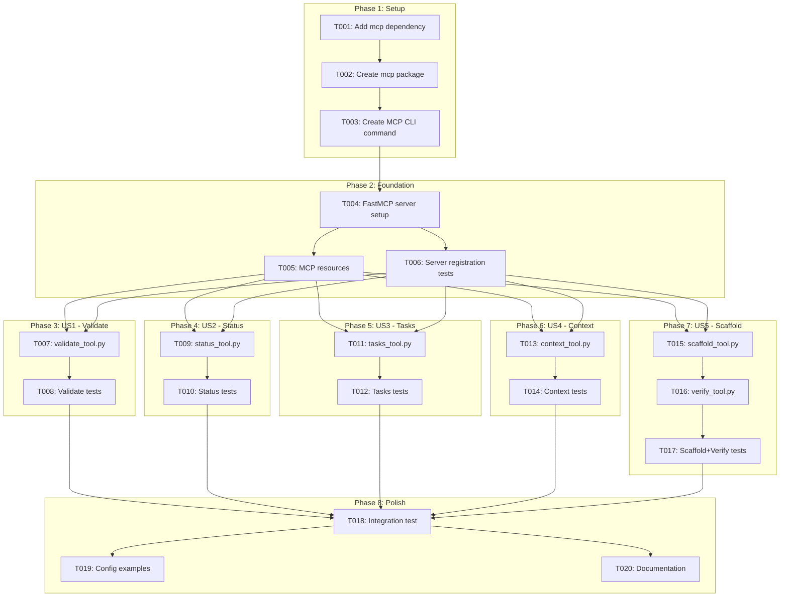
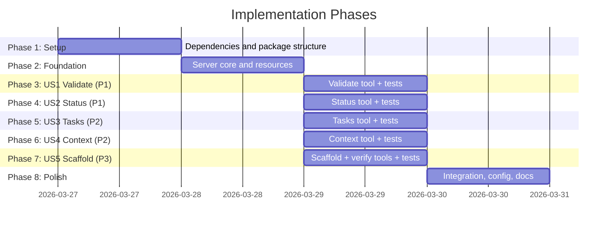

# Tasks: MCP Server for doit Operations

**Input**: Design documents from `/specs/055-mcp-server/`
**Prerequisites**: plan.md (required), spec.md (required for user stories), research.md, data-model.md, contracts/

## Task Dependencies

<!-- BEGIN:AUTO-GENERATED section="task-dependencies" -->



<!-- END:AUTO-GENERATED -->

## Phase Timeline

<!-- BEGIN:AUTO-GENERATED section="phase-timeline" -->



<!-- END:AUTO-GENERATED -->

## Format: `[ID] [P?] [Story] Description`

- **[P]**: Can run in parallel (different files, no dependencies)
- **[Story]**: Which user story this task belongs to (e.g., US1, US2, US3)
- Include exact file paths in descriptions

---

## Phase 1: Setup (Shared Infrastructure)

**Purpose**: Add MCP dependency and create package structure

- [x] T001 Add `mcp` as optional dependency in pyproject.toml under `[project.optional-dependencies.mcp]` extra and add conditional import guard in src/doit_cli/mcp/__init__.py
- [x] T002 Create MCP package structure: src/doit_cli/mcp/__init__.py, src/doit_cli/mcp/server.py, src/doit_cli/mcp/tools/__init__.py
- [x] T003 Create MCP CLI command `doit mcp serve` in src/doit_cli/cli/mcp_command.py and register as subcommand in src/doit_cli/main.py

---

## Phase 2: Foundation (Blocking Prerequisites)

**Purpose**: Core MCP server setup that all tools depend on

**CRITICAL**: No tool implementation can begin until this phase is complete

- [x] T004 Implement FastMCP server initialization in src/doit_cli/mcp/server.py with server name "doit", version from package, stdio transport, and tool/resource registration framework
- [x] T005 [P] Implement MCP resources for project memory files (constitution, roadmap, tech-stack) in src/doit_cli/mcp/server.py using `doit://memory/{name}` URI scheme
- [x] T006 [P] Create server registration tests in tests/unit/test_mcp_server.py verifying all tools and resources are registered correctly

**Checkpoint**: MCP server starts, registers tools and resources, and responds to MCP protocol handshake

---

## Phase 3: User Story 1 - Validate Specs from AI Chat (Priority: P1)

**Goal**: AI assistants can validate spec files and receive structured validation results

**Independent Test**: Configure MCP server in Claude Code, ask "validate my spec" — returns structured findings with severity and recommendations

- [x] T007 [US1] Implement doit_validate tool in src/doit_cli/mcp/tools/validate_tool.py wrapping ValidationService.validate_file() and validate_all() with JSON response per contracts/mcp-tools.md schema
- [x] T008 [US1] Create unit tests in tests/unit/test_mcp_validate.py covering: valid spec returns pass, spec with errors returns structured findings, no specs found returns informative message

**Checkpoint**: doit_validate tool returns structured JSON for valid specs, invalid specs, and missing specs

---

## Phase 4: User Story 2 - Check Project Status from AI Chat (Priority: P1)

**Goal**: AI assistants can query project status including spec states and roadmap

**Independent Test**: Ask AI "what's the status of my project?" — returns spec counts by status and roadmap items

- [x] T009 [US2] Implement doit_status tool in src/doit_cli/mcp/tools/status_tool.py wrapping StatusReporter.generate_report() with optional roadmap from ContextLoader, JSON response per contracts/mcp-tools.md schema
- [x] T010 [US2] Create unit tests in tests/unit/test_mcp_status.py covering: multiple specs in various states, include_roadmap flag, no .doit/ directory returns error

**Checkpoint**: doit_status tool returns spec counts, status breakdown, and optional roadmap data

---

## Phase 5: User Story 3 - List and Query Tasks (Priority: P2)

**Goal**: AI assistants can query task lists with completion status and dependencies

**Independent Test**: Ask AI "what tasks are remaining?" — returns structured task list with progress

- [x] T011 [US3] Implement doit_tasks tool in src/doit_cli/mcp/tools/tasks_tool.py wrapping TaskParser.parse() with auto-detection of feature from git branch, JSON response per contracts/mcp-tools.md schema
- [x] T012 [US3] Create unit tests in tests/unit/test_mcp_tasks.py covering: tasks.md with mixed complete/pending, include_dependencies flag, no tasks.md returns informative message

**Checkpoint**: doit_tasks tool returns structured task list with IDs, status, priorities, and completion percentage

---

## Phase 6: User Story 4 - Read Project Context (Priority: P2)

**Goal**: AI assistants can load project context (constitution, tech stack, roadmap) programmatically

**Independent Test**: AI automatically reads project context without manual commands

- [x] T013 [US4] Implement doit_context tool in src/doit_cli/mcp/tools/context_tool.py wrapping ContextLoader.load() with source filtering, JSON response per contracts/mcp-tools.md schema
- [x] T014 [US4] Create unit tests in tests/unit/test_mcp_context.py covering: all sources loaded, source filtering, missing memory files returns partial context with indicators

**Checkpoint**: doit_context tool returns structured context with source names, content, token counts, and status

---

## Phase 7: User Story 5 - Scaffold and Verify (Priority: P3)

**Goal**: AI assistants can scaffold project structure and verify project setup

**Independent Test**: Ask AI to set up project structure — creates directories and returns summary

- [x] T015 [P] [US5] Implement doit_scaffold tool in src/doit_cli/mcp/tools/scaffold_tool.py wrapping Scaffolder.create_doit_structure() with JSON response per contracts/mcp-tools.md schema
- [x] T016 [US5] Implement doit_verify tool in src/doit_cli/mcp/tools/verify_tool.py wrapping Validator.check_doit_folder() and check_agent_directory() with JSON response per contracts/mcp-tools.md schema
- [x] T017 [US5] Create unit tests in tests/unit/test_mcp_scaffold.py and tests/unit/test_mcp_verify.py covering: scaffold creates structure, scaffold preserves existing, verify passes for complete project, verify fails for missing dirs

**Checkpoint**: doit_scaffold creates project structure, doit_verify checks completeness — both return structured JSON

---

## Phase 8: Polish & Cross-Cutting Concerns

**Purpose**: Integration testing, configuration examples, and documentation

- [x] T018 Create integration test in tests/integration/test_mcp_integration.py that starts the MCP server, sends tool requests via stdio protocol, and validates responses match contract schemas
- [x] T019 [P] Add MCP server configuration examples to docs/ for Claude Code (.claude/settings.json) and GitHub Copilot (.vscode/settings.json)
- [x] T020 [P] Update docs/features/ with 055-mcp-server.md feature documentation including setup instructions, tool reference, and troubleshooting

---

## Dependencies & Execution Order

### Phase Dependencies

- **Setup (Phase 1)**: No dependencies — can start immediately
- **Foundation (Phase 2)**: Depends on Setup completion — BLOCKS all tools
- **User Stories (Phases 3-7)**: All depend on Foundation phase completion
  - US1 (Validate) and US2 (Status) are both P1 — can run in parallel
  - US3 (Tasks) and US4 (Context) are both P2 — can run in parallel
  - US5 (Scaffold+Verify) is P3 — can run in parallel with others
- **Polish (Phase 8)**: Depends on all user stories being complete

### User Story Dependencies

- **US1 - Validate (P1)**: Independent — uses ValidationService only
- **US2 - Status (P1)**: Independent — uses StatusReporter + optional ContextLoader
- **US3 - Tasks (P2)**: Independent — uses TaskParser only
- **US4 - Context (P2)**: Independent — uses ContextLoader only
- **US5 - Scaffold+Verify (P3)**: Independent — uses Scaffolder + Validator

### Parallel Opportunities

- After Foundation: ALL 5 user stories can start in parallel (they wrap independent services)
- Within each story: Tool implementation and tests can be parallelized with [P] marker
- Phase 8 tasks T019 and T020 can run in parallel

---

## Parallel Example: All User Stories After Foundation

```text
# After Phase 2 Foundation is complete, launch all tools in parallel:
Task T007: "Implement doit_validate tool in src/doit_cli/mcp/tools/validate_tool.py"
Task T009: "Implement doit_status tool in src/doit_cli/mcp/tools/status_tool.py"
Task T011: "Implement doit_tasks tool in src/doit_cli/mcp/tools/tasks_tool.py"
Task T013: "Implement doit_context tool in src/doit_cli/mcp/tools/context_tool.py"
Task T015: "Implement doit_scaffold tool in src/doit_cli/mcp/tools/scaffold_tool.py"
```

---

## Implementation Strategy

### MVP First (US1 + US2 Only)

1. Complete Phase 1: Setup (T001-T003)
2. Complete Phase 2: Foundation (T004-T006)
3. Complete Phase 3: US1 Validate (T007-T008)
4. Complete Phase 4: US2 Status (T009-T010)
5. **STOP and VALIDATE**: Test validate and status tools with Claude Code
6. Deploy if ready — most critical tools available

### Incremental Delivery

1. Setup + Foundation → Server running with resources
2. Add US1 Validate → Test independently → Most-used tool available
3. Add US2 Status → Test independently → Project awareness
4. Add US3 Tasks → Test independently → Task management
5. Add US4 Context → Test independently → Full context loading
6. Add US5 Scaffold+Verify → Test independently → Project setup
7. Polish → Integration tests, docs, config examples

---

## Notes

- [P] tasks = different files, no dependencies
- [Story] label maps task to specific user story for traceability
- Each user story is independently completable and testable
- All tools wrap existing services — zero business logic duplication
- Total: 20 tasks across 8 phases
- Parallel opportunities: All 5 user stories can run simultaneously after Foundation
