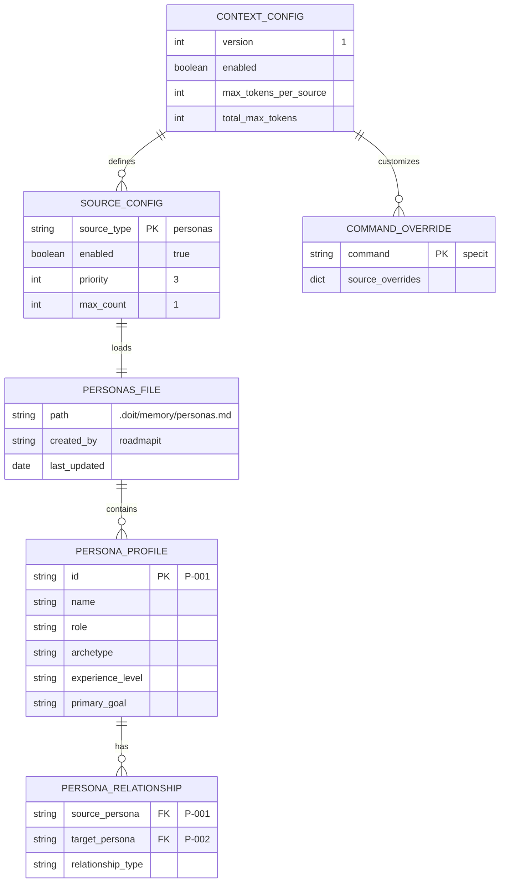
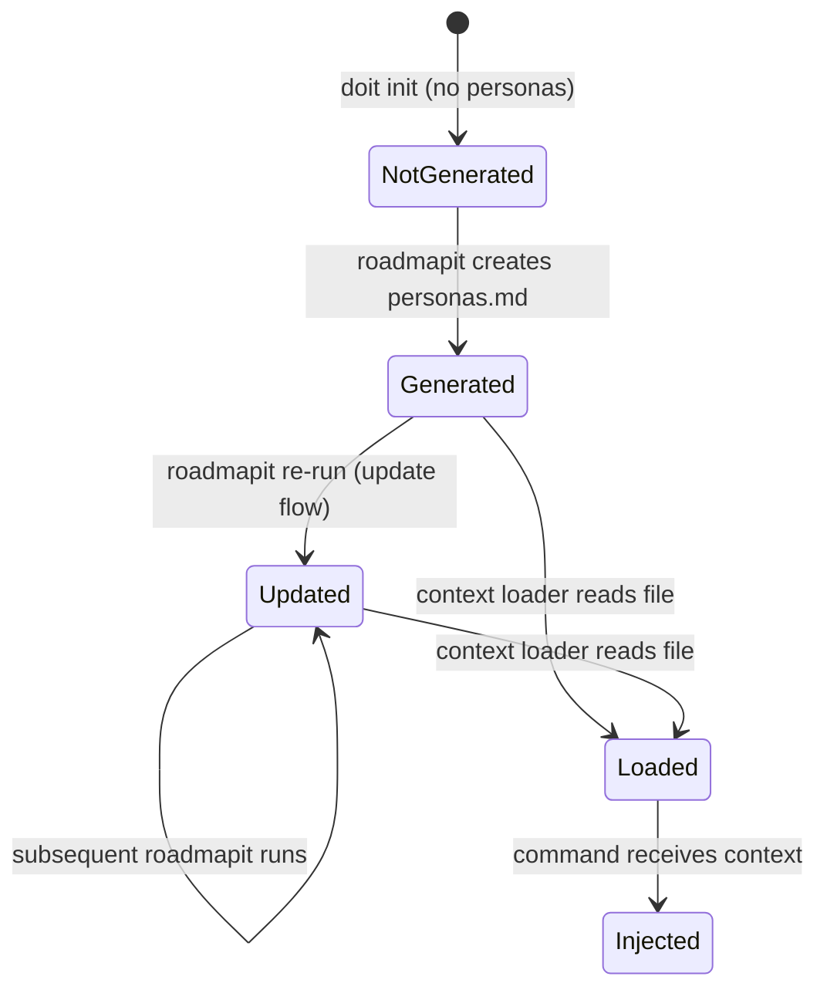

# Data Model: Project-Level Personas with Context Injection

**Feature Branch**: `056-persona-context-injection`
**Date**: 2026-03-26

---

<!-- BEGIN:AUTO-GENERATED section="er-diagram" -->

<!-- END:AUTO-GENERATED -->

---

## Entities

### SourceConfig (existing — extended)

The `SourceConfig` dataclass in `context_config.py` gains a new entry in `default_sources()`:

| Field | Type | Value |
|-------|------|-------|
| source_type | str | `"personas"` |
| enabled | bool | `True` |
| priority | int | `3` |
| max_count | int | `1` |

**Relationship**: One-to-one with the personas file at `.doit/memory/personas.md`.

### ContextSource (existing — new instance)

When `load_personas()` runs, it returns a `ContextSource` instance:

| Field | Type | Description |
|-------|------|-------------|
| source_type | str | `"personas"` |
| path | Path | `.doit/memory/personas.md` |
| content | str | Full file content (no truncation) |
| token_count | int | Estimated token count |
| truncated | bool | Always `False` |
| original_tokens | int or None | Always `None` |

### Personas File (`.doit/memory/personas.md`)

Generated by `/doit.roadmapit` using `personas-output-template.md`. Structure:

| Section | Content |
|---------|---------|
| Persona Summary | Table with ID, Name, Role, Archetype, Primary Goal |
| Detailed Profiles | Per-persona sections with Identity, Demographics, Goals, Pain Points, Behavioral Patterns, Success Criteria, Usage Context, Relationships |
| Relationship Map | Mermaid flowchart of persona relationships |
| Conflicts & Tensions | Table of competing goals and resolution strategies |
| Traceability | Persona-to-user-story coverage mapping |

### CommandOverride (existing — extended)

New default overrides to disable personas for non-target commands:

| Command | personas enabled |
|---------|-----------------|
| researchit | `true` (default) |
| specit | `true` (default) |
| planit | `true` (default) |
| constitution | `false` |
| roadmapit | `false` |
| taskit | `false` |
| implementit | `false` |
| testit | `false` |
| reviewit | `false` |
| checkin | `false` |

---

## State Transitions

**States**:
- **NotGenerated**: `.doit/memory/personas.md` does not exist. Context loader skips gracefully.
- **Generated**: File created by first `/doit.roadmapit` run. Available for context loading.
- **Updated**: File updated by subsequent `/doit.roadmapit` runs (merge, not overwrite).
- **Loaded**: Content read by `ContextLoader.load_personas()` into a `ContextSource`.
- **Injected**: Persona context delivered to a command session (researchit, specit, planit).
