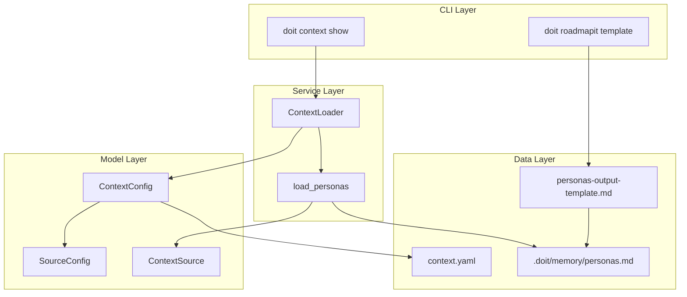

# Implementation Plan: Project-Level Personas with Context Injection

**Branch**: `056-persona-context-injection` | **Date**: 2026-03-26 | **Spec**: [spec.md](spec.md)
**Input**: Feature specification from `/specs/056-persona-context-injection/spec.md`

## Summary

Add `.doit/memory/personas.md` as a first-class context source. The `/doit.roadmapit` command generates project-level personas using the existing `personas-output-template.md`. The context loader registers `personas` as a new source (priority 3), and the command templates for `/doit.researchit`, `/doit.specit`, and `/doit.planit` are updated to use persona context. All changes follow established patterns — no new Python modules, no new abstractions.

## Technical Context

**Language/Version**: Python 3.11+
**Primary Dependencies**: Typer (CLI), Rich (output), PyYAML (config), httpx (HTTP)
**Storage**: File-based — markdown in `.doit/memory/`, YAML in `.doit/config/`
**Testing**: pytest with markers (unit, integration, e2e)
**Target Platform**: Cross-platform CLI (macOS, Linux, Windows)
**Project Type**: single
**Performance Goals**: Context loading with personas adds no perceptible delay
**Constraints**: No context truncation — all sources loaded in full
**Scale/Scope**: Typically 2-4 personas per project (~800-1600 tokens)

## Architecture Overview

<!-- BEGIN:AUTO-GENERATED section="architecture" -->

<!-- END:AUTO-GENERATED -->

## Constitution Check

*GATE: Must pass before Phase 0 research. Re-check after Phase 1 design.*

| Principle | Status | Notes |
| --------- | ------ | ----- |
| I. Specification-First | PASS | Spec completed before planning |
| II. Persistent Memory | PASS | Personas stored in `.doit/memory/personas.md` — version-controlled markdown |
| III. Auto-Generated Diagrams | PASS | No manual diagrams required; mermaid in data-model.md is auto-generated |
| IV. Opinionated Workflow | PASS | Persona generation integrated into existing roadmapit workflow step |
| V. AI-Native Design | PASS | Personas injected via context system for AI slash commands |

**Gate result**: ALL PASS — no violations.

## Project Structure

### Documentation (this feature)

```text
specs/056-persona-context-injection/
├── spec.md              # Feature specification
├── plan.md              # This file
├── research.md          # Phase 0 research decisions
├── data-model.md        # Entity definitions and state transitions
├── quickstart.md        # Implementation quickstart guide
├── checklists/
│   └── requirements.md  # Quality checklist
└── tasks.md             # Phase 2 output (created by /doit.taskit)
```

### Source Code (repository root)

```text
src/doit_cli/
├── services/
│   └── context_loader.py          # Add load_personas() method + elif branch
├── models/
│   └── context_config.py          # Add "personas" to defaults, priorities, display names
└── templates/
    ├── config/
    │   └── context.yaml            # Add personas source entry
    ├── commands/
    │   ├── doit.roadmapit.md       # Add persona generation step
    │   ├── doit.researchit.md      # Add project persona context reference
    │   ├── doit.specit.md          # Add project persona mapping instruction
    │   └── doit.planit.md          # Add persona context reference
    └── personas-output-template.md # Existing (from 053) — no changes

tests/
├── unit/
│   └── services/
│       └── test_context_loader.py  # Add tests for load_personas()
└── unit/
    └── models/
        └── test_context_config.py  # Add tests for personas source config
```

**Structure Decision**: Single project — all changes are to existing files in the established `src/doit_cli/` structure. No new modules or directories needed.

## Complexity Tracking

No constitution violations to justify. All changes follow established patterns.

---

## Implementation Details

### Change 1: Context Config Model (`context_config.py`)

**Location**: `src/doit_cli/models/context_config.py`

Add `"personas"` to three hardcoded locations:

1. **`SourceConfig.default_sources()`** (~line 120): Add `"personas": cls(source_type="personas", enabled=True, priority=3)` and adjust priorities of existing sources (roadmap → 4, completed_roadmap → 5, current_spec → 6, related_specs → 7)

2. **`SummarizationConfig.source_priorities`** (~line 33): Add `"personas"` after `"tech_stack"` in the priority list

3. **`LoadedContext.to_markdown()` display_names** (~line 437): Add `"personas": "Personas"`

4. **`CommandOverride.default_commands()`** (~line 144): Add personas disabled for `constitution`, `roadmapit`, `taskit`, `implementit`, `testit`, `reviewit`, `checkin`

### Change 2: Context Loader Service (`context_loader.py`)

**Location**: `src/doit_cli/services/context_loader.py`

1. **Add `load_personas()` method** (~after line 867, following `load_completed_roadmap` pattern):
   - Read from `.doit/memory/personas.md`
   - Check for feature-level override: if `specs/{feature}/personas.md` exists (detected via current git branch), load that instead
   - Return full content (no truncation) as `ContextSource(source_type="personas", ...)`
   - Set `truncated=False` always

2. **Update `load()` method** (~line 579): Add `elif source_name == "personas": source = self.load_personas(...)` branch

3. **Update source name list** in `load()` (~line 579): Add `"personas"` to the list of sources to iterate

### Change 3: Context YAML Template

**Location**: `src/doit_cli/templates/config/context.yaml`

Add after `tech_stack` section:

```yaml
  # Project personas - stakeholder profiles from .doit/memory/personas.md
  # Generated by /doit.roadmapit, provides user context to AI agents
  personas:
    enabled: true
    priority: 3
```

### Change 4: Roadmapit Template

**Location**: `src/doit_cli/templates/commands/doit.roadmapit.md`

Add a section instructing the AI to generate `.doit/memory/personas.md` after roadmap creation:

- Use `personas-output-template.md` as the structure
- Derive personas from constitution stakeholder types and roadmap user-facing features
- If `.doit/memory/personas.md` already exists, offer to update rather than overwrite
- Skip persona generation gracefully if no constitution exists

### Change 5: Command Templates (researchit, specit, planit)

**doit.researchit.md**: Add instruction in the context loading section to note that project personas are available via context injection. When asking Phase 2 questions about users, reference existing persona names/IDs as starting points.

**doit.specit.md**: Add instruction that when project personas are in context, generated user stories should include `Persona: P-NNN` references matching the most relevant persona. Feature-level personas take precedence if both exist.

**doit.planit.md**: Add instruction that when project personas are in context, design decisions should reference persona characteristics (e.g., technical proficiency, usage patterns) when justifying choices.

### Change 6: Live Config Update

**Location**: `.doit/config/context.yaml` (project instance, not template)

Update the live project config to include the personas source with priority 3. Adjust existing priorities to match the new ordering.

---

## Test Strategy

### Unit Tests

1. **`test_context_config.py`**: Verify `default_sources()` includes "personas" at priority 3
2. **`test_context_config.py`**: Verify `source_priorities` includes "personas"
3. **`test_context_config.py`**: Verify display names include "personas"
4. **`test_context_loader.py`**: Test `load_personas()` when file exists → returns ContextSource
5. **`test_context_loader.py`**: Test `load_personas()` when file missing → returns None
6. **`test_context_loader.py`**: Test `load_personas()` when file empty → returns None
7. **`test_context_loader.py`**: Test feature-level persona precedence over project-level
8. **`test_context_loader.py`**: Test command override disabling personas

### Integration Tests

1. Full `load()` with personas file present → included in results
2. Full `load()` with personas file missing → other sources unaffected
3. `load()` with `--command specit` → personas enabled
4. `load()` with `--command taskit` → personas disabled via override
