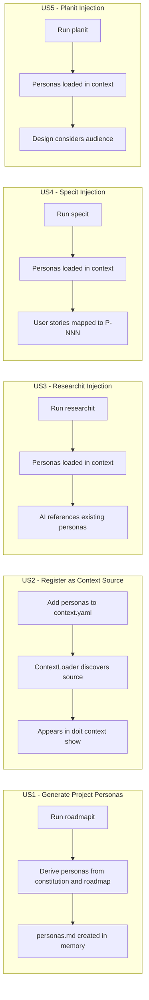
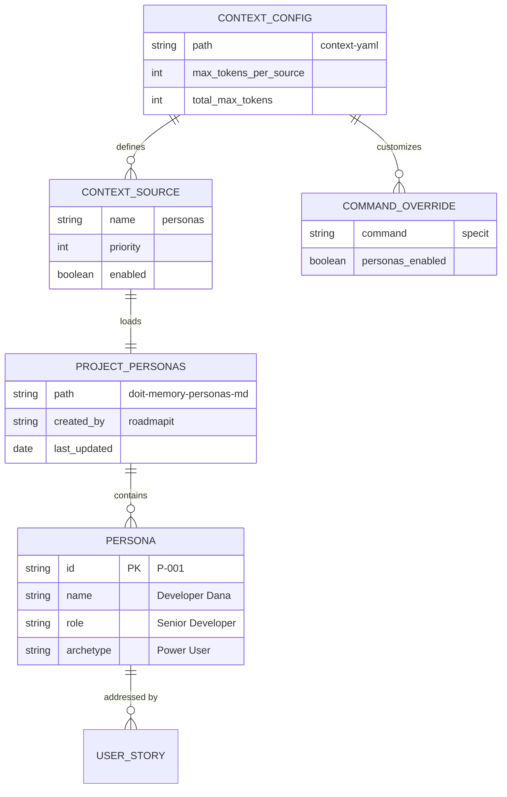

# Feature Specification: Project-Level Personas with Context Injection

**Feature Branch**: `056-persona-context-injection`
**Created**: 2026-03-26
**Status**: Complete
**Input**: User description: "Project-level personas in memory with context injection for researchit, planit, and specit"

## Summary

Add project-level personas as a first-class context source in the doit workflow. During roadmap creation (`/doit.roadmapit`), the system generates `.doit/memory/personas.md` using the existing `personas-output-template.md`. This file is then registered as a new context source in `context.yaml`, so that `/doit.researchit`, `/doit.planit`, and `/doit.specit` automatically receive persona context — making every workflow session persona-aware without manual file loading.

This builds on the persona template infrastructure from `053-stakeholder-persona-templates` and elevates personas from per-feature artifacts to persistent project-level knowledge.

## User Scenarios & Testing *(mandatory)*

### User Story 1 - Generate Project Personas During Roadmap Creation (Priority: P1)

As a Product Owner running `/doit.roadmapit`, I want the system to generate `.doit/memory/personas.md` with project-level stakeholder personas so that all downstream workflows have consistent persona context.

**Why this priority**: Without project-level personas in memory, no downstream context injection is possible. This is the foundation for the entire feature.

**Independent Test**: Can be fully tested by running `/doit.roadmapit` on a project with a constitution and roadmap, then verifying `.doit/memory/personas.md` is created with valid persona profiles using the `personas-output-template.md` structure.

**Acceptance Scenarios**:

1. **Given** a project with a constitution and roadmap, **When** `/doit.roadmapit` runs, **Then** `.doit/memory/personas.md` is generated with at least one persona profile
2. **Given** personas already exist in `.doit/memory/personas.md`, **When** `/doit.roadmapit` runs again, **Then** the system offers to update existing personas rather than overwriting them
3. **Given** a project with no constitution, **When** `/doit.roadmapit` attempts persona generation, **Then** the system skips persona generation with a warning and continues normally

---

### User Story 2 - Register Personas as a Context Source (Priority: P1)

As a Developer maintaining the context system, I want personas registered as a named source in `context.yaml` so that the context loader can discover, load, and inject persona data alongside constitution, tech-stack, and roadmap.

**Why this priority**: Context registration is required before any command can receive persona data. Without it, the personas file exists but is never loaded.

**Independent Test**: Can be tested by adding a `personas` source entry to `context.yaml`, running `doit context show`, and verifying the personas source appears in the loaded sources table with correct token count.

**Acceptance Scenarios**:

1. **Given** `.doit/memory/personas.md` exists and `context.yaml` has a `personas` source entry, **When** `doit context show` runs, **Then** personas appears in the loaded sources table with status and token count
2. **Given** `.doit/memory/personas.md` does not exist, **When** `doit context show` runs, **Then** the personas source is skipped gracefully (no error)
3. **Given** the personas source is disabled in `context.yaml`, **When** `doit context show` runs, **Then** personas content is not loaded

---

### User Story 3 - Persona Context in Researchit (Priority: P2)

As a Product Owner running `/doit.researchit`, I want project personas automatically available so that I can reference existing stakeholder profiles during research sessions and identify gaps or new personas.

**Why this priority**: Research sessions benefit from persona context to ask better questions and identify when new user types emerge that differ from known personas.

**Independent Test**: Can be tested by running `/doit.researchit` on a project with `.doit/memory/personas.md` populated, then verifying the AI references existing personas during the Q&A session.

**Acceptance Scenarios**:

1. **Given** project personas exist in memory, **When** `/doit.researchit` starts, **Then** the loaded context includes persona data visible via `doit context show --command researchit`
2. **Given** project personas exist, **When** the AI asks about target users during Phase 2, **Then** it references existing persona names and IDs as starting points
3. **Given** no project personas exist, **When** `/doit.researchit` runs, **Then** the session proceeds normally without persona references

---

### User Story 4 - Persona Context in Specit (Priority: P2)

As a Product Owner running `/doit.specit`, I want project personas injected so that user stories are automatically mapped to the most relevant persona using their P-NNN identifier.

**Why this priority**: Persona-story mapping improves traceability and ensures specifications address real stakeholder needs. This is already partially supported in `/doit.specit` for per-feature `personas.md`; extending it to project-level personas completes the chain.

**Independent Test**: Can be tested by running `/doit.specit` with project personas in memory and verifying each generated user story includes a `Persona: P-NNN` reference.

**Acceptance Scenarios**:

1. **Given** project personas exist in memory, **When** `/doit.specit` generates user stories, **Then** each user story header includes a `Persona: P-NNN` reference matching the most relevant persona
2. **Given** both project-level and feature-level personas exist, **When** `/doit.specit` runs, **Then** feature-level personas take precedence over project-level ones
3. **Given** no personas exist at any level, **When** `/doit.specit` runs, **Then** user stories use generic "As a user..." format

---

### User Story 5 - Persona Context in Planit (Priority: P2)

As a Developer running `/doit.planit`, I want project personas available in context so that implementation plans consider the target audience and their technical proficiency levels.

**Why this priority**: Knowing who the feature is for influences design decisions (e.g., admin-only features vs. end-user features have different complexity requirements).

**Independent Test**: Can be tested by running `/doit.planit` with project personas in memory and verifying the AI references persona context when making design recommendations.

**Acceptance Scenarios**:

1. **Given** project personas exist in memory, **When** `doit context show --command planit` runs, **Then** personas appear in the loaded sources
2. **Given** project personas include a "Power User" and a "Casual User," **When** `/doit.planit` designs the implementation, **Then** the plan references relevant persona needs when justifying design choices

---

### User Story 6 - Per-Command Persona Overrides (Priority: P3)

As a Project Maintainer, I want to disable persona context injection for specific commands via `context.yaml` so that I can control which workflows receive persona data.

**Why this priority**: Flexibility to turn off persona context for commands where it adds noise (e.g., `taskit`, `testit`) keeps context budgets efficient.

**Independent Test**: Can be tested by adding a command override that disables personas for `taskit`, then running `doit context show --command taskit` and verifying personas are not loaded.

**Acceptance Scenarios**:

1. **Given** a command override disables personas for `taskit`, **When** `doit context show --command taskit` runs, **Then** personas source is not loaded
2. **Given** no command override exists for `planit`, **When** `doit context show --command planit` runs, **Then** personas source is loaded using global defaults

---

### Edge Cases

- What happens when `.doit/memory/personas.md` exists but is empty? → Treated as "no personas" — source is skipped gracefully
- What happens when personas exceed the `max_tokens_per_source` limit? → Personas are always loaded in full; if total context is too large, disable the source via per-command override rather than truncating
- What happens when a persona ID in a spec references a persona that no longer exists in project memory? → Warning logged during `doit validate`; the spec remains valid but flagged
- How does the system handle persona updates when features are in progress? → Persona updates apply to new workflow sessions only; existing specs are not retroactively modified

## User Journey Visualization

<!-- BEGIN:AUTO-GENERATED section="user-journey" -->

<!-- END:AUTO-GENERATED -->

## Entity Relationships

<!-- BEGIN:AUTO-GENERATED section="entity-relationships" -->

<!-- END:AUTO-GENERATED -->

## Requirements *(mandatory)*

### Functional Requirements

- **FR-001**: System MUST generate `.doit/memory/personas.md` during `/doit.roadmapit` execution using the `personas-output-template.md` structure
- **FR-002**: System MUST derive initial persona profiles from the project constitution (stakeholder types), roadmap (user-facing features), and any existing feature-level `personas.md` files
- **FR-003**: System MUST register `personas` as a named context source in `context.yaml` with configurable priority and enabled state
- **FR-004**: Context loader MUST load `.doit/memory/personas.md` when the `personas` source is enabled and the file exists
- **FR-005**: Context loader MUST skip the personas source gracefully when the file does not exist (no error, no warning in normal output)
- **FR-006**: `/doit.researchit` MUST receive persona context when project personas exist, enabling the AI to reference existing stakeholders during research sessions
- **FR-007**: `/doit.specit` MUST receive persona context and map generated user stories to persona IDs (P-NNN format) when project personas exist
- **FR-008**: `/doit.planit` MUST receive persona context so implementation plans can reference target audience characteristics
- **FR-009**: Per-command overrides in `context.yaml` MUST allow disabling personas for specific commands
- **FR-010**: When both project-level (`.doit/memory/personas.md`) and feature-level (`specs/{feature}/personas.md`) personas exist, feature-level personas MUST take precedence for that feature's workflow
- **FR-011**: System MUST preserve existing personas when re-running `/doit.roadmapit`, offering to update rather than overwrite
- **FR-012**: Personas MUST be loaded in full without truncation; if total context budget is a concern, per-command overrides should disable the source entirely rather than truncating content

### Key Entities

- **Project Personas**: The `.doit/memory/personas.md` file containing project-wide stakeholder profiles, generated by `/doit.roadmapit` and consumed by the context loader
- **Persona**: An individual stakeholder profile with unique ID (P-NNN), name, role, archetype, goals, and pain points
- **Context Source**: A registered data source in `context.yaml` that the context loader discovers, loads, and injects into command sessions
- **Command Override**: A per-command configuration in `context.yaml` that enables or disables specific context sources

## Success Criteria *(mandatory)*

### Measurable Outcomes

- **SC-001**: After running `/doit.roadmapit`, `.doit/memory/personas.md` exists with at least one complete persona profile containing all required template fields
- **SC-002**: `doit context show` displays the personas source with token count and status when `.doit/memory/personas.md` exists
- **SC-003**: Running `/doit.specit` with project personas produces user stories where 100% reference a persona ID (P-NNN)
- **SC-004**: Running `/doit.researchit` with project personas results in the AI referencing at least one existing persona by name during the session
- **SC-005**: Disabling personas via command override results in zero persona tokens loaded for that command
- **SC-006**: Context loading with personas adds no more than 2 seconds to command startup time

## Assumptions

- The `personas-output-template.md` from spec 053 is available and defines the canonical persona profile structure
- The context loader supports adding new source types via configuration without major architectural changes (confirmed: source loading is config-driven)
- Project-level personas are maintained manually or via `/doit.roadmapit` — there is no automatic persona discovery from code analysis
- Persona IDs (P-NNN) are unique within a project and stable across sessions

## Out of Scope

- Automatic persona refinement based on accumulated research sessions (roadmap P4: "Context-aware persona refinement")
- Persona impact analysis on roadmap changes (roadmap P4: "Persona impact analysis on roadmap changes")
- Web dashboard or visual persona management UI
- Persona versioning or change tracking history
- Persona injection into `taskit`, `implementit`, `testit`, or `reviewit` commands (can be added later via command overrides)
