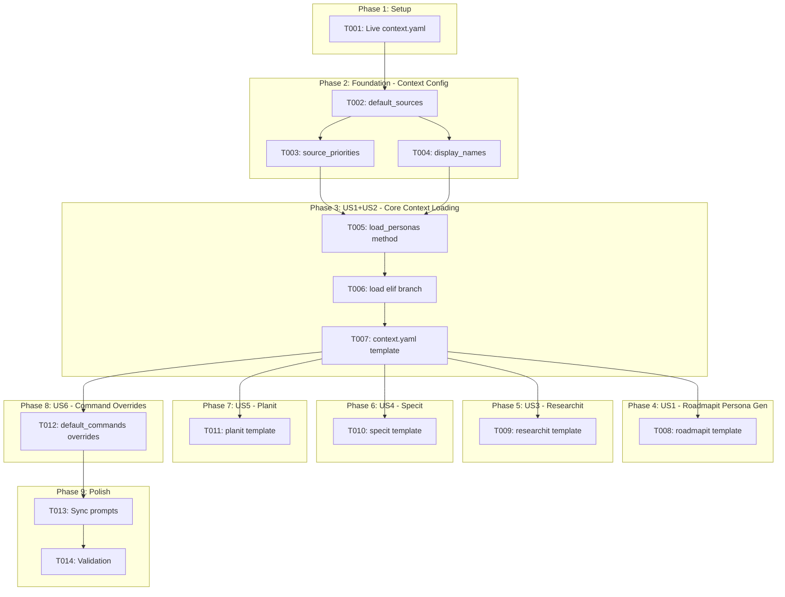
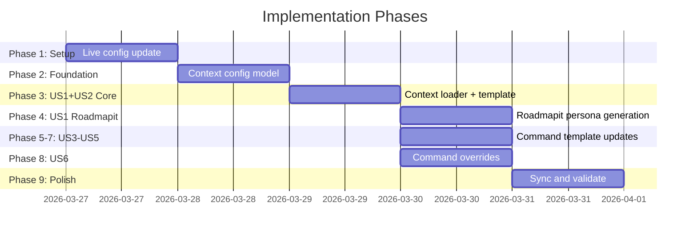

# Tasks: Project-Level Personas with Context Injection

**Input**: Design documents from `/specs/056-persona-context-injection/`
**Prerequisites**: plan.md (required), spec.md (required for user stories), research.md, data-model.md

**Tests**: Not explicitly requested in the feature specification. Test tasks are omitted.

**Organization**: Tasks are grouped by user story to enable independent implementation and testing of each story.

## Task Dependencies

<!-- BEGIN:AUTO-GENERATED section="task-dependencies" -->

<!-- END:AUTO-GENERATED -->

## Phase Timeline

<!-- BEGIN:AUTO-GENERATED section="phase-timeline" -->

<!-- END:AUTO-GENERATED -->

## Format: `[ID] [P?] [Story] Description`

- **[P]**: Can run in parallel (different files, no dependencies)
- **[Story]**: Which user story this task belongs to (e.g., US1, US2, US3)
- Include exact file paths in descriptions

---

## Phase 1: Setup

**Purpose**: Update the live project configuration to include the personas source

- [x] T001 Update `.doit/config/context.yaml` to add `personas` source entry at priority 3, and adjust existing source priorities: roadmap → 4, current_spec → 5, related_specs → 6, completed_roadmap → 7

---

## Phase 2: Foundation (Context Config Model)

**Purpose**: Register personas in the context configuration model so the loader can discover it

**CRITICAL**: The context loader cannot load personas until these config changes are in place.

- [x] T002 [US2] Add `"personas": cls(source_type="personas", enabled=True, priority=3)` to `SourceConfig.default_sources()` in `src/doit_cli/models/context_config.py` and adjust existing source priorities (roadmap → 4, completed_roadmap → 5, current_spec → 6, related_specs → 7)
- [x] T003 [P] [US2] Add `"personas"` after `"tech_stack"` in `SummarizationConfig.source_priorities` list in `src/doit_cli/models/context_config.py`
- [x] T004 [P] [US2] Add `"personas": "Personas"` to the `display_names` dict in `LoadedContext.to_markdown()` in `src/doit_cli/models/context_config.py`

**Checkpoint**: `doit context show` should recognize "personas" as a valid source type (though no file exists yet to load).

---

## Phase 3: US1 + US2 — Core Context Loading

**Goal**: Enable the context loader to read `.doit/memory/personas.md` and inject it into command sessions.

**Independent Test**: Run `doit context show` with a `.doit/memory/personas.md` file present and verify it appears in the loaded sources table.

### Implementation

- [x] T005 [US2] Add `load_personas()` method to `ContextLoader` in `src/doit_cli/services/context_loader.py` following the `load_constitution()` pattern — read from `.doit/memory/personas.md`, check for feature-level override at `specs/{feature}/personas.md` (detected via git branch), return full content without truncation as `ContextSource(source_type="personas", truncated=False)`
- [x] T006 [US2] Add `"personas"` to the source names list in `ContextLoader.load()` method and add `elif source_name == "personas": source = self.load_personas(max_tokens=max_for_source)` branch in `src/doit_cli/services/context_loader.py`
- [x] T007 [P] [US2] Add `personas` source entry (enabled, priority 3) with comments to the bundled context.yaml template in `src/doit_cli/templates/config/context.yaml`, between `tech_stack` and `roadmap` sections

**Checkpoint**: `doit context show` displays "Personas" in the loaded sources table when `.doit/memory/personas.md` exists. When the file is missing, no error occurs.

---

## Phase 4: US1 — Roadmapit Persona Generation

**Goal**: `/doit.roadmapit` generates `.doit/memory/personas.md` using the personas-output-template.

**Independent Test**: Run `/doit.roadmapit` on a project with a constitution, then verify `.doit/memory/personas.md` is created with valid persona profiles.

### Implementation

- [x] T008 [US1] Add persona generation section to `src/doit_cli/templates/commands/doit.roadmapit.md` that instructs the AI to: (1) load `personas-output-template.md` as the output structure, (2) derive personas from constitution stakeholder types and roadmap user-facing features, (3) if `.doit/memory/personas.md` already exists, offer to update rather than overwrite, (4) skip persona generation with a warning if no constitution exists

**Checkpoint**: After running `/doit.roadmapit`, `.doit/memory/personas.md` exists with at least one complete persona profile.

---

## Phase 5: US3 — Researchit Persona Context

**Goal**: `/doit.researchit` references project personas from injected context during research sessions.

**Independent Test**: Run `/doit.researchit` with `.doit/memory/personas.md` populated, verify the AI references existing personas during Phase 2 Q&A.

### Implementation

- [x] T009 [US3] Add instruction to `src/doit_cli/templates/commands/doit.researchit.md` in the context loading section to note that project personas are available via context injection, and during Phase 2 (Users and Goals) questions, reference existing persona names and IDs (P-NNN) as starting points rather than asking from scratch

---

## Phase 6: US4 — Specit Persona Mapping

**Goal**: `/doit.specit` maps generated user stories to project persona IDs (P-NNN format).

**Independent Test**: Run `/doit.specit` with project personas in memory, verify each generated user story includes a `Persona: P-NNN` reference.

### Implementation

- [x] T010 [US4] Add instruction to `src/doit_cli/templates/commands/doit.specit.md` that when project personas are available in context, generated user stories should include `Persona: P-NNN` references matching the most relevant persona, and that feature-level personas (from `specs/{feature}/personas.md`) take precedence over project-level personas if both exist

---

## Phase 7: US5 — Planit Persona Context

**Goal**: `/doit.planit` references persona characteristics when making design decisions.

**Independent Test**: Run `/doit.planit` with project personas in memory, verify the plan references persona needs when justifying design choices.

### Implementation

- [x] T011 [US5] Add instruction to `src/doit_cli/templates/commands/doit.planit.md` that when project personas are available in context, design decisions should reference persona characteristics (technical proficiency, usage patterns, experience level) when justifying choices

---

## Phase 8: US6 — Per-Command Persona Overrides

**Goal**: Personas are disabled by default for commands that don't benefit from persona context.

**Independent Test**: Run `doit context show --command taskit` and verify personas are not loaded. Run `doit context show --command specit` and verify personas are loaded.

### Implementation

- [x] T012 [US6] Add persona override entries to `CommandOverride.default_commands()` in `src/doit_cli/models/context_config.py` — disable personas for `constitution`, `roadmapit`, `taskit`, `implementit`, `testit`, `reviewit`, and `checkin` commands

---

## Phase 9: Polish & Cross-Cutting Concerns

**Purpose**: Sync templates and validate the full integration.

- [x] T013 Run `doit sync-prompts` to sync updated command templates to Claude and Copilot agent files
- [x] T014 Run `doit context show` and `doit context show --command specit` to validate the full integration end-to-end, confirming personas load correctly when file exists and are skipped gracefully when missing

---

## Dependencies & Execution Order

### Phase Dependencies

- **Phase 1 (Setup)**: No dependencies — update live config first
- **Phase 2 (Foundation)**: Depends on Phase 1 — config model must register personas before loader can use it
- **Phase 3 (Core Loading)**: Depends on Phase 2 — loader needs config to know about personas source
- **Phase 4 (Roadmapit)**: Depends on Phase 3 — needs loader working so generated personas are loadable
- **Phases 5-7 (Template Updates)**: Depend on Phase 3 — can run in parallel with each other
- **Phase 8 (Overrides)**: Depends on Phase 2 — modifies same config file, but can run in parallel with Phases 4-7
- **Phase 9 (Polish)**: Depends on all previous phases

### User Story Dependencies

- **US1 (Roadmapit Generation)**: Needs Phase 2+3 complete; generates the personas file
- **US2 (Context Registration)**: Needs Phase 2+3 complete; core loading infrastructure
- **US3 (Researchit)**: Needs US2 complete; template-only change
- **US4 (Specit)**: Needs US2 complete; template-only change
- **US5 (Planit)**: Needs US2 complete; template-only change
- **US6 (Overrides)**: Needs Phase 2 complete; config-only change

### Parallel Opportunities

- T003 and T004 can run in parallel (different locations in same file)
- T007 can run in parallel with T005/T006 (different files)
- T009, T010, and T011 can run in parallel (different template files)
- T012 can run in parallel with T009-T011 (different file)

---

## Parallel Example: Template Updates (Phases 5-7)

```bash
# These three tasks modify different template files and can run simultaneously:
Task T009: "Update researchit template in src/doit_cli/templates/commands/doit.researchit.md"
Task T010: "Update specit template in src/doit_cli/templates/commands/doit.specit.md"
Task T011: "Update planit template in src/doit_cli/templates/commands/doit.planit.md"
```

---

## Implementation Strategy

### MVP First (US2 — Context Registration Only)

1. Complete Phase 1: Live config update
2. Complete Phase 2: Config model changes
3. Complete Phase 3: Context loader + template
4. **STOP and VALIDATE**: Create a manual `.doit/memory/personas.md` and run `doit context show` — personas should appear
5. This validates the entire context injection pipeline without any template changes

### Incremental Delivery

1. Phase 1+2+3 → Context loading works → Validate with manual personas file
2. Phase 4 → Roadmapit generates personas automatically → Validate end-to-end generation
3. Phases 5-7 → Command templates reference personas → Validate AI uses persona context
4. Phase 8 → Overrides → Validate non-target commands don't load personas
5. Phase 9 → Sync and final validation

---

## Notes

- [P] tasks = different files, no dependencies
- [Story] label maps task to specific user story for traceability
- All changes are to existing files — no new Python modules or directories
- The `personas-output-template.md` already exists from spec 053 — no changes needed
- Total: 14 tasks across 9 phases
- Suggested MVP scope: Phases 1-3 (T001-T007) — context loading works with manual personas file
