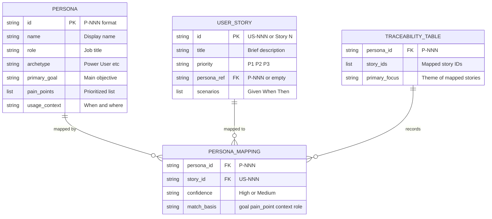
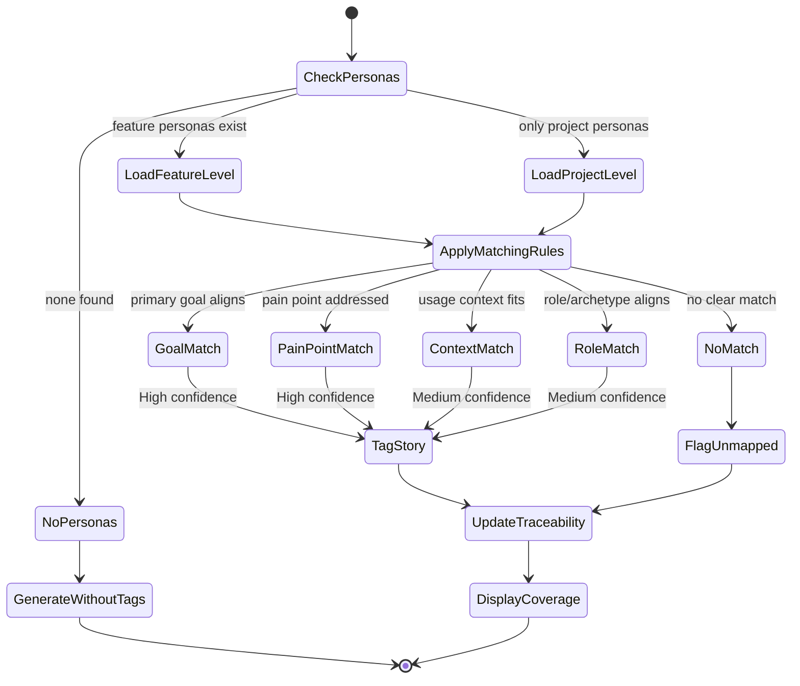

# Data Model: Persona-Aware User Story Generation

**Feature Branch**: `057-persona-aware-user-story-generation`
**Created**: 2026-03-26

## Overview

This feature operates on existing data structures — no new entities are created. The data model documents how existing structures are used and extended for persona-to-story mapping.

## Entity Relationship Diagram

<!-- BEGIN:AUTO-GENERATED section="er-diagram" -->



<!-- END:AUTO-GENERATED -->

## Entities

### Persona (existing — spec 053)

Defined in `personas.md` files. No modifications.

| Field | Type | Required | Description |
| ----- | ---- | -------- | ----------- |
| id | string | Yes | Unique ID in P-NNN format |
| name | string | Yes | Display name |
| role | string | Yes | Job title or role |
| archetype | enum | Yes | Power User, Casual User, Administrator, Approver, Observer |
| primary_goal | string | Yes | Main objective |
| pain_points | list | Yes | Prioritized frustrations (top 3) |
| usage_context | string | Yes | When/where they encounter the problem |
| demographics | object | No | Experience level, team size, domain expertise |
| behavioral_patterns | object | No | Tech proficiency, work style, decision making |
| relationships | list | No | Connections to other personas |

### User Story (existing — spec template)

Defined in `spec.md`. Extended with optional persona reference.

| Field | Type | Required | Description |
| ----- | ---- | -------- | ----------- |
| number | integer | Yes | Story sequence number |
| title | string | Yes | Brief descriptive title |
| priority | enum | Yes | P1, P2, P3 |
| persona_ref | string | No | P-NNN ID of mapped persona (new field) |
| description | string | Yes | Plain language user journey |
| scenarios | list | Yes | Given/When/Then acceptance scenarios |

**Format change**: Story header extends from:

```text
### User Story N - [Title] (Priority: PN)
```

to:

```text
### User Story N - [Title] (Priority: PN) | Persona: P-NNN
```

The `| Persona: P-NNN` suffix is optional — omitted when no personas are available.

### Persona Mapping (new — logical, not stored)

This is a logical entity that exists during the matching process. It is materialized in two places:
- The story header (`| Persona: P-NNN`)
- The traceability table in `personas.md`

| Field | Type | Required | Description |
| ----- | ---- | -------- | ----------- |
| persona_id | string | Yes | P-NNN reference |
| story_id | string | Yes | Story number or US-NNN |
| confidence | enum | No | High, Medium (P3 feature) |
| match_basis | enum | No | goal, pain_point, context, role |

### Traceability Table (existing — personas-output-template)

Defined in `personas.md` under `## Traceability → ### Persona Coverage`. Updated by `/doit.specit` after story generation.

| Field | Type | Required | Description |
| ----- | ---- | -------- | ----------- |
| persona_id | string | Yes | P-NNN reference |
| story_ids | list | Yes | List of mapped story IDs (may be empty) |
| primary_focus | string | Yes | Theme description of mapped stories |

## Persona Source Precedence

Per spec 056 R-003:

```text
1. Feature-level: specs/{feature}/personas.md  (highest priority)
2. Project-level: .doit/memory/personas.md     (fallback)
3. None available: skip persona mapping         (graceful fallback)
```

When feature-level personas exist, project-level personas are ignored entirely (not merged).

## Matching State Machine


