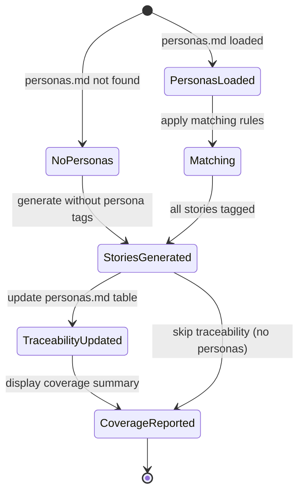

# Implementation Plan: Persona-Aware User Story Generation

**Branch**: `057-persona-aware-user-story-generation` | **Date**: 2026-03-26 | **Spec**: [spec.md](spec.md)
**Input**: Feature specification from `/specs/057-persona-aware-user-story-generation/spec.md`

## Summary

Enhance the `/doit.specit` command template to automatically map each generated user story to the most relevant persona using P-NNN traceability IDs. All changes are template/prompt-level updates — no new Python modules. The specit template already has persona-loading instructions (added by spec 056); this feature adds structured matching rules, traceability table updates, and coverage reporting to close the persona pipeline.

## Technical Context

**Language/Version**: Python 3.11+ (constitution baseline), but this feature is template-only (Markdown)
**Primary Dependencies**: None — changes are to Markdown command templates processed by AI assistants
**Storage**: File-based — Markdown files in `.doit/memory/` and `specs/{feature}/`
**Testing**: pytest (unit tests for any validation logic); manual verification of template behavior
**Target Platform**: Cross-platform CLI (macOS, Linux, Windows)
**Project Type**: single
**Performance Goals**: N/A — template changes only, no runtime performance impact
**Constraints**: Template-only changes per spec 056 R-005; no new Python modules
**Scale/Scope**: 4 template files modified, 0 new Python files

## Architecture Overview

<!-- BEGIN:AUTO-GENERATED section="architecture" -->
```mermaid
flowchart TD
    subgraph "Command Templates"
        SPECIT["doit.specit.md<br/>Story generation + persona mapping"]
        RESEARCHIT["doit.researchit.md<br/>Persona definition"]
        ROADMAPIT["doit.roadmapit.md<br/>Persona generation"]
    end
    subgraph "Template Files"
        SPEC_TPL["spec-template.md<br/>Story header format"]
        US_TPL["user-stories-template.md<br/>Persona reference format"]
    end
    subgraph "Persona Sources"
        PROJ["`.doit/memory/personas.md`<br/>Project-level"]
        FEAT["specs/{feature}/personas.md<br/>Feature-level"]
    end
    subgraph "Context System (spec 056)"
        CTX["context_loader.py<br/>load_personas()"]
        CFG["context.yaml<br/>personas source config"]
    end

    ROADMAPIT -->|generates| PROJ
    RESEARCHIT -->|generates| FEAT
    CFG -->|configures| CTX
    CTX -->|loads| PROJ
    CTX -->|loads| FEAT
    CTX -->|injects into| SPECIT
    SPECIT -->|uses format from| SPEC_TPL
    SPECIT -->|uses format from| US_TPL
    SPECIT -->|reads| FEAT
    SPECIT -->|updates traceability in| FEAT
```
<!-- END:AUTO-GENERATED -->

## Constitution Check

*GATE: Must pass before Phase 0 research. Re-check after Phase 1 design.*

| Principle | Status | Notes |
| --------- | ------ | ----- |
| I. Specification-First | ✅ Pass | Feature has full spec with 8 user stories, 13 FRs |
| II. Persistent Memory | ✅ Pass | Uses existing `.doit/memory/personas.md` pattern |
| III. Auto-Generated Diagrams | ✅ Pass | Spec includes Mermaid diagrams |
| IV. Opinionated Workflow | ✅ Pass | Enhances existing specit → planit → taskit flow |
| V. AI-Native Design | ✅ Pass | Template-only changes for AI assistant consumption |
| Tech Stack: Python 3.11+ | ✅ Pass | No new Python code; template changes only |
| Tech Stack: No new modules | ✅ Pass | Per spec 056 R-005, all changes in existing files |

**Gate Result**: PASS — no violations. Proceeding to Phase 0.

## Project Structure

### Documentation (this feature)

```text
specs/057-persona-aware-user-story-generation/
├── spec.md              # Feature specification
├── plan.md              # This file
├── research.md          # Research from /doit.researchit
├── personas.md          # Feature personas
├── user-stories.md      # User stories from research
├── interview-notes.md   # Interview templates
├── competitive-analysis.md  # Competitive analysis
├── data-model.md        # Phase 1 output
├── quickstart.md        # Phase 1 output
└── checklists/
    └── requirements.md  # Spec quality checklist
```

### Source Code (files to modify)

```text
src/doit_cli/templates/
├── commands/
│   └── doit.specit.md          # PRIMARY: Add matching rules, traceability updates, coverage report
├── spec-template.md            # UPDATE: Persona reference in story header format
└── user-stories-template.md    # UPDATE: Add persona ID field to story format

.claude/commands/
└── doit.specit.md              # SYNC: Copy from src/doit_cli/templates/commands/

.github/prompts/
└── doit.specit.prompt.md       # SYNC: Copy from src/doit_cli/templates/commands/
```

**Structure Decision**: Single project, template-only changes. All modifications are to existing Markdown files in `src/doit_cli/templates/`. Synced copies in `.claude/commands/` and `.github/prompts/` are updated via `doit sync-prompts`.

---

## Phase 0: Research

### Research Decisions

All open questions from the research phase are resolved:

#### R-001: Persona-to-Story Matching Approach

**Decision**: Semantic goal alignment performed by the AI assistant at generation time
**Rationale**: The AI assistant already has persona context loaded (goals, pain points, usage context) and generates stories from the same context. Matching is a natural extension of the generation process — the AI should assign the persona whose goals/pain points are most directly addressed by each story.

**Alternatives considered**:

- Keyword matching on goals/pain points — too brittle, would miss semantic connections
- Deterministic code-based matching — unnecessary complexity; the matching is inherently fuzzy and benefits from AI reasoning
- User-driven manual mapping — defeats the purpose of automation

#### R-002: Multi-Persona Story Format

**Decision**: Comma-separated persona IDs in the header: `| Persona: P-001, P-002`
**Rationale**: Simple, parseable, consistent with existing header format. The traceability table handler can split on comma to register both mappings.

**Alternatives considered**:

- Separate "Primary Persona" and "Secondary Personas" fields — over-engineered for a P2 feature
- Only allow single persona per story — too restrictive per PO feedback

#### R-003: Traceability Table Update Strategy

**Decision**: Full replacement on each `/doit.specit` run
**Rationale**: The traceability table should always reflect the current spec state. Append-only would accumulate stale references from deleted/modified stories. Full replacement ensures accuracy.

**Alternatives considered**:

- Append-only — would accumulate stale entries
- Diff-based merge — unnecessary complexity for a small table

#### R-004: Matching Rules Structure

**Decision**: Add a structured "Persona Matching Rules" section to the specit template that the AI follows when generating stories. Rules are ordered by priority:

1. **Direct goal match**: Story directly addresses a persona's primary goal → High confidence
2. **Pain point match**: Story addresses one of the persona's top pain points → High confidence
3. **Usage context match**: Story fits the persona's usage context → Medium confidence
4. **Role/archetype match**: Story aligns with the persona's role or archetype → Medium confidence
5. **No match**: Story doesn't clearly match any persona → Generate without persona tag, flag in coverage report

**Rationale**: Provides deterministic guidance without being overly rigid. The priority order ensures the most meaningful matches are preferred.

#### R-005: Coverage Report Format

**Decision**: Inline summary displayed after story generation, before the "Next Steps" section:

```markdown
## Persona Coverage

| Persona | Stories | Coverage |
|---------|---------|----------|
| P-001 (Name) | US-001, US-003 | ✓ Covered |
| P-002 (Name) | US-002 | ✓ Covered |
| P-003 (Name) | — | ⚠ Underserved |
```

**Rationale**: Immediate visibility without requiring a separate command. Consistent with the spec's existing summary output pattern.

---

## Phase 1: Design & Data Model

### Files to Modify

#### 1. `src/doit_cli/templates/commands/doit.specit.md` (PRIMARY)

This is the main change. Add three new sections to the specit template:

**Section A: Persona Matching Rules** (insert after "Load Personas" section, ~line 168)

Add structured matching instructions that the AI follows:

```markdown
## Persona Matching Rules (when personas loaded)

When generating user stories with persona context available, follow these matching rules in priority order:

1. **Direct goal match**: If a story directly addresses a persona's primary goal, assign that persona. Confidence: High.
2. **Pain point match**: If a story addresses one of the persona's top 3 pain points, assign that persona. Confidence: High.
3. **Usage context match**: If a story fits the persona's described usage context, assign that persona. Confidence: Medium.
4. **Role/archetype match**: If a story aligns with the persona's role or archetype but not specific goals, assign that persona. Confidence: Medium.
5. **Multi-persona**: If a story equally addresses goals of 2+ personas, list all relevant IDs: `| Persona: P-001, P-002`.
6. **No match**: If no persona clearly matches, generate the story without a Persona tag. Flag it in the coverage report.

**After all stories are generated**:
- Update the Traceability → Persona Coverage table in the feature's `personas.md`
- Display a Persona Coverage summary showing story counts per persona
- Flag any persona with zero stories as "underserved"
```

**Section B: Traceability Table Update** (insert into story generation workflow, after stories written)

Add instructions for updating the personas.md traceability table:

```markdown
### Update Persona Traceability

After generating all user stories:

1. Read the feature's `personas.md` file (if it exists)
2. Find the `## Traceability` → `### Persona Coverage` table
3. Replace the table content with current mappings:
   - For each persona, list all story IDs that reference it
   - Include personas with zero stories (empty story column)
   - Set "Primary Focus" to the main theme of mapped stories
4. Write the updated personas.md
```

**Section C: Coverage Report** (insert into completion output, before "Next Steps")

Add coverage summary to the output:

```markdown
### Persona Coverage Report

After story generation, display:

| Persona | Stories | Coverage |
|---------|---------|----------|
| P-NNN (Name) | US-001, US-003 | ✓ Covered |
| P-NNN (Name) | — | ⚠ Underserved |

If any personas are underserved, add:
> ⚠ {N} persona(s) have no user stories mapped. Consider adding stories that address their goals.
```

#### 2. `src/doit_cli/templates/spec-template.md`

Update the user story header format to include the persona reference:

**Current format** (line 23):

```markdown
### User Story 1 - [Brief Title] (Priority: P1)
```

**New format**:

```markdown
### User Story 1 - [Brief Title] (Priority: P1) | Persona: P-NNN
```

Add a comment explaining the persona field is optional (only when personas loaded).

#### 3. `src/doit_cli/templates/user-stories-template.md`

Update the story format to include persona ID in the header and add a "Persona" field:

**Current format**:

```markdown
### US-001: {Story Title} (P1)

**Persona**: {Persona Name}
```

**New format**:

```markdown
### US-001: {Story Title} (P1) | Persona: P-NNN

**Persona**: {Persona Name} (P-NNN) — {Archetype}
```

#### 4. Sync targets (via `doit sync-prompts`)

After modifying source templates:

- `.claude/commands/doit.specit.md` — auto-synced
- `.github/prompts/doit.specit.prompt.md` — auto-synced

### Data Model

No new data models needed. This feature operates on existing structures:

- **Persona** (defined by spec 053): `{id: P-NNN, name, role, archetype, goals, pain_points, usage_context}`
- **User Story** (existing spec template): `{number, title, priority, persona_ref, scenarios[]}`
- **Traceability Table** (defined in personas-output-template.md): `{persona_id, story_ids[], primary_focus}`

### API Contracts

No API contracts needed — this is a template-only feature with no HTTP endpoints or service interfaces.

### State Transitions



---

## Post-Design Constitution Re-Check

| Principle | Status | Notes |
| --------- | ------ | ----- |
| I. Specification-First | ✅ Pass | Full spec exists, plan aligns |
| II. Persistent Memory | ✅ Pass | Updates existing personas.md traceability table |
| III. Auto-Generated Diagrams | ✅ Pass | Plan includes Mermaid diagrams |
| IV. Opinionated Workflow | ✅ Pass | Enhances specit without changing workflow order |
| V. AI-Native Design | ✅ Pass | All changes are AI-consumed templates |
| No new Python modules | ✅ Pass | 0 new .py files; all changes are .md templates |

**Gate Result**: PASS — design is constitution-compliant.

---

## Implementation Summary

| Artifact | Files Changed | Scope |
| -------- | ------------- | ----- |
| Specit template | 1 file (`doit.specit.md`) | Add matching rules, traceability update, coverage report |
| Spec template | 1 file (`spec-template.md`) | Add `\| Persona: P-NNN` to story header |
| User stories template | 1 file (`user-stories-template.md`) | Add persona ID to story format |
| Sync | 2 files (`.claude/`, `.github/`) | Auto-synced via `doit sync-prompts` |
| **Total** | **3 source files + 2 synced** | **Template-only, no Python changes** |
