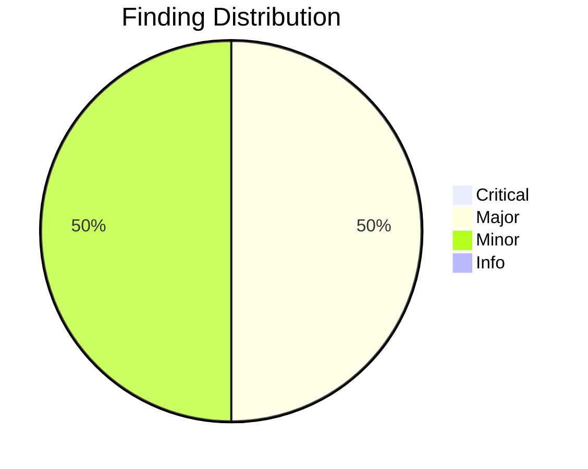
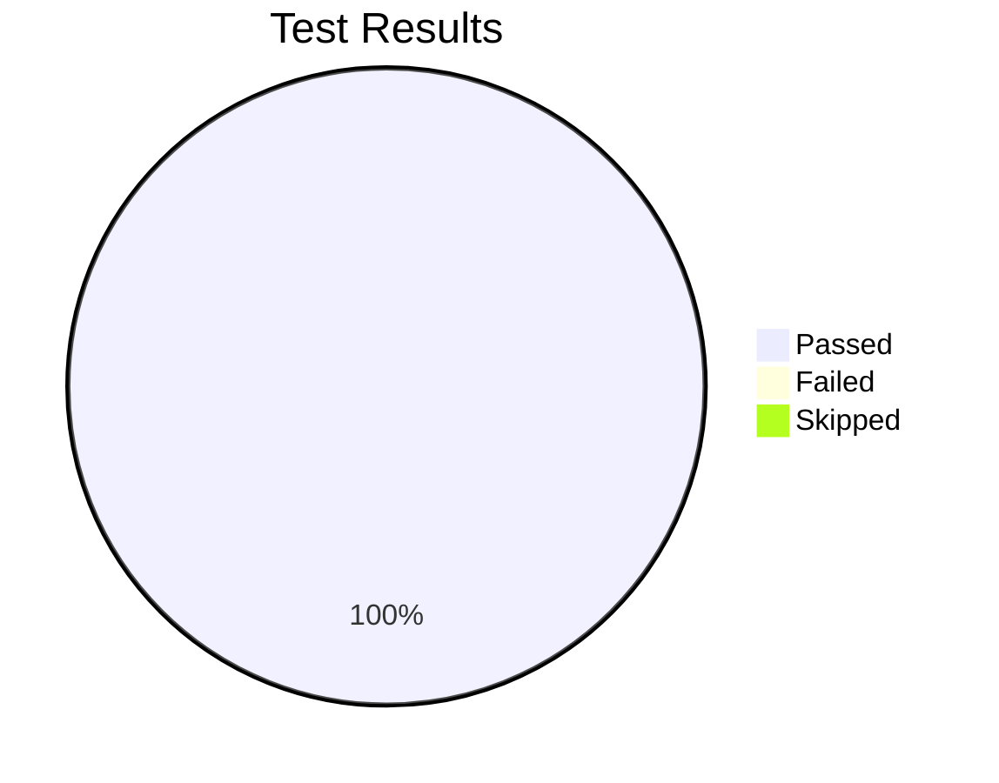

# Review Report: Persona-Aware User Story Generation

**Date**: 2026-03-26
**Reviewer**: Claude
**Branch**: `057-persona-aware-user-story-generation`

## Quality Overview

<!-- BEGIN:AUTO-GENERATED section="finding-distribution" -->

<!-- END:AUTO-GENERATED -->

## Code Review Summary

| Severity | Count |
| -------- | ----- |
| Critical | 0 |
| Major | 1 |
| Minor | 1 |
| Info | 0 |

### Major Findings

| File | Issue | Status |
| ---- | ----- | ------ |
| `.doit/templates/spec-template.md`, `.doit/templates/user-stories-template.md`, `.doit/templates/commands/doit.specit.md` | Local `.doit/templates/` copies were out of sync with source `src/doit_cli/templates/` — missing all persona header format changes | ✓ FIXED |

### Minor Findings

| File | Issue | Status |
| ---- | ----- | ------ |
| `tests/unit/test_persona_aware_story_templates.py` | Unused `import pytest` — flagged by ruff linter | ✓ FIXED |

## Automated Test Summary

<!-- BEGIN:AUTO-GENERATED section="test-results" -->

<!-- END:AUTO-GENERATED -->

| Metric | Count |
| ------ | ----- |
| Total Tests | 1259 |
| Passed | 1259 |
| Failed | 0 |
| Skipped | 0 |

### Feature Tests (test_persona_aware_story_templates.py)

| Test Class | Tests | Status |
| ---------- | ----- | ------ |
| TestSpecTemplatePersonaHeaders | 4 | ✓ PASS |
| TestUserStoriesTemplatePersonaFormat | 4 | ✓ PASS |
| TestSpecitMatchingRules | 7 | ✓ PASS |
| TestSpecitTraceabilityUpdate | 4 | ✓ PASS |
| TestSpecitCoverageReport | 5 | ✓ PASS |
| TestSpecitFallbackBehavior | 8 | ✓ PASS |
| TestSpecitMultiPersona | 3 | ✓ PASS |
| TestDotDoitTemplateSyncIntegrity | 3 | ✓ PASS |
| TestAgentSyncIntegrity | 6 | ✓ PASS |
| TestSpecitPersonaLoadingEnhanced | 4 | ✓ PASS |
| TestSpecitBackwardCompatibility | 6 | ✓ PASS |

## Fixes Applied

1. Synced `.doit/templates/spec-template.md` with source
2. Synced `.doit/templates/user-stories-template.md` with source
3. Synced `.doit/templates/commands/doit.specit.md` with source
4. Removed unused `pytest` import from test file
5. Added 3 new tests to verify `.doit/templates/` stays in sync with source

## Sign-Off

- Code Review: Approved — all findings fixed
- Automated Tests: 1259/1259 passing (54 feature-specific)
- Lint: All checks passed (ruff)

## Next Steps

- Run `/doit.checkin` to finalize and merge changes
