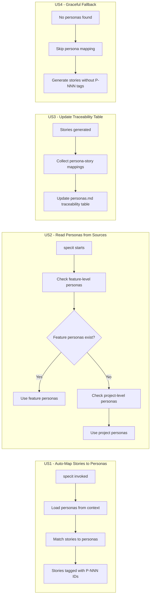
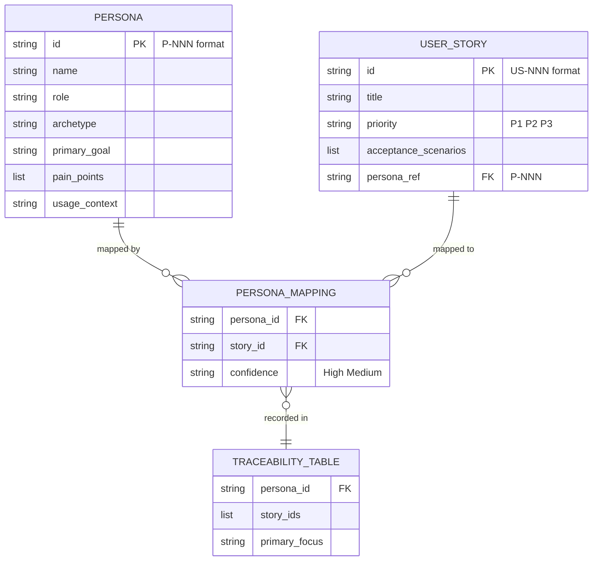

# Feature Specification: Persona-Aware User Story Generation

**Feature Branch**: `057-persona-aware-user-story-generation`
**Created**: 2026-03-26
**Status**: Complete
**Input**: User description: "Persona-aware user story generation — automatically map generated user stories to personas using P-NNN traceability IDs"
**Research**: [research.md](research.md) | [user-stories.md](user-stories.md)
**Personas**: [personas.md](personas.md)

## Summary

When `/doit.specit` generates user stories, it should automatically map each story to the most relevant persona from `.doit/memory/personas.md` (project-level) or `specs/{feature}/personas.md` (feature-level) using existing P-NNN traceability IDs. This completes the persona pipeline established by specs 053 (Stakeholder Persona Templates) and 056 (Project-Level Personas with Context Injection), closing the traceability gap between persona definitions and generated specifications.

## User Scenarios & Testing

### User Story 1 - Auto-Map Stories to Personas During Spec Generation (Priority: P1) | Persona: P-001

As **Product Owner (P-001)**, a Power User who drives the SDD workflow, I want `/doit.specit` to automatically tag each generated user story with the most relevant persona ID so that I don't need to manually cross-reference and map stories to personas after generation.

**Why this priority**: This is the core capability that completes the persona pipeline. Without it, the persona context injected by spec 056 has no structured output — stories remain disconnected from personas.

**Independent Test**: Can be fully tested by running `/doit.specit` on a feature that has personas defined and verifying that each generated story includes a `Persona: P-NNN` reference. Delivers immediate value by eliminating manual persona tagging.

**Acceptance Scenarios**:

1. **Given** personas are defined in `.doit/memory/personas.md` or `specs/{feature}/personas.md`, **When** `/doit.specit` generates user stories, **Then** each story includes a `| Persona: P-NNN` field in the story header linking it to the most relevant persona
2. **Given** both project-level and feature-level personas exist, **When** `/doit.specit` generates user stories, **Then** feature-level personas take precedence over project-level personas per spec 056 R-003
3. **Given** personas are defined with goals, pain points, and usage context, **When** the AI assistant matches a story to a persona, **Then** the match is based on alignment between the story's intent and the persona's goals and pain points

---

### User Story 2 - Read Personas from Existing Sources (Priority: P1) | Persona: P-003

As **AI Assistant (P-003)**, a Power User that executes `/doit.specit`, I want to read personas from the context system already established by spec 056 so that I have structured data to match against when generating stories.

**Why this priority**: Without persona data loaded, no mapping can occur. This story enables the mapping engine by leveraging the existing context injection pipeline.

**Independent Test**: Can be tested by verifying that when `/doit.specit` runs, the loaded persona context includes persona IDs, names, goals, and pain points from the appropriate source (feature-level or project-level).

**Acceptance Scenarios**:

1. **Given** project-level personas exist in `.doit/memory/personas.md`, **When** `/doit.specit` runs for any feature, **Then** the project-level personas are available for story mapping
2. **Given** feature-level personas exist in `specs/{feature}/personas.md`, **When** `/doit.specit` runs for that feature, **Then** feature-level personas are used, overriding project-level personas
3. **Given** personas loaded via the context system (spec 056), **When** `/doit.specit` generates stories, **Then** the same loaded persona context is used for mapping without duplicate file reads

---

### User Story 3 - Update Traceability Table After Story Generation (Priority: P1) | Persona: P-001

As **Product Owner (P-001)**, I want the traceability table in `personas.md` to be automatically updated after `/doit.specit` runs so that I can see persona-to-story coverage at a glance without manually maintaining cross-references.

**Why this priority**: Traceability is a core principle of spec-driven development. Without automated traceability updates, the persona-to-story link degrades over time as specs evolve.

**Independent Test**: Can be tested by running `/doit.specit`, then checking the Traceability → Persona Coverage table in `personas.md` to verify it lists the correct story IDs per persona.

**Acceptance Scenarios**:

1. **Given** `/doit.specit` has generated user stories with persona mappings, **When** the generation completes, **Then** the Traceability → Persona Coverage table in `personas.md` is updated with story IDs per persona
2. **Given** a persona with no stories mapped to it, **When** the traceability table is updated, **Then** the persona appears in the table with an empty "User Stories Addressing" column, signaling a coverage gap

---

### User Story 4 - Graceful Fallback When No Personas Exist (Priority: P1) | Persona: P-003

As **AI Assistant (P-003)**, I want clear fallback behavior when no personas are available so that `/doit.specit` continues to work for projects that haven't defined personas, preserving backward compatibility.

**Why this priority**: Backward compatibility is non-negotiable. This feature must be additive — it enhances the workflow when personas exist but must not break it when they don't.

**Independent Test**: Can be tested by running `/doit.specit` on a feature with no `personas.md` file present (neither project-level nor feature-level) and verifying stories generate correctly without persona mappings.

**Acceptance Scenarios**:

1. **Given** no `.doit/memory/personas.md` and no `specs/{feature}/personas.md` exist, **When** `/doit.specit` generates user stories, **Then** stories are generated without persona mappings using the existing format
2. **Given** a `personas.md` file exists but contains no valid persona entries, **When** `/doit.specit` generates user stories, **Then** stories are generated without persona mappings and no error is raised

---

### User Story 5 - View Persona Context in Generated Stories (Priority: P1) | Persona: P-002

As **Developer (P-002)**, a Casual User who consumes generated specs, I want each user story to show which persona it serves so that I can understand the user context and make targeted implementation decisions without cross-referencing separate files.

**Why this priority**: Developers are the downstream consumers of this feature. If persona mappings aren't visible and useful in the generated output, the entire feature fails to deliver value.

**Independent Test**: Can be tested by reading a generated `spec.md` and verifying that each user story header contains the persona ID and name, and that the story context references the persona's goals.

**Acceptance Scenarios**:

1. **Given** a generated spec with persona mappings, **When** a Developer reads a user story, **Then** the persona ID and name are visible in the story header as `| Persona: P-NNN`
2. **Given** a user story mapped to a specific persona, **When** a Developer needs more persona detail, **Then** the persona ID links back to the full profile in `personas.md`

---

### User Story 6 - Multi-Persona Story Support (Priority: P2) | Persona: P-001

As **Product Owner (P-001)**, I want to optionally tag a user story with multiple persona IDs when it genuinely serves more than one persona so that cross-cutting concerns are properly represented in the traceability chain.

**Why this priority**: Nice-to-have enhancement. Most stories map to a single primary persona, but some cross-cutting stories (e.g., system-wide notifications) serve multiple personas. Supporting this prevents artificial constraints on story design.

**Independent Test**: Can be tested by generating a story that addresses goals shared by two personas and verifying both persona IDs appear in the header and both are reflected in the traceability table.

**Acceptance Scenarios**:

1. **Given** a user story that addresses goals shared by P-001 and P-002, **When** the AI assistant maps the story, **Then** the story's Persona field lists both: `| Persona: P-001, P-002`
2. **Given** a multi-persona story, **When** the traceability table is updated, **Then** the story ID appears in the row for each mapped persona

---

### User Story 7 - Persona Coverage Report (Priority: P2) | Persona: P-001

As **Product Owner (P-001)**, I want a coverage summary after story generation showing which personas are well-served and which are underserved so that I can identify gaps in my requirements before proceeding to planning.

**Why this priority**: Nice-to-have that provides immediate feedback. Without it, the Product Owner must manually scan the traceability table to find coverage gaps — possible but less efficient.

**Independent Test**: Can be tested by running `/doit.specit` with personas that have varying story coverage, and verifying the summary output shows story counts per persona with underserved personas flagged.

**Acceptance Scenarios**:

1. **Given** `/doit.specit` has completed story generation with persona mappings, **When** the generation summary is displayed, **Then** a coverage report shows each persona and the number of stories mapped to them
2. **Given** a persona with zero stories mapped, **When** the coverage report is displayed, **Then** the persona is flagged as "underserved"

---

### User Story 8 - Confidence Scoring for Mappings (Priority: P3) | Persona: P-003

As **AI Assistant (P-003)**, I want to indicate a confidence level when mapping a story to a persona so that the Product Owner can prioritize which mappings to review and adjust.

**Why this priority**: Future enhancement. Useful for large specs with many personas where some mappings may be ambiguous, but not essential for the core pipeline to function.

**Independent Test**: Can be tested by generating stories where some clearly match one persona and others are ambiguous, then verifying confidence indicators (High/Medium) appear alongside mappings.

**Acceptance Scenarios**:

1. **Given** a story with a clear match to a single persona's goals, **When** the mapping is made, **Then** the confidence is indicated as "High"
2. **Given** a story that could plausibly match multiple personas, **When** the mapping is made to the best-fit persona, **Then** the confidence is indicated as "Medium" with a note about alternative personas

---

### Edge Cases

- What happens when a persona exists in `personas.md` but has no goals or pain points defined? The system should still attempt mapping based on available fields (role, archetype, usage context) and note reduced confidence.
- How does the system handle a story that doesn't match any persona? The story should be generated without a persona mapping and flagged in the coverage report as "unmapped."
- What happens when `personas.md` exists but is malformed (invalid markdown, missing required fields)? The system should log a warning and fall back to generating stories without mappings.
- How are personas handled when both project-level and feature-level files exist but contain conflicting persona IDs? Feature-level takes full precedence per spec 056 R-003 — project-level personas are ignored entirely.

## User Journey Visualization

<!-- BEGIN:AUTO-GENERATED section="user-journey" -->

<!-- END:AUTO-GENERATED -->

## Entity Relationships

<!-- BEGIN:AUTO-GENERATED section="entity-relationships" -->

<!-- END:AUTO-GENERATED -->

## Requirements

### Functional Requirements

- **FR-001**: System MUST automatically assign the most relevant persona ID (P-NNN format) to each user story generated by `/doit.specit` when personas are available in the context
- **FR-002**: System MUST read personas from feature-level `specs/{feature}/personas.md` when available, falling back to project-level `.doit/memory/personas.md`
- **FR-003**: System MUST give feature-level personas full precedence over project-level personas when both exist (per spec 056 R-003)
- **FR-004**: System MUST include the persona ID and name in the user story header using the format `| Persona: P-NNN`
- **FR-005**: System MUST match stories to personas based on alignment between story intent and persona goals, pain points, and usage context
- **FR-006**: System MUST generate stories without persona mappings when no personas are available, preserving existing behavior
- **FR-007**: System MUST NOT raise errors when personas files are missing or contain no valid entries
- **FR-008**: System MUST update the Traceability → Persona Coverage table in `personas.md` after story generation with the mapping of persona IDs to story IDs
- **FR-009**: System MUST show personas with zero mapped stories in the traceability table to signal coverage gaps
- **FR-010**: System MUST leverage the existing context injection pipeline from spec 056 to load persona data without introducing new file-loading mechanisms
- **FR-011**: System SHOULD support tagging a story with multiple persona IDs when it addresses goals shared by more than one persona (P2)
- **FR-012**: System SHOULD display a persona coverage summary after story generation showing story counts per persona and flagging underserved personas (P2)
- **FR-013**: System MAY indicate a confidence level (High/Medium) for each persona-to-story mapping (P3)

### Key Entities

- **Persona**: A defined user archetype with unique ID (P-NNN), name, role, archetype, goals, pain points, and usage context. Source: `personas.md` files.
- **User Story**: A feature requirement in Given/When/Then format with priority, acceptance scenarios, and persona mapping. Source: generated `spec.md`.
- **Persona Mapping**: The association between a user story and one or more personas, based on goal/pain-point alignment. Stored in story headers and traceability tables.
- **Traceability Table**: A coverage matrix in `personas.md` showing which stories address each persona's needs. Updated by `/doit.specit`.

## Success Criteria

### Measurable Outcomes

- **SC-001**: 100% of generated user stories include a persona ID when personas are available in the context — zero manual tagging required
- **SC-002**: 100% of defined personas appear in the traceability table after spec generation, with accurate story-to-persona mappings
- **SC-003**: `/doit.specit` completes successfully with identical output when no personas are present — zero backward compatibility regressions
- **SC-004**: Product Owners spend zero time manually mapping personas to stories after running `/doit.specit`

## Assumptions

- Personas follow the P-NNN ID format established by spec 053 and include at minimum: ID, name, role, and primary goal
- The context injection pipeline from spec 056 is operational and loads persona content into the specit workflow
- Feature-level personas in `specs/{feature}/personas.md` use the same template structure as project-level personas in `.doit/memory/personas.md`
- All changes are template/prompt-level updates following the pattern established by spec 056 (no new Python modules)
- Persona matching is performed by the AI assistant at generation time using the structured persona data, not by deterministic code

## Dependencies

- **Spec 056** (Project-Level Personas with Context Injection) — provides the context loading mechanism. Status: Complete.
- **Spec 053** (Stakeholder Persona Templates) — defines the persona template structure and P-NNN ID format. Status: Complete.

## Out of Scope

- Creating new personas — this feature maps to existing personas only (persona generation is `/doit.roadmapit`'s responsibility)
- Requiring personas to function — `/doit.specit` must work without personas (backward compatible)
- Modifying persona files beyond updating the traceability table
- Changing the existing Given/When/Then user story format
- Adding new Python modules or services — all changes are template/prompt updates
