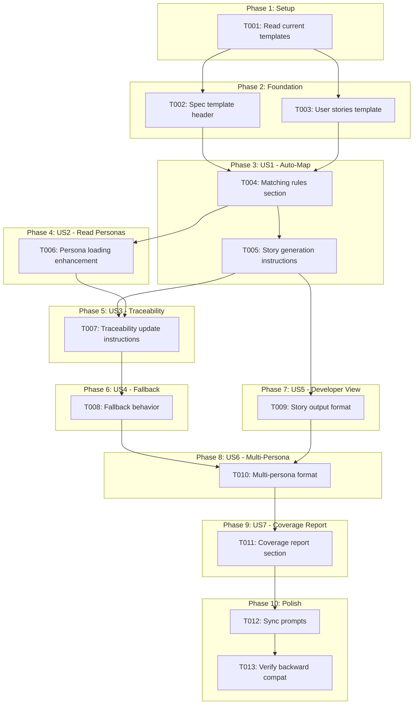
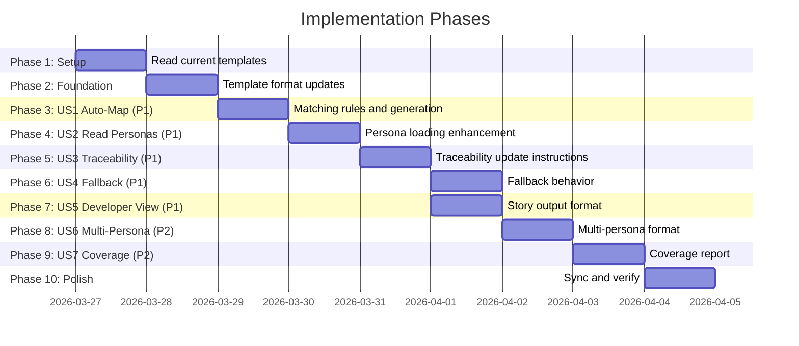

# Tasks: Persona-Aware User Story Generation

**Input**: Design documents from `/specs/057-persona-aware-user-story-generation/`
**Prerequisites**: plan.md (required), spec.md (required for user stories), research.md, data-model.md

**Tests**: No test tasks included — this is a template-only feature with no Python code changes.

**Organization**: Tasks are grouped by user story to enable independent implementation and testing of each story.

## Task Dependencies

<!-- BEGIN:AUTO-GENERATED section="task-dependencies" -->

<!-- END:AUTO-GENERATED -->

## Phase Timeline

<!-- BEGIN:AUTO-GENERATED section="phase-timeline" -->

<!-- END:AUTO-GENERATED -->

## Format: `[ID] [P?] [Story] Description`

- **[P]**: Can run in parallel (different files, no dependencies)
- **[Story]**: Which user story this task belongs to (e.g., US1, US2, US3)
- Include exact file paths in descriptions

## Phase 1: Setup

**Purpose**: Read current template state to understand insertion points

- [x] T001 Read and understand current specit template structure in `src/doit_cli/templates/commands/doit.specit.md`, specifically the "Load Personas" section (~lines 126-168) and the story generation workflow. Identify insertion points for: (A) matching rules section after line 168, (B) traceability update instructions in the story generation workflow, (C) coverage report in the completion output before "Next Steps"

---

## Phase 2: Foundation (Template Format Updates)

**Purpose**: Update the base template formats that all user stories depend on

**⚠️ CRITICAL**: These format changes must be in place before the specit template changes can reference them

- [x] T002 [P] Update user story header format in `src/doit_cli/templates/spec-template.md` — change line 23 from `### User Story 1 - [Brief Title] (Priority: P1)` to `### User Story 1 - [Brief Title] (Priority: P1) | Persona: P-NNN` and add a comment explaining the `| Persona: P-NNN` suffix is optional (only included when personas are loaded in context). Also update the P2 and P3 story headers at lines 38 and 52 with the same format
- [x] T003 [P] Update story format in `src/doit_cli/templates/user-stories-template.md` — change story headers from `### US-001: {Story Title} (P1)` to `### US-001: {Story Title} (P1) | Persona: P-NNN` and update the Persona field from `**Persona**: {Persona Name}` to `**Persona**: {Persona Name} (P-NNN) — {Archetype}`. Update both the example stories (US-001, US-002, US-003) with the new format

**Checkpoint**: Template formats are ready for specit template changes

---

## Phase 3: User Story 1 - Auto-Map Stories to Personas (Priority: P1) 🎯 MVP

**Goal**: Add structured persona matching rules to the specit template so the AI automatically assigns P-NNN IDs to generated stories

**Independent Test**: Run `/doit.specit` on a feature with personas defined. Verify each generated story header contains `| Persona: P-NNN`

### Implementation for User Story 1

- [x] T004 [US1] Add "Persona Matching Rules" section to `src/doit_cli/templates/commands/doit.specit.md` — insert after the "Load Personas" section (after line 168). Include the 5-level priority matching rules from plan.md R-004: (1) Direct goal match → High confidence, (2) Pain point match → High confidence, (3) Usage context match → Medium confidence, (4) Role/archetype match → Medium confidence, (5) No match → generate without tag. Include instruction: "For each user story you generate, review the loaded personas and assign the persona whose goals/pain points are most directly addressed by the story"
- [x] T005 [US1] Update story generation instructions in `src/doit_cli/templates/commands/doit.specit.md` — in the existing "When generating user stories with personas" section (~lines 151-162), add explicit instruction: "After determining the matching persona, include the persona ID in the story header using the format established in spec-template.md: `### User Story N - [Title] (Priority: PN) | Persona: P-NNN`. In the story body, reference the persona's name, archetype, and primary goal to provide context"

**Checkpoint**: The specit template now contains matching rules. Stories generated with personas present will include P-NNN tags

---

## Phase 4: User Story 2 - Read Personas from Existing Sources (Priority: P1)

**Goal**: Enhance persona loading instructions to explicitly describe the data extraction needed for matching

**Independent Test**: Verify the specit template instructs the AI to extract persona IDs, names, goals, and pain points from the loaded context

### Implementation for User Story 2

- [x] T006 [US2] Enhance the "Load Personas" section in `src/doit_cli/templates/commands/doit.specit.md` (~lines 135-140) — expand the "Extract persona IDs and names" instruction to also extract goals and pain points. Update the stored list format from `[{id, name, role}]` to `[{id, name, role, archetype, primary_goal, pain_points, usage_context}]`. Add instruction: "Parse the Detailed Profiles section for each persona's Goals and Pain Points fields — these are the primary inputs for persona matching"

**Checkpoint**: Persona loading extracts all fields needed for matching

---

## Phase 5: User Story 3 - Update Traceability Table (Priority: P1)

**Goal**: Add instructions for automatically updating the Persona Coverage traceability table in personas.md after story generation

**Independent Test**: Run `/doit.specit`, then check `personas.md` — the Traceability → Persona Coverage table should list the correct story IDs per persona

### Implementation for User Story 3

- [x] T007 [US3] Add "Update Persona Traceability" section to `src/doit_cli/templates/commands/doit.specit.md` — insert after the story generation workflow (before the "Specification Quality Validation" step). Include instructions: (1) After generating all user stories, read the feature's `specs/{feature}/personas.md` file, (2) Find the `## Traceability` → `### Persona Coverage` table, (3) Replace the table content with current mappings — for each persona list all story IDs that reference it, (4) Include personas with zero mapped stories showing empty "User Stories Addressing" column, (5) Set "Primary Focus" to the main theme of mapped stories, (6) Write the updated personas.md back. Specify this is a full replacement, not append

**Checkpoint**: Traceability table in personas.md is automatically maintained

---

## Phase 6: User Story 4 - Graceful Fallback (Priority: P1)

**Goal**: Ensure the specit template explicitly handles the case when no personas are available

**Independent Test**: Run `/doit.specit` on a feature with no `personas.md` file. Stories should generate without persona tags, no errors

### Implementation for User Story 4

- [x] T008 [US4] Add explicit fallback instructions to the "Persona Matching Rules" section in `src/doit_cli/templates/commands/doit.specit.md` — add a subsection "When No Personas Are Available" that instructs: (1) If no personas context was loaded (neither project-level nor feature-level), skip all persona matching rules, (2) Generate stories using the standard format without `| Persona: P-NNN` suffix, (3) Skip the traceability table update step, (4) Skip the coverage report, (5) Do NOT raise errors or warnings about missing personas — this is a valid state. Also add to the existing "If NO personas.md found" section (~line 164): "If `personas.md` exists but contains no valid persona entries (no P-NNN IDs found), treat as no personas available"

**Checkpoint**: Specit works identically to current behavior when no personas exist

---

## Phase 7: User Story 5 - View Persona Context in Generated Stories (Priority: P1)

**Goal**: Ensure generated story output format includes persona information that developers can immediately use

**Independent Test**: Read a generated spec — each story header should contain the persona ID and name, with the persona's goal referenced in the story body

### Implementation for User Story 5

- [x] T009 [US5] Update the story generation example in `src/doit_cli/templates/commands/doit.specit.md` (~lines 156-162) — enhance the example to show the full output format that developers will see. Update the example from just `As **Developer Dana (P-001)**, a Power User who needs efficiency...` to include explicit instruction: "In the story body, include the persona's archetype and primary goal to give developers immediate context. Format: `As **{Name} (P-NNN)**, a {Archetype} whose primary goal is {goal}...`. This eliminates the need for developers to cross-reference personas.md for basic context"

**Checkpoint**: All P1 stories complete. Generated specs include persona context visible to developers

---

## Phase 8: User Story 6 - Multi-Persona Story Support (Priority: P2)

**Goal**: Support tagging a single story with multiple persona IDs

**Independent Test**: Generate a story that addresses goals shared by two personas. Verify both P-NNN IDs appear in the header

### Implementation for User Story 6

- [x] T010 [US6] Add multi-persona handling to the "Persona Matching Rules" section in `src/doit_cli/templates/commands/doit.specit.md` — in matching rule #5 (already added in T004), expand the multi-persona instruction: "If a story equally addresses the goals of 2 or more personas, list all relevant IDs comma-separated in the header: `| Persona: P-001, P-002`. In the story body, reference all matched personas. When updating the traceability table, register the story under each matched persona's row. Limit multi-persona tagging to stories that genuinely serve multiple personas — most stories should map to a single primary persona"

**Checkpoint**: Multi-persona stories are properly tagged and reflected in traceability

---

## Phase 9: User Story 7 - Persona Coverage Report (Priority: P2)

**Goal**: Display a coverage summary after story generation showing which personas are served

**Independent Test**: Run `/doit.specit` with personas. Verify coverage report appears showing story counts per persona and flagging underserved personas

### Implementation for User Story 7

- [x] T011 [US7] Add "Persona Coverage Report" section to `src/doit_cli/templates/commands/doit.specit.md` — insert in the completion output section (after the Artifact Status Table in step 6, before "Next Steps"). Include instructions: (1) After story generation and traceability update, display a Persona Coverage table, (2) Format: `| Persona | Stories | Coverage |` with columns for persona ID+name, comma-separated story IDs, and coverage status, (3) Mark personas with ≥1 story as "✓ Covered", (4) Mark personas with 0 stories as "⚠ Underserved", (5) If any personas are underserved, add a note: "⚠ {N} persona(s) have no user stories mapped. Consider adding stories that address their goals", (6) Only display this section when personas are available (skip when no personas loaded)

**Checkpoint**: Coverage report provides immediate visibility into persona coverage gaps

---

## Phase 10: Polish & Cross-Cutting Concerns

**Purpose**: Sync changes and verify backward compatibility

- [x] T012 Run `doit sync-prompts` to sync the updated specit template from `src/doit_cli/templates/commands/doit.specit.md` to `.claude/commands/doit.specit.md` and `.github/prompts/doit.specit.prompt.md`. Verify all three files have the same content (excluding any frontmatter format differences for GitHub prompts)
- [x] T013 Verify backward compatibility by reviewing the complete specit template end-to-end. Confirm: (1) All persona-related sections are conditional on personas being loaded, (2) The "If NO personas.md found" fallback is clear and explicit, (3) No existing behavior is changed when personas are not present, (4) The template still works correctly for the standard non-persona flow

---

## Dependencies & Execution Order

### Phase Dependencies

- **Setup (Phase 1)**: No dependencies — read current state
- **Foundation (Phase 2)**: Depends on Setup — updates base template formats
- **US1-US5 (Phases 3-7)**: All depend on Foundation — modify specit template
- **US6-US7 (Phases 8-9)**: Depend on US1 completion — extend matching rules
- **Polish (Phase 10)**: Depends on all user stories — sync and verify

### User Story Dependencies

- **US1 (Auto-Map)**: Depends on Foundation (Phase 2) — core matching rules, no other story deps
- **US2 (Read Personas)**: Depends on Foundation (Phase 2) — enhances persona loading, independent of US1
- **US3 (Traceability)**: Depends on US1 and US2 — needs matching results to populate table
- **US4 (Fallback)**: Depends on US1 — adds fallback to matching rules section
- **US5 (Developer View)**: Depends on US1 — enhances story output format
- **US6 (Multi-Persona)**: Depends on US1 — extends matching rules (P2)
- **US7 (Coverage Report)**: Depends on US3 and US6 — reports on mapping results (P2)
- **US8 (Confidence Scoring)**: P3 future — not included in this task list

### Within Each User Story

- Read current template state before modifying
- Modify source template (`src/doit_cli/templates/commands/doit.specit.md`)
- All changes to the same file — sequential within the file, but different sections

### Parallel Opportunities

- T002 and T003 can run in parallel (different files: spec-template.md vs user-stories-template.md)
- US1 (T004-T005) and US2 (T006) modify different sections of specit.md — could be parallelized with care
- US4 (T008) and US5 (T009) modify different sections — can run in parallel

---

## Parallel Example: Foundation Phase

```bash
# Launch both foundation tasks together (different files):
Task: "T002 Update spec-template.md story header format"
Task: "T003 Update user-stories-template.md story format"
```

---

## Implementation Strategy

### MVP First (User Story 1 Only)

1. Complete Phase 1: Setup (read templates)
2. Complete Phase 2: Foundation (update base formats)
3. Complete Phase 3: User Story 1 (matching rules)
4. **STOP and VALIDATE**: Test specit with personas — verify stories get P-NNN tags
5. This alone delivers the core value of automatic persona mapping

### Incremental Delivery

1. Complete Setup + Foundation → Format changes ready
2. Add US1 (Auto-Map) → Stories get persona tags → Core value delivered (MVP!)
3. Add US2 (Read Personas) → Better data extraction for matching
4. Add US3 (Traceability) → Traceability table auto-updated
5. Add US4 (Fallback) → Backward compatibility guaranteed
6. Add US5 (Developer View) → Enhanced developer experience
7. Add US6 (Multi-Persona) → Cross-cutting story support (P2)
8. Add US7 (Coverage Report) → Visibility into coverage gaps (P2)
9. Polish → Sync prompts, verify everything

---

## Notes

- [P] tasks = different files, no dependencies
- [Story] label maps task to specific user story for traceability
- All changes are to **3 source Markdown template files** — no Python code
- The primary file (`doit.specit.md`) receives most changes — tasks are sequential within it
- US8 (Confidence Scoring, P3) is excluded from this task list — future enhancement
- Commit after each phase completion for clean history
