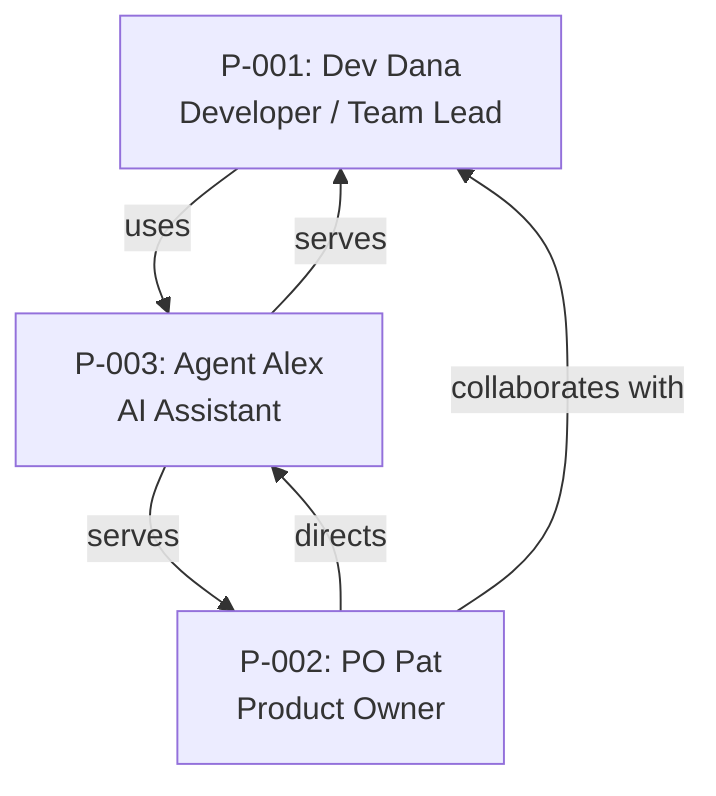

# Personas: Error Recovery Patterns in All Commands

**Feature Branch**: `feature/058-error-recovery-patterns`
**Created**: 2026-03-26
**Derived From**: [research.md](research.md)

## Persona Summary

| ID | Name | Role | Archetype | Primary Goal | Top Pain Point |
|----|------|------|-----------|--------------|----------------|
| P-001 | Dev Dana | Software Developer / Team Lead | Power User | Recover quickly and resume workflow | No documented recovery path when errors occur mid-workflow |
| P-002 | PO Pat | Product Owner | Casual User | Complete research/spec sessions without dev help | Technical error messages are intimidating with no plain-language guidance |
| P-003 | Agent Alex | AI Assistant (Claude/Copilot) | Power User | Execute recovery autonomously from template instructions | Templates lack structured, parseable error recovery procedures |

---

## Persona Profiles

### P-001: Dev Dana — Software Developer / Team Lead

**Archetype**: Power User

#### Demographics

- **Experience Level**: Mid to Senior
- **Team Size**: Solo developer or small team (2-8)
- **Domain Expertise**: Full-stack development, CLI tools, git workflows
- **Technology Proficiency**: High

#### Goals

- **Primary**: Recover from errors quickly and resume the SDD workflow without losing progress
- **Secondary**: Understand root causes to prevent recurrence; build confidence in the workflow's resilience

#### Pain Points (Prioritized)

1. **No recovery path**: Encounters errors mid-workflow (e.g., during `implementit` task execution or `testit` framework detection) with no documented steps to recover — forced to guess or restart
2. **Lost progress**: When errors occur after significant work (e.g., multiple tasks completed in `implementit`), unclear whether progress is preserved in state files or needs to be redone
3. **Inconsistent error handling**: `fixit` has excellent recovery docs while `planit` has a one-liner — creates uncertainty about which commands are "safe" to rely on
4. **State file mystery**: Knows `.doit/state/` exists but doesn't understand what's recoverable vs. what's lost when things go wrong

#### Behavioral Patterns

- **Work Style**: Methodical — follows the SDD workflow step-by-step but expects the workflow to handle edge cases
- **Decision Making**: Data-driven — wants to understand what went wrong before attempting recovery
- **Error Response**: Comfortable with CLI debugging but frustrated by undocumented scenarios; will check git status, state files, and error logs before restarting

#### Success Criteria

- Can recover from any common error within 2-3 documented steps
- Never needs to restart a workflow from scratch due to a recoverable error
- Understands which errors are recoverable vs. which require a fresh start

#### Usage Context

- **When**: Daily during active development sprints
- **Where**: Terminal/IDE with doit CLI
- **Workflow Position**: Most errors encountered during implementation (taskit → implementit → testit → reviewit → checkin) where the most work is at risk

#### Relationships

- Collaborates with P-002 (PO Pat) during research and spec phases
- Relies on P-003 (Agent Alex) to execute commands — needs Alex to handle errors autonomously

#### Conflicts & Tensions

- Wants detailed, technical recovery steps (specific commands, file paths) vs. P-002 who needs plain-language guidance
- May prefer to manually fix state files vs. P-003 which needs programmatic, structured recovery procedures

---

### P-002: PO Pat — Product Owner

**Archetype**: Casual User

#### Demographics

- **Experience Level**: Mid to Senior (in business domain, not engineering)
- **Team Size**: Works with development teams of 5-15
- **Domain Expertise**: Business analysis, requirements gathering, stakeholder management
- **Technology Proficiency**: Low to Medium

#### Goals

- **Primary**: Complete researchit and specit sessions without needing a developer to rescue them from errors
- **Secondary**: Know immediately whether work is lost or safe when an error occurs

#### Pain Points (Prioritized)

1. **Intimidating errors**: Technical error messages (stack traces, file paths, exception names) provide no actionable guidance for non-technical users
2. **Fear of making it worse**: Without clear recovery steps, hesitant to try anything — worried about corrupting data or breaking the workflow further
3. **Interrupted creative flow**: Errors during interactive Q&A sessions (researchit, specit) break the discovery process; by the time recovery happens, the thread of conversation is lost
4. **Dependency on developers**: Must ask a developer for help with workflow errors that should be self-service

#### Behavioral Patterns

- **Work Style**: Collaborative — often works through researchit with stakeholders present; errors are embarrassing in this context
- **Decision Making**: Consensus-seeking — wants confirmation that recovery steps are safe before executing
- **Error Response**: Stops immediately and seeks help rather than experimenting; prefers "safe" options that can't make things worse

#### Success Criteria

- Error messages include a plain-language explanation of what happened
- Recovery steps are safe to execute (can't make things worse)
- Work-in-progress is clearly preserved or clearly lost — no ambiguity

#### Usage Context

- **When**: Weekly or bi-weekly during research and specification sessions
- **Where**: Terminal (often with screen sharing during stakeholder sessions)
- **Workflow Position**: Primarily researchit and specit phases; occasionally roadmapit

#### Relationships

- Reports to / collaborates with P-001 (Dev Dana) for technical phases
- Directs P-003 (Agent Alex) through slash commands during research/spec

#### Conflicts & Tensions

- Needs simplified, non-technical recovery guidance vs. P-001 who wants detailed technical steps
- May want to "just restart" rather than attempt recovery, which conflicts with preserving progress

---

### P-003: Agent Alex — AI Assistant (Claude Code / GitHub Copilot)

**Archetype**: Power User

#### Demographics

- **Experience Level**: N/A (AI agent)
- **Team Size**: Operates as a tool for P-001 and P-002
- **Domain Expertise**: Follows template instructions literally; broad technical knowledge but constrained to documented procedures
- **Technology Proficiency**: High (but instruction-dependent)

#### Goals

- **Primary**: Execute documented recovery procedures autonomously without escalating to the user
- **Secondary**: Provide clear, contextual error information when escalation is necessary

#### Pain Points (Prioritized)

1. **No recovery instructions**: Without error recovery sections in templates, must improvise recovery — leading to inconsistent and sometimes incorrect responses
2. **Inconsistent format**: The 6 templates with `### On Error` subsections use different formats and levels of detail — no standard to follow
3. **Missing escalation criteria**: Doesn't know when to attempt recovery vs. when to ask the user — no severity indicators or decision trees
4. **Can't assess state**: Without documented diagnostic steps, can't determine the current error state before attempting recovery

#### Behavioral Patterns

- **Work Style**: Strictly procedural — follows template instructions step-by-step; quality of error handling is directly proportional to template quality
- **Decision Making**: Rule-based — needs explicit if/then logic for error scenarios; cannot reliably improvise recovery for undocumented cases
- **Error Response**: Will attempt to recover using general knowledge if templates are silent, but results are unpredictable and may not align with doit's specific state management

#### Success Criteria

- Every command template provides structured, parseable error recovery procedures
- Recovery steps use consistent format (If [condition] → numbered steps)
- Clear escalation criteria: when to recover autonomously vs. when to inform the user

#### Usage Context

- **When**: Every command execution — the primary reader of command templates
- **Where**: Embedded in user's IDE or terminal
- **Workflow Position**: All phases — executes every doit command on behalf of P-001 and P-002

#### Relationships

- Serves P-001 (Dev Dana) — executes technical workflow commands
- Serves P-002 (PO Pat) — guides interactive research and spec sessions
- No peer relationships — operates as a tool

#### Conflicts & Tensions

- Needs highly structured, unambiguous instructions vs. P-002 who needs conversational, reassuring language
- May attempt recovery steps that P-001 would prefer to handle manually

---

## Relationship Map

## Traceability

### Persona Coverage

| Persona | User Stories Addressing | Primary Focus |
|---------|------------------------|---------------|
| P-001: Dev Dana | US-1, US-4, US-6, US-7, US-8 | Error recovery in core workflow, state preservation, severity triage |
| P-002: PO Pat | US-3 | Plain-language error summaries for non-technical users |
| P-003: Agent Alex | US-2, US-5, US-7 | Consistent AI-parseable format, autonomous recovery across all commands |

---

## Conflicts & Tensions Summary

| Personas | Tension | Resolution Approach |
|----------|---------|-------------------|
| P-001 vs P-002 | Technical detail level in recovery steps | Layer guidance: lead with plain-language summary, follow with specific commands |
| P-001 vs P-003 | Manual vs autonomous recovery preference | Include escalation criteria so AI knows when to defer to developer |
| P-002 vs P-003 | Conversational vs structured format needs | Structure for AI parseability, write in human-readable language |
