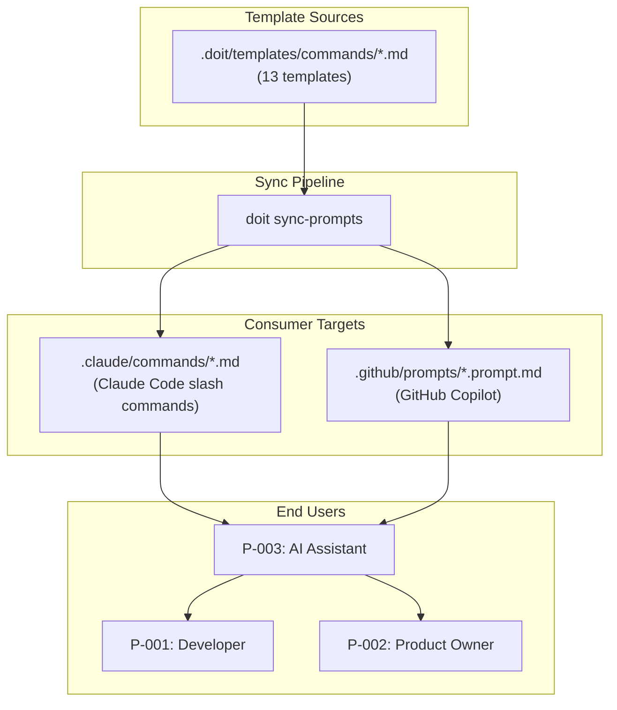

# Implementation Plan: Error Recovery Patterns in All Commands

**Branch**: `058-error-recovery-patterns` | **Date**: 2026-03-26 | **Spec**: [spec.md](spec.md)
**Input**: Feature specification from `/specs/058-error-recovery-patterns/spec.md`
**Research**: [research.md](research.md) | **Personas**: [personas.md](personas.md)

## Summary

Add structured `## Error Recovery` sections to all 13 command templates following the pattern established by `doit.fixit.md`. This is a **documentation-only feature** — all changes are to Markdown template files. No Python code, data models, API contracts, or tests are involved. The work involves authoring 3-5 error scenarios per template with plain-language summaries, numbered recovery steps, CLI commands, and escalation paths.

## Technical Context

**Language/Version**: N/A — Markdown template authoring only
**Primary Dependencies**: None — no code changes
**Storage**: File-based — Markdown templates in `.doit/templates/commands/`
**Testing**: Manual audit — verify all 13 templates contain `## Error Recovery` sections
**Target Platform**: Cross-platform (templates consumed by Claude Code + GitHub Copilot)
**Project Type**: single (documentation within existing CLI project)
**Performance Goals**: N/A
**Constraints**: Templates must remain parseable by AI assistants; each template adds ~40-80 lines
**Scale/Scope**: 13 command templates × 3-5 error scenarios each = 39-65 error scenarios total

## Architecture Overview

<!-- BEGIN:AUTO-GENERATED section="architecture" -->

<!-- END:AUTO-GENERATED -->

## Constitution Check

*GATE: Must pass before Phase 0 research. Re-check after Phase 1 design.*

| Principle | Status | Notes |
|-----------|--------|-------|
| I. Specification-First | ✅ PASS | Spec created via `/doit.specit`, research via `/doit.researchit` |
| II. Persistent Memory | ✅ PASS | All artifacts stored in `specs/058-error-recovery-patterns/` (version-controlled) |
| III. Auto-Generated Diagrams | ✅ PASS | Architecture diagram generated above; no data entities to model |
| IV. Opinionated Workflow | ✅ PASS | This feature *strengthens* Principle IV by documenting error recovery within the workflow |
| V. AI-Native Design | ✅ PASS | Error recovery sections designed specifically for AI parseability (FR-008) |
| Quality Standards | ✅ PASS | No code changes; validation is via template audit checklist |

**Gate Result**: PASS — no violations, no justifications needed.

## Project Structure

### Documentation (this feature)

```text
specs/058-error-recovery-patterns/
├── spec.md              # Feature specification
├── plan.md              # This file
├── research.md          # Research from /doit.researchit
├── personas.md          # Persona profiles
├── user-stories.md      # User stories
├── interview-notes.md   # Interview templates
├── competitive-analysis.md # Competitive landscape
├── quickstart.md        # Implementation quickstart guide
├── checklists/
│   └── requirements.md  # Spec quality checklist
└── tasks.md             # Generated by /doit.taskit
```

### Source Code (files to modify)

```text
.doit/templates/commands/
├── doit.checkin.md          # Expand existing On Error → full Error Recovery
├── doit.constitution.md     # Expand existing On Error → full Error Recovery
├── doit.documentit.md       # Add Error Recovery (has severity table, no recovery steps)
├── doit.fixit.md            # Reference pattern — minor format alignment only
├── doit.implementit.md      # Expand existing On Error → full Error Recovery
├── doit.planit.md           # Expand existing On Error → full Error Recovery
├── doit.researchit.md       # Add Error Recovery (currently none)
├── doit.reviewit.md         # Expand existing On Error → full Error Recovery
├── doit.roadmapit.md        # Add Error Recovery (currently none)
├── doit.scaffoldit.md       # Add Error Recovery (currently none)
├── doit.specit.md           # Expand existing On Error → full Error Recovery
├── doit.taskit.md           # Expand existing On Error → full Error Recovery
└── doit.testit.md           # Expand existing On Error → full Error Recovery
```

**Structure Decision**: No new directories or files beyond the 13 existing templates. Changes are in-place edits adding `## Error Recovery` sections.

**Post-Edit Sync**: After all templates are updated, run `doit sync-prompts` to propagate changes to `.claude/commands/` and `.github/prompts/`.

## Error Recovery Section Pattern

The reference implementation from `doit.fixit.md` establishes this pattern:

```markdown
## Error Recovery

### {Error Scenario Name}

{Plain-language summary: ≤25 words, no file paths or exception names.}

If {specific condition}:

1. {Recovery step with specific CLI command}
2. {Next recovery step}
3. {Final step or escalation}
```

### Additions for this feature (beyond fixit pattern)

Per the spec requirements (FR-010, FR-011, FR-012), each subsection will include:

- **Severity indicator** (P2): `**ERROR**`, `**WARNING**`, or `**FATAL**` label
- **State preservation note** (P1 for stateful commands): "Your progress IS/IS NOT preserved."
- **Verify step** (P2): Final step with a verification command
- **Prevention tip** (P3): One-liner "Prevention:" note where applicable
- **Escalation path** (P1): Clear guidance when recovery isn't possible

### Enhanced pattern:

```markdown
### {Error Scenario Name}

{Plain-language summary sentence.}

**{SEVERITY}** | If {specific condition}:

1. {Recovery step with CLI command}
2. {Next step}
3. Verify: {command to confirm recovery}

> Prevention: {one-liner tip to avoid this in future}

If the above steps don't resolve the issue: {escalation guidance}
```

## Command-Specific Error Scenarios

Based on research of the codebase's 68 custom exception classes, service-level error handling, and existing `### On Error` content, here are the planned error scenarios per template:

### Tier 1: Core Workflow Commands (highest impact)

#### doit.specit.md (currently: 1 generic On Error)

| # | Scenario | Severity | Source |
|---|----------|----------|--------|
| 1 | Branch creation failure | ERROR | Git operations |
| 2 | GitHub API authentication error | ERROR | Issue creation |
| 3 | File write permission denied | ERROR | Spec file creation |
| 4 | Missing research artifacts | WARNING | Pre-requisite check |
| 5 | Ambiguity resolution timeout | WARNING | Interactive Q&A |

#### doit.planit.md (currently: 2 On Error sections)

| # | Scenario | Severity | Source |
|---|----------|----------|--------|
| 1 | Missing spec.md | ERROR | Pre-requisite (migrate existing) |
| 2 | Tech stack mismatch | WARNING | Constitution check |
| 3 | Research file not found | WARNING | Phase 0 dependency |
| 4 | Agent context update failure | WARNING | Script execution |

#### doit.taskit.md (currently: 3 On Error sections)

| # | Scenario | Severity | Source |
|---|----------|----------|--------|
| 1 | Missing plan.md | ERROR | Pre-requisite (migrate existing) |
| 2 | Missing spec.md | ERROR | Pre-requisite (migrate existing) |
| 3 | Circular dependency detected | ERROR | Task ordering |
| 4 | Task count exceeds reasonable limit | WARNING | Scope check |

#### doit.implementit.md (currently: 2 On Error sections)

| # | Scenario | Severity | Source |
|---|----------|----------|--------|
| 1 | Missing tasks.md | ERROR | Pre-requisite (migrate existing) |
| 2 | Task execution failure | ERROR | Mid-workflow error |
| 3 | State file corruption | FATAL | `.doit/state/` corruption |
| 4 | Test failure during implementation | WARNING | Continuous testing |
| 5 | Interrupted session / partial progress | WARNING | State recovery |

#### doit.testit.md (currently: 1 On Error)

| # | Scenario | Severity | Source |
|---|----------|----------|--------|
| 1 | No test framework detected | ERROR | Framework detection (migrate existing) |
| 2 | Test execution failure | ERROR | Test runner errors |
| 3 | Missing test dependencies | ERROR | Package resolution |
| 4 | Coverage threshold not met | WARNING | Quality gate |

#### doit.reviewit.md (currently: 1 On Error)

| # | Scenario | Severity | Source |
|---|----------|----------|--------|
| 1 | Missing prerequisites | ERROR | Pre-requisite (migrate existing) |
| 2 | Critical findings blocking merge | ERROR | Review results |
| 3 | Manual test failure | WARNING | Review checklist |

### Tier 2: Peripheral Commands

#### doit.checkin.md (currently: 1 On Error)

| # | Scenario | Severity | Source |
|---|----------|----------|--------|
| 1 | Incomplete issues | ERROR | Issue status (migrate existing) |
| 2 | GitHub API failure | ERROR | PR creation / issue close |
| 3 | Branch push rejected | ERROR | Git remote |
| 4 | PR creation conflict | WARNING | Duplicate PR |

#### doit.researchit.md (currently: none)

| # | Scenario | Severity | Source |
|---|----------|----------|--------|
| 1 | Session interrupted mid-Q&A | WARNING | Interactive session |
| 2 | Draft file corruption | ERROR | `.research-draft.md` |
| 3 | Feature directory creation failure | ERROR | Filesystem |
| 4 | Resume vs. fresh start conflict | WARNING | Existing artifacts |

#### doit.scaffoldit.md (currently: none)

| # | Scenario | Severity | Source |
|---|----------|----------|--------|
| 1 | Directory creation failure (permissions) | ERROR | Filesystem |
| 2 | Template copy failure | ERROR | Template resolution |
| 3 | Existing project conflict | WARNING | Re-initialization |

#### doit.roadmapit.md (currently: none)

| # | Scenario | Severity | Source |
|---|----------|----------|--------|
| 1 | GitHub API authentication failure | ERROR | Roadmap sync |
| 2 | Merge conflict in roadmap file | ERROR | Concurrent edits |
| 3 | Priority conflict / duplicate items | WARNING | Roadmap integrity |

#### doit.constitution.md (currently: 1 On Error)

| # | Scenario | Severity | Source |
|---|----------|----------|--------|
| 1 | Validation failure | ERROR | Content validation (migrate existing) |
| 2 | File write permission denied | ERROR | Constitution file |
| 3 | Dependent templates out of sync | WARNING | Template sync |

#### doit.documentit.md (currently: severity table only, no recovery)

| # | Scenario | Severity | Source |
|---|----------|----------|--------|
| 1 | Missing documentation sources | ERROR | File resolution |
| 2 | Index generation failure | ERROR | Doc structure |
| 3 | Stale cross-references | WARNING | Link validation |

### Tier 3: Reference (minimal changes)

#### doit.fixit.md (already has full Error Recovery)

No new scenarios needed. Minor format alignment only:
- Verify severity indicators are present (add if missing)
- Add verification steps to each subsection
- Add prevention tips where applicable

## Implementation Approach

### Migration Strategy for Existing On Error Sections

For the 9 templates with existing `### On Error` content:

1. **Read** existing On Error subsection(s)
2. **Preserve** all existing guidance text
3. **Restructure** into the new `## Error Recovery` format:
   - Promote from `### On Error` (H3) to `## Error Recovery` (H2)
   - Convert inline error message templates to numbered recovery steps
   - Add plain-language summary sentence before technical content
4. **Expand** with 2-4 additional error scenarios (to reach 3-5 total)
5. **Position** the section after main workflow steps, before `## Next Steps`
6. **Remove** old `### On Error` subsections (now consolidated into `## Error Recovery`)

### New Section Strategy for Templates with No Error Handling

For the 3 templates with zero error content (researchit, roadmapit, scaffoldit):

1. **Identify** the 3-5 most common failure modes from codebase analysis
2. **Author** complete `## Error Recovery` sections from scratch
3. **Position** before `## Next Steps`

### Sync Strategy

After all 13 templates are updated:

1. Run `doit sync-prompts` to propagate to Claude Code and Copilot targets
2. Verify sync completed for all 13 commands
3. Spot-check 2-3 synced files for content integrity

## Complexity Tracking

No constitution violations — no complexity justifications needed.

| Item | Assessment |
|------|-----------|
| Code changes | None — template/documentation only |
| New dependencies | None |
| New files | None — all edits to existing templates |
| Test changes | None — validated via manual audit |
| Risk level | Low — Markdown changes with no runtime impact |
