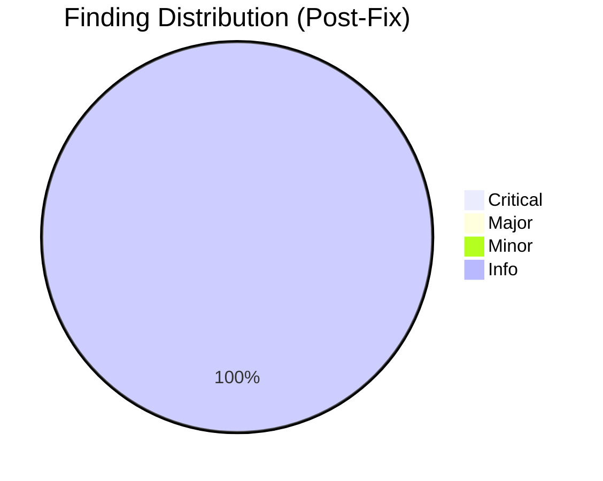
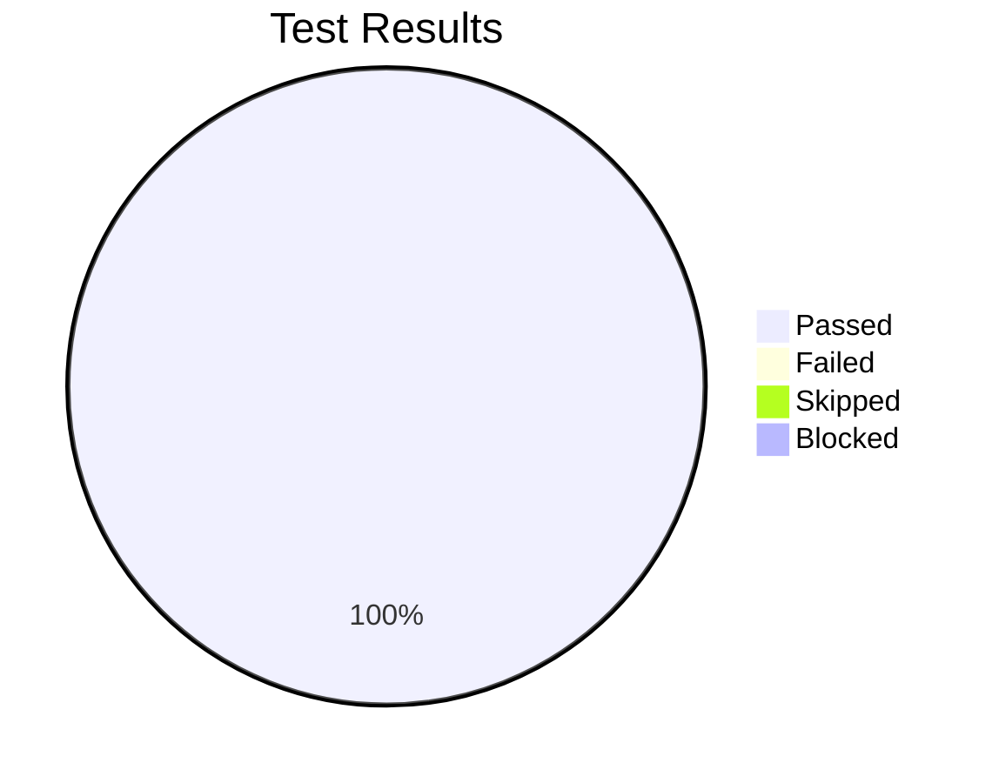

# Review Report: Error Recovery Patterns in All Commands

**Date**: 2026-03-26
**Reviewer**: Claude (automated)
**Branch**: `058-error-recovery-patterns`

## Quality Overview

<!-- BEGIN:AUTO-GENERATED section="finding-distribution" -->

<!-- END:AUTO-GENERATED -->

## Code Review Summary

| Severity | Count (Initial) | Count (Post-Fix) |
|----------|-----------------|------------------|
| Critical | 0 | 0 |
| Major | 5 | 0 |
| Minor | 9 | 0 |
| Info | 4 | 4 |

### Findings Found and Fixed

All findings from the initial review were resolved:

| # | Severity | File(s) | Issue | Fix Applied |
|---|----------|---------|-------|-------------|
| 1 | MAJOR | checkin, planit, roadmapit, constitution, documentit, reviewit | 7 scenarios across 5 templates missing Prevention tips (FR-012) | Added Prevention tips to all 7 scenarios |
| 2 | MAJOR | doit.fixit.md | Stateful command missing explicit state preservation statement (FR-005) | Added "Your investigation progress may be lost" to Workflow State Corruption |
| 3 | MAJOR | doit.reviewit.md | "Missing Prerequisites" Verify step was generic (FR-011) | Changed to specific `ls specs/*/spec.md specs/*/plan.md specs/*/tasks.md` |
| 4 | MAJOR | doit.documentit.md | Two Verify steps were generic (FR-011) | Made both specific with `ls` commands |
| 5 | MAJOR | doit.reviewit.md | "Critical Findings" and "Manual Test Failure" missing Prevention tips (FR-012) | Added Prevention tips to both |
| 6 | MINOR | test_error_recovery_patterns.py | MT-002 positioning assertion too weak | Added H2 section-order verification |
| 7 | MINOR | test_error_recovery_patterns.py | MT-005 plain-language check too narrow | Added checks for list items, code blocks, severity-first lines |
| 8 | MINOR | test_error_recovery_patterns.py | MT-007 verify check overly broad (`"erify"`) | Changed to exact `"Verify:"` or `"verify:"` match |
| 9 | MINOR | test_error_recovery_patterns.py | MT-008 escalation check brittle | Added `"doesn't resolve"` and `"cannot resolve"` as accepted phrases |

### Info Findings (No Action Required)

| # | File(s) | Note |
|---|---------|------|
| 1 | All templates | Test conventions follow project patterns well |
| 2 | All 4 locations | Sync integrity is perfect — zero drift |
| 3 | CLAUDE.md | Agent context update is clean, matches established pattern |
| 4 | test file | 159 parametrized tests provide strong regression coverage |

## Test Results Overview

<!-- BEGIN:AUTO-GENERATED section="test-results" -->

<!-- END:AUTO-GENERATED -->

## Automated Testing Summary

| Metric | Value |
|--------|-------|
| Total Tests | 1418 |
| Passed | 1418 |
| Failed | 0 |
| Skipped | 0 |
| Duration | 16.6s |

### Feature-Specific Tests (test_error_recovery_patterns.py)

| Test Class | Tests | Description |
|------------|-------|-------------|
| TestErrorRecoverySectionExists | 13 | MT-001: Every template has `## Error Recovery` |
| TestErrorRecoveryPositioning | 13 | MT-002: Section positioned before Next Steps |
| TestOldOnErrorRemoved | 13 | MT-003: No old `### On Error` subsections |
| TestNoConflictingSections | 13 | MT-004: No dual error handling sections |
| TestPlainLanguageSummaries | 13 | MT-005: Plain-language summaries per scenario |
| TestSeverityIndicators | 13 | MT-006: Severity indicators in all scenarios |
| TestVerifySteps | 13 | MT-007: Verify steps in all procedures |
| TestEscalationPaths | 13 | MT-008: Escalation paths in all scenarios |
| TestStatePreservationNotes | 3 | MT-009: State notes in stateful commands |
| TestScenarioCount | 13 | FR-002: 3-5 scenarios per template |
| TestSyncIntegrity (src↔doit) | 13 | MT-010: Source matches .doit/ |
| TestSyncIntegrity (src↔claude) | 13 | MT-011: Source matches .claude/ |
| TestSyncIntegrity (src↔github) | 13 | MT-012: Source matches .github/ |
| **Total** | **159** | |

## Requirement Compliance (Post-Fix)

| Requirement | Status |
|-------------|--------|
| FR-001: Every template has Error Recovery | ✅ PASS |
| FR-002: 3-5 scenarios per template | ✅ PASS |
| FR-003: Format (### + summary + steps + escalation) | ✅ PASS |
| FR-004: Plain-language summary ≤25 words | ✅ PASS |
| FR-005: State preservation in stateful commands | ✅ PASS (fixed fixit) |
| FR-006: Escalation paths | ✅ PASS |
| FR-007: Old On Error removed | ✅ PASS |
| FR-008: Consistent If/Then format | ✅ PASS |
| FR-009: Compatible with Claude + Copilot | ✅ PASS |
| FR-010: Severity indicators | ✅ PASS |
| FR-011: Verify steps | ✅ PASS (fixed generic steps) |
| FR-012: Prevention tips | ✅ PASS (fixed 7 missing) |

## Files Modified

### Templates (13 × 4 locations = 52 files)
- `.doit/templates/commands/doit.{command}.md` (13 files)
- `src/doit_cli/templates/commands/doit.{command}.md` (13 files)
- `.claude/commands/doit.{command}.md` (13 files)
- `.github/prompts/doit.{command}.prompt.md` (13 files)

### Tests (1 new file)
- `tests/unit/test_error_recovery_patterns.py` (159 tests)

### Config
- `CLAUDE.md` (agent context update)

## Recommendations

1. All review findings have been fixed — no outstanding issues
2. All 1418 tests pass including 159 new feature-specific tests
3. All 12 functional requirements are satisfied
4. Ready for checkin

## Next Steps

- Run `/doit.checkin` to finalize and merge
