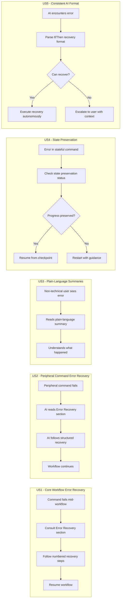

# Feature Specification: Error Recovery Patterns in All Commands

**Feature Branch**: `058-error-recovery-patterns`
**Created**: 2026-03-26
**Status**: Complete
**Input**: User description: "Error recovery patterns in all commands — Add structured ## Error Recovery section to each command template"
**Research**: [research.md](research.md) | [user-stories.md](user-stories.md)
**Personas**: [personas.md](personas.md)

## Summary

Only 1 of 13 command templates (`doit.fixit.md`) includes a structured error recovery section. The remaining 12 templates either have minimal `### On Error` subsections (6 templates) or no error guidance at all (6 templates). This leaves users and AI assistants without documented recovery paths when workflow steps fail — resulting in abandoned sessions, lost progress, and inconsistent error handling.

This feature adds a standardized `## Error Recovery` section to all 13 command templates, following the pattern established by `doit.fixit.md`. Each section will document 3-5 command-specific failure scenarios with numbered recovery steps, state preservation guidance, and escalation paths.

### Assumptions

- The `doit.fixit.md` error recovery section is the accepted reference pattern for all other templates
- Error recovery sections are documentation/template-only changes — no Python codebase modifications required
- Existing `### On Error` subsections in 6 templates will be migrated and expanded (not discarded)
- The same error recovery content will be used in both Claude Code commands (`.claude/commands/`) and Copilot prompts (`.github/prompts/`), kept in sync via `doit sync-prompts`
- Each template is self-contained — no shared error patterns reference file is needed for the initial implementation
- Recovery steps target a technically literate audience but lead with plain-language summaries for accessibility

### Out of Scope

- Changes to the Python codebase error handling or exception hierarchy
- New CLI commands for error recovery (e.g., `doit recover`)
- Automated error detection or self-healing mechanisms
- Error telemetry or analytics collection
- Changes to the state persistence format or backup service behavior
- Error code systems (e.g., numbered error codes with linked documentation)

## User Scenarios & Testing *(mandatory)*

### User Story 1 - Structured Error Recovery in Core Workflow Commands (Priority: P1) | Persona: P-001

As **Dev Dana (P-001)**, a Power User whose primary goal is recovering quickly and resuming the workflow, I want the 5 core workflow commands (specit, planit, implementit, testit, reviewit) to each have a structured `## Error Recovery` section so that when a command fails mid-workflow, I can follow documented steps to recover without restarting.

**Why this priority**: These 5 commands form the critical path of the SDD workflow where the most work investment is at risk. Errors during implementation or testing can represent hours of lost effort if recovery isn't documented.

**Independent Test**: Can be fully tested by triggering a known error condition in any core workflow command (e.g., missing `spec.md` for planit) and verifying that the template's error recovery section provides specific, actionable recovery steps that resolve the issue.

**Acceptance Scenarios**:

1. **Given** a developer runs `implementit` and a task fails due to a missing dependency, **When** they consult the implementit template's `## Error Recovery` section, **Then** they find a subsection titled with the error type (e.g., "### Task Execution Failure") containing numbered recovery steps with specific CLI commands
2. **Given** a developer runs `testit` and the test framework is not detected, **When** they read the error recovery section, **Then** they find steps to verify framework installation, configure detection, and retry — with at least 3 distinct error scenarios documented
3. **Given** a developer runs `planit` and the prerequisite `spec.md` is missing, **When** they consult the error recovery section, **Then** they find guidance to check if spec exists, suggest running specit first, or locate a misnamed spec file — not just "On Error: missing spec.md"
4. **Given** all 5 core workflow templates have been updated, **When** an auditor reviews each template, **Then** each contains a `## Error Recovery` section positioned after the main workflow steps and before "Next Steps", with 3-5 error scenarios, numbered recovery steps, and escalation paths

---

### User Story 2 - Error Recovery in Peripheral Commands (Priority: P1) | Persona: P-003

As **Agent Alex (P-003)**, a Power User AI assistant whose primary goal is executing recovery autonomously, I want the remaining 8 commands (checkin, constitution, documentit, fixit, researchit, roadmapit, scaffoldit, taskit) to have the same structured `## Error Recovery` format so that I can handle errors consistently across all commands.

**Why this priority**: AI assistants execute all 13 commands and need consistent error handling. Inconsistency between commands (fixit has excellent recovery, taskit has none) leads to unpredictable AI behavior.

**Independent Test**: Can be tested by running each of the 8 commands with a deliberate error condition and verifying the AI assistant can parse and follow the recovery instructions without improvising.

**Acceptance Scenarios**:

1. **Given** `researchit` is interrupted mid-Q&A session, **When** the AI reads the error recovery section, **Then** it finds guidance to save draft state, inform the user their answers are preserved, and offer to resume
2. **Given** `checkin` fails because a GitHub API call returns an authentication error, **When** the AI reads the error recovery section, **Then** it finds steps to diagnose the auth issue, suggest `gh auth status`, and offer a manual checkin fallback
3. **Given** `scaffoldit` encounters a directory creation failure due to permissions, **When** the AI reads the error recovery section, **Then** it finds steps to check permissions, suggest running with appropriate access, and verify the directory structure
4. **Given** `fixit` already has a comprehensive error recovery section, **When** the template is reviewed for consistency, **Then** its format is confirmed as the reference pattern and no substantive changes are needed (only minor formatting alignment if necessary)

---

### User Story 3 - Plain-Language Error Summaries (Priority: P1) | Persona: P-002

As **PO Pat (P-002)**, a Casual User whose primary goal is completing research/spec sessions without developer help, I want each error recovery subsection to begin with a one-sentence plain-language summary so that I can understand what happened before seeing technical recovery steps.

**Why this priority**: Non-technical users are blocked when error messages are opaque. A single plain-language sentence before technical steps makes recovery accessible to all personas without diluting the technical content needed by developers and AI.

**Independent Test**: Can be tested by reviewing each error scenario subsection in every template and verifying the first line is a plain-language summary sentence (no file paths, no exception names, no CLI jargon).

**Acceptance Scenarios**:

1. **Given** a `specit` file creation fails due to permissions, **When** PO Pat reads the error recovery subsection, **Then** the first line reads something like "The specification file couldn't be saved to disk" before any technical recovery steps
2. **Given** a `researchit` session encounters a state corruption error, **When** the AI assistant reads the recovery section aloud to PO Pat, **Then** PO Pat understands that their answers are safe and the session can continue — without needing to interpret technical details
3. **Given** all 13 templates have been updated, **When** a reviewer checks every error scenario subsection, **Then** each begins with a non-technical summary sentence (≤25 words, no file paths or exception names)

---

### User Story 4 - State Preservation Guidance (Priority: P1) | Persona: P-001

As **Dev Dana (P-001)**, a Power User who has invested significant work in a workflow session, I want error recovery sections for stateful commands to explicitly state whether my progress is preserved so that I can decide whether to recover or restart.

**Why this priority**: The most damaging errors are those where users don't know if their progress is lost. The codebase has state persistence and backup services, but this is invisible to users without documentation.

**Independent Test**: Can be tested by triggering an error in a stateful command (implementit, researchit, fixit) and verifying the recovery section explicitly states whether in-progress work is preserved.

**Acceptance Scenarios**:

1. **Given** an error occurs during `implementit` after 5 of 8 tasks are completed, **When** the developer reads the error recovery section, **Then** they find an explicit statement like "Your progress IS preserved — completed tasks are saved in `.doit/state/`" with steps to resume from the failed task
2. **Given** a state file becomes corrupted during `researchit`, **When** the developer reads the recovery section, **Then** they find steps to inspect the draft file (`.research-draft.md`), understand what's recoverable, and resume from the last good state
3. **Given** a non-stateful command like `scaffoldit` fails, **When** the developer reads the recovery section, **Then** they find no misleading state-preservation claims — the section appropriately indicates that re-running the command is the recovery path

---

### User Story 5 - Consistent AI-Parseable Format (Priority: P1) | Persona: P-003

As **Agent Alex (P-003)**, a Power User AI assistant, I want all error recovery sections to use a consistent, structured format with "If [condition] → numbered steps" patterns so that I can parse and follow recovery procedures reliably across all commands.

**Why this priority**: AI assistants are the primary consumers of command templates. Without a consistent format, AI must improvise recovery — leading to unpredictable and sometimes incorrect behavior. Consistency across 13 templates enables reliable autonomous error handling.

**Independent Test**: Can be tested by writing a simple parser that extracts error scenarios and recovery steps from each template's `## Error Recovery` section, verifying all 13 templates produce valid, parseable output in the same format.

**Acceptance Scenarios**:

1. **Given** an error occurs in any doit command, **When** the AI reads the template's `## Error Recovery` section, **Then** it finds subsections formatted as `### Error Type Name` with an "If [condition]:" prefix followed by numbered recovery steps
2. **Given** an error cannot be recovered autonomously, **When** the AI reads the escalation criteria, **Then** it finds a clear "Escalate to user" instruction with a list of information to report (error message, affected files, current state)
3. **Given** the `doit.fixit.md` template, **When** its error recovery format is compared to any other updated template, **Then** the structural format matches: subsection per error type, plain-language summary, numbered recovery steps, escalation path

---

### User Story 6 - Severity Indicators (Priority: P2) | Persona: P-001

As **Dev Dana (P-001)**, a Power User, I want error recovery subsections to include severity indicators (WARNING, ERROR, FATAL) so that I can quickly gauge whether to attempt recovery or start fresh.

**Why this priority**: Enhances the P1 recovery sections by helping users triage errors at a glance. Not critical for initial value delivery but significantly improves the user experience.

**Independent Test**: Can be tested by reviewing each error scenario subsection and verifying it includes a severity label, and that FATAL scenarios recommend reinitialization rather than in-place recovery.

**Acceptance Scenarios**:

1. **Given** a missing prerequisite file error in `planit`, **When** the developer reads the recovery subsection, **Then** they see an `**ERROR**` label indicating this is recoverable with specific steps
2. **Given** a corrupted `.doit/` directory, **When** the developer reads the recovery subsection, **Then** they see a `**FATAL**` label with guidance to reinitialize using `doit init`
3. **Given** a stale state file warning in `implementit`, **When** the developer reads the recovery subsection, **Then** they see a `**WARNING**` label indicating the workflow can continue but the stale state should be cleaned up

---

### User Story 7 - Recovery Verification Steps (Priority: P2) | Persona: P-001, P-003

As **Dev Dana (P-001)** or **Agent Alex (P-003)**, I want each recovery procedure to end with a verification step so that I can confirm the error is resolved before continuing the workflow.

**Why this priority**: Without verification, users may think they've recovered but hit the same error again. A simple check command at the end of each recovery procedure closes the loop.

**Independent Test**: Can be tested by following a recovery procedure to completion and verifying the final step provides a specific command to confirm recovery success.

**Acceptance Scenarios**:

1. **Given** a developer has followed recovery steps for a state file issue in `implementit`, **When** they reach the end of the recovery procedure, **Then** they find a "Verify:" step with a specific command (e.g., `doit status` or `ls .doit/state/`) that confirms the workflow can resume
2. **Given** an AI assistant completes a recovery procedure, **When** it executes the verification step, **Then** the output clearly indicates success or failure — no ambiguous results

---

### User Story 8 - Prevention Tips (Priority: P3) | Persona: P-001

As **Dev Dana (P-001)**, a Power User, I want brief prevention tips alongside recovery steps so that I can avoid recurring errors in future sessions.

**Why this priority**: Nice-to-have that reduces repeat errors over time. Low effort to add (one-liner per scenario) but not required for initial error recovery value.

**Independent Test**: Can be tested by checking that each error scenario subsection includes a "Prevention:" one-liner tip where applicable.

**Acceptance Scenarios**:

1. **Given** a developer has recovered from a GitHub authentication error in `checkin`, **When** they read the recovery steps, **Then** they find a "Prevention:" tip suggesting to verify `gh auth status` before starting the checkin workflow

---

### Edge Cases

- What happens when a template's error recovery section references a CLI command that doesn't exist in the user's doit version?
- How should error recovery handle simultaneous errors (e.g., both a missing file AND a GitHub API failure)?
- What if state files referenced in recovery steps have already been cleaned up by automatic stale-state cleanup (7-day TTL)?
- How should error recovery sections handle platform-specific errors (e.g., file permissions on Windows vs. macOS/Linux)?

## User Journey Visualization

<!-- BEGIN:AUTO-GENERATED section="user-journey" -->

<!-- END:AUTO-GENERATED -->

## Requirements *(mandatory)*

### Functional Requirements

- **FR-001**: Every command template (13 total) MUST contain a `## Error Recovery` section positioned after the main workflow steps and before the "Next Steps" section
- **FR-002**: Each `## Error Recovery` section MUST document between 3 and 5 command-specific error scenarios, tailored to that command's unique failure modes
- **FR-003**: Each error scenario MUST be formatted as a subsection (`### Error Type Name`) containing: a plain-language summary sentence, numbered recovery steps with specific CLI commands, and an escalation path
- **FR-004**: Each error scenario subsection MUST begin with a one-sentence plain-language summary (≤25 words, no file paths or exception names) before any technical recovery steps
- **FR-005**: Error recovery sections for stateful commands (implementit, fixit, researchit) MUST explicitly state whether in-progress work is preserved and where state files are located
- **FR-006**: Each error scenario MUST include an escalation path — clear guidance for when recovery isn't possible (e.g., "If the above steps don't resolve the issue: cancel the workflow and restart")
- **FR-007**: Existing `### On Error` subsections in 6 templates (specit, planit, implementit, testit, reviewit, checkin) MUST be migrated into the new `## Error Recovery` format, preserving existing guidance and expanding to 3-5 scenarios
- **FR-008**: The error recovery format MUST use consistent "If [condition]:" prefixes and numbered step patterns parseable by AI assistants
- **FR-009**: Updated templates MUST remain compatible with both Claude Code slash commands (`.claude/commands/`) and GitHub Copilot prompt files (`.github/prompts/`), synced via `doit sync-prompts`
- **FR-010** (P2): Each error scenario subsection SHOULD include a severity indicator (`**WARNING**`, `**ERROR**`, or `**FATAL**`) to help users triage errors at a glance
- **FR-011** (P2): Each recovery procedure SHOULD end with a "Verify:" step providing a specific command to confirm the recovery was successful
- **FR-012** (P3): Error scenarios SHOULD include a one-line "Prevention:" tip where a preventive action exists

## Success Criteria *(mandatory)*

### Measurable Outcomes

- **SC-001**: 100% of command templates (13/13) contain a `## Error Recovery` section with 3-5 documented error scenarios
- **SC-002**: Every error scenario across all templates includes specific CLI commands in its recovery steps (zero generic "fix and retry" instructions)
- **SC-003**: AI assistants can follow recovery procedures in any command without improvising — verified by executing each template's error recovery against known error conditions
- **SC-004**: Non-technical users can understand what happened from the plain-language summary alone — verified by review that all summaries use ≤25 words with no technical jargon
- **SC-005**: Developers can recover from any documented error type within 2-3 steps without restarting the full workflow
- **SC-006**: All error recovery content is synchronized between `.doit/templates/commands/`, `.claude/commands/`, and `.github/prompts/` via `doit sync-prompts`
