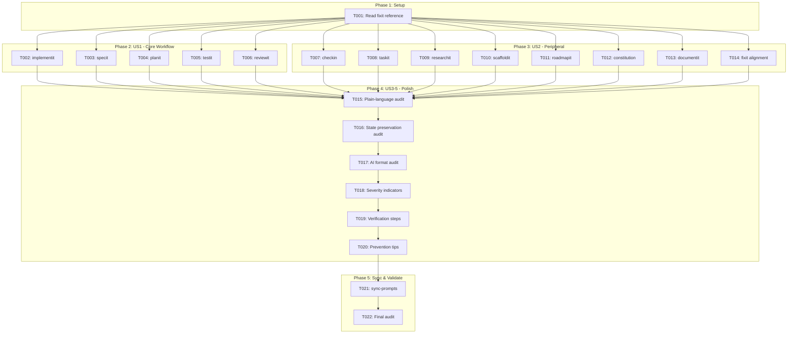
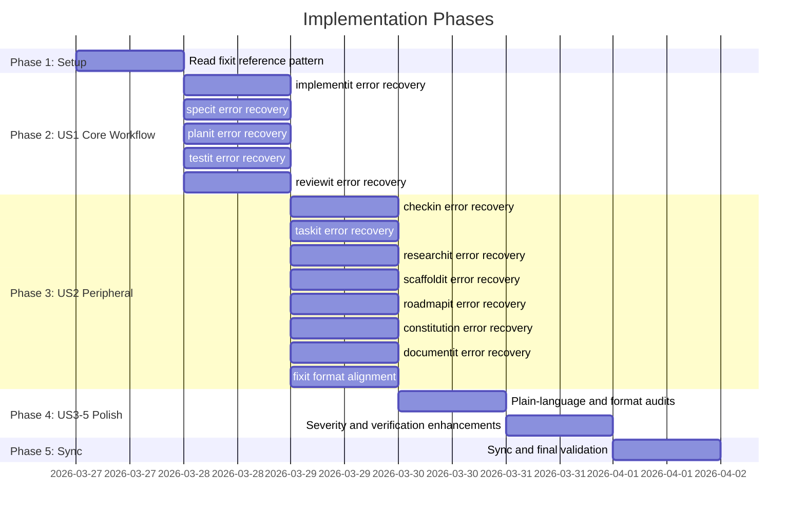

# Tasks: Error Recovery Patterns in All Commands

**Input**: Design documents from `/specs/058-error-recovery-patterns/`
**Prerequisites**: plan.md (required), spec.md (required for user stories)

**Tests**: No tests required — this is a documentation-only feature. Validation is via manual audit checklist.

**Organization**: Tasks are grouped by user story to enable independent implementation and testing of each story. All tasks involve editing existing Markdown template files — no code changes.

## Task Dependencies

<!-- BEGIN:AUTO-GENERATED section="task-dependencies" -->

<!-- END:AUTO-GENERATED -->

## Phase Timeline

<!-- BEGIN:AUTO-GENERATED section="phase-timeline" -->

<!-- END:AUTO-GENERATED -->

## Format: `[ID] [P?] [Story] Description`

- **[P]**: Can run in parallel (different files, no dependencies)
- **[Story]**: Which user story this task belongs to (e.g., US1, US2, US3)
- Include exact file paths in descriptions

## Phase 1: Setup

**Purpose**: Understand the reference pattern before authoring any error recovery sections

- [x] T001 Read the error recovery section in .doit/templates/commands/doit.fixit.md (lines 258-300) and internalize the pattern: H2 section heading, H3 per error scenario, plain-language summary, "If [condition]:" prefix, numbered recovery steps with CLI commands, escalation path. This is the reference pattern for all subsequent tasks.

---

## Phase 2: User Story 1 - Core Workflow Error Recovery (Priority: P1) — MVP

**Goal**: Add structured `## Error Recovery` sections to the 5 core workflow commands (specit, planit, implementit, testit, reviewit), migrating existing `### On Error` content and expanding to 3-5 scenarios each.

**Independent Test**: Trigger a known error in each command (e.g., missing spec.md for planit) and verify the template provides specific, actionable recovery steps.

### Implementation for User Story 1

- [x] T002 [P] [US1] Add `## Error Recovery` section to .doit/templates/commands/doit.implementit.md — migrate existing `### On Error (missing tasks.md)` and `### On Error (other issues)` subsections; add 3 new scenarios: Task Execution Failure, State File Corruption (FATAL), Interrupted Session / Partial Progress; include state preservation notes ("Your progress IS preserved in .doit/state/"); position after main workflow steps, before `## Next Steps`; remove old `### On Error` subsections
- [x] T003 [P] [US1] Add `## Error Recovery` section to .doit/templates/commands/doit.specit.md — migrate existing generic `### On Error` subsection; add 4 new scenarios: Branch Creation Failure, GitHub API Authentication Error, File Write Permission Denied, Missing Research Artifacts; position after main workflow steps, before `## Next Steps`; remove old `### On Error` subsection
- [x] T004 [P] [US1] Add `## Error Recovery` section to .doit/templates/commands/doit.planit.md — migrate existing `### On Error (missing spec.md)` and `### On Error (other issues)` subsections; add 2 new scenarios: Tech Stack Mismatch, Research File Not Found; position after main workflow steps, before `## Next Steps`; remove old `### On Error` subsections
- [x] T005 [P] [US1] Add `## Error Recovery` section to .doit/templates/commands/doit.testit.md — migrate existing `### On Error (no test framework detected)` subsection; add 3 new scenarios: Test Execution Failure, Missing Test Dependencies, Coverage Threshold Not Met; position after main workflow steps, before `## Next Steps`; remove old `### On Error` subsection
- [x] T006 [P] [US1] Add `## Error Recovery` section to .doit/templates/commands/doit.reviewit.md — migrate existing `### On Error (missing prerequisites)` subsection; add 2 new scenarios: Critical Findings Blocking Merge, Manual Test Failure; position after main workflow steps, before `## Next Steps`; remove old `### On Error` subsection

**Checkpoint**: All 5 core workflow templates now have `## Error Recovery` sections with 3-5 scenarios each. Can verify by running: `for f in specit planit implementit testit reviewit; do grep -c "^### " .doit/templates/commands/doit.$f.md; done`

---

## Phase 3: User Story 2 - Peripheral Command Error Recovery (Priority: P1)

**Goal**: Add structured `## Error Recovery` sections to the remaining 8 commands, ensuring consistent format across all 13 templates.

**Independent Test**: Run each peripheral command with a deliberate error and verify the AI can parse and follow recovery instructions.

### Implementation for User Story 2

- [x] T007 [P] [US2] Add `## Error Recovery` section to .doit/templates/commands/doit.checkin.md — migrate existing `### On Error (issues incomplete)` subsection; add 3 new scenarios: GitHub API Failure, Branch Push Rejected, PR Creation Conflict; position after main workflow steps, before `## Next Steps`; remove old `### On Error` subsection
- [x] T008 [P] [US2] Add `## Error Recovery` section to .doit/templates/commands/doit.taskit.md — migrate existing `### On Error (missing plan.md)`, `### On Error (missing spec.md)`, and `### On Error (other issues)` subsections; add 1 new scenario: Circular Dependency Detected; position after main workflow steps, before `## Next Steps`; remove old `### On Error` subsections
- [x] T009 [P] [US2] Add `## Error Recovery` section to .doit/templates/commands/doit.researchit.md — write from scratch (no existing error content); include 4 scenarios: Session Interrupted Mid-Q&A, Draft File Corruption, Feature Directory Creation Failure, Resume vs Fresh Start Conflict; include state preservation notes for draft files; position before `## Next Steps` or end of file
- [x] T010 [P] [US2] Add `## Error Recovery` section to .doit/templates/commands/doit.scaffoldit.md — write from scratch (no existing error content); include 3 scenarios: Directory Creation Failure (Permissions), Template Copy Failure, Existing Project Conflict; position before `## Next Steps` or end of file
- [x] T011 [P] [US2] Add `## Error Recovery` section to .doit/templates/commands/doit.roadmapit.md — write from scratch (no existing error content); include 3 scenarios: GitHub API Authentication Failure, Merge Conflict in Roadmap File, Priority Conflict / Duplicate Items; position before `## Next Steps` or end of file
- [x] T012 [P] [US2] Add `## Error Recovery` section to .doit/templates/commands/doit.constitution.md — migrate existing `### On Error (validation failed)` subsection; add 2 new scenarios: File Write Permission Denied, Dependent Templates Out of Sync; position after main workflow steps, before `## Next Steps`; remove old `### On Error` subsection
- [x] T013 [P] [US2] Add `## Error Recovery` section to .doit/templates/commands/doit.documentit.md — convert existing severity table (Errors Must Fix) into proper recovery subsections; add recovery steps to each scenario: Missing Documentation Sources, Index Generation Failure, Stale Cross-References; position after main workflow steps, before `## Next Steps`
- [x] T014 [US2] Review .doit/templates/commands/doit.fixit.md for format alignment — verify existing error recovery section matches the enhanced pattern (plain-language summaries, escalation paths); make minor formatting adjustments only if needed; do NOT change the substance of existing recovery steps

**Checkpoint**: All 13 templates now have `## Error Recovery` sections. Verify: `for f in .doit/templates/commands/doit.*.md; do if grep -q "^## Error Recovery" "$f"; then echo "✓ $(basename $f)"; else echo "✗ $(basename $f)"; fi; done`

---

## Phase 4: User Stories 3-5 — Cross-Cutting Quality (Priority: P1-P2)

**Goal**: Audit and enhance all 13 error recovery sections for plain-language summaries (US3), state preservation guidance (US4), AI-parseable format consistency (US5), severity indicators (US6), verification steps (US7), and prevention tips (US8).

**Independent Test**: Review every error scenario subsection across all templates against the enhanced pattern checklist.

### US3: Plain-Language Audit (P1)

- [x] T015 [US3] Audit all error recovery subsections across all 13 templates in .doit/templates/commands/ — verify each error scenario begins with a plain-language summary sentence (≤25 words, no file paths, no exception names, no CLI jargon); fix any that don't meet this criterion

### US4: State Preservation Audit (P1)

- [x] T016 [US4] Audit stateful command templates (doit.implementit.md, doit.fixit.md, doit.researchit.md) in .doit/templates/commands/ — verify each error scenario that could affect in-progress work includes an explicit "Your progress IS/IS NOT preserved" statement with the location of state files; add missing state preservation notes

### US5: AI Format Consistency Audit (P1)

- [x] T017 [US5] Audit all 13 templates in .doit/templates/commands/ for consistent AI-parseable format — verify every error scenario uses "If [condition]:" prefix with numbered recovery steps; verify every scenario has an escalation path ("If the above steps don't resolve the issue:"); fix any inconsistencies

### US6: Severity Indicators (P2)

- [x] T018 [US6] Add severity indicators to all error recovery subsections across all 13 templates in .doit/templates/commands/ — add `**WARNING**`, `**ERROR**`, or `**FATAL**` label to each error scenario based on the severity mapping in plan.md; ensure FATAL scenarios recommend reinitialization, ERROR scenarios provide specific recovery, WARNING scenarios indicate workflow can continue

### US7: Recovery Verification Steps (P2)

- [x] T019 [US7] Add "Verify:" steps to all error recovery subsections across all 13 templates in .doit/templates/commands/ — add a final numbered step with a specific CLI command (e.g., `doit status`, `ls .doit/state/`, `git status`) to each recovery procedure that confirms the recovery was successful

### US8: Prevention Tips (P3)

- [x] T020 [US8] Add "Prevention:" tips to error recovery subsections across all 13 templates in .doit/templates/commands/ — add a one-line `> Prevention:` blockquote to each error scenario where a preventive action exists (e.g., "Run `gh auth status` before starting checkin"); skip scenarios where no practical prevention exists

---

## Phase 5: Sync & Final Validation

**Purpose**: Propagate all template changes to Claude Code and Copilot targets, then validate completeness

- [x] T021 Run `doit sync-prompts` to propagate updated templates from .doit/templates/commands/ to .claude/commands/ and .github/prompts/; verify sync completed for all 13 commands; spot-check 2-3 synced files for content integrity
- [x] T022 Run final audit: verify all 13 templates in .doit/templates/commands/ contain `## Error Recovery` with 3-5 scenarios each; verify SC-001 through SC-006 from spec.md are met; update specs/058-error-recovery-patterns/checklists/requirements.md with final validation results

---

## Dependencies & Execution Order

### Phase Dependencies

- **Setup (Phase 1)**: No dependencies — read reference pattern
- **US1 Core Workflow (Phase 2)**: Depends on Phase 1 — all 5 tasks can run in parallel
- **US2 Peripheral (Phase 3)**: Depends on Phase 1 — all 8 tasks can run in parallel; can also run in parallel with Phase 2
- **US3-5 Polish (Phase 4)**: Depends on Phases 2 and 3 — all error recovery sections must exist before audit
- **Sync & Validate (Phase 5)**: Depends on Phase 4 — all enhancements must be complete before sync

### User Story Dependencies

- **US1 (Core Workflow)**: Can start after Phase 1 — no dependencies on other stories
- **US2 (Peripheral)**: Can start after Phase 1 — independent of US1 (different files)
- **US3 (Plain-Language)**: Depends on US1 + US2 — needs error recovery sections to exist before audit
- **US4 (State Preservation)**: Depends on US1 + US2 — needs sections to exist; only applies to 3 templates
- **US5 (AI Format)**: Depends on US1 + US2 — needs sections for format verification
- **US6 (Severity)**: Depends on US3-5 audits — add labels after content is finalized
- **US7 (Verification)**: Depends on US6 — add verify steps after severity labels
- **US8 (Prevention)**: Depends on US7 — add tips as final enhancement layer

### Parallel Opportunities

- **Phase 2**: All 5 core workflow tasks (T002-T006) edit different files — fully parallel
- **Phase 3**: All 8 peripheral tasks (T007-T014) edit different files — fully parallel
- **Phase 2 + Phase 3**: Can run concurrently since they edit different files
- **Phase 4**: Audit tasks (T015-T020) are sequential — each builds on the previous

---

## Parallel Example: Phase 2 (Core Workflow)

```bash
# All 5 core workflow templates can be edited simultaneously:
Task: "Add Error Recovery to .doit/templates/commands/doit.implementit.md"
Task: "Add Error Recovery to .doit/templates/commands/doit.specit.md"
Task: "Add Error Recovery to .doit/templates/commands/doit.planit.md"
Task: "Add Error Recovery to .doit/templates/commands/doit.testit.md"
Task: "Add Error Recovery to .doit/templates/commands/doit.reviewit.md"
```

## Parallel Example: Phase 3 (Peripheral Commands)

```bash
# All 8 peripheral templates can be edited simultaneously:
Task: "Add Error Recovery to .doit/templates/commands/doit.checkin.md"
Task: "Add Error Recovery to .doit/templates/commands/doit.taskit.md"
Task: "Add Error Recovery to .doit/templates/commands/doit.researchit.md"
Task: "Add Error Recovery to .doit/templates/commands/doit.scaffoldit.md"
Task: "Add Error Recovery to .doit/templates/commands/doit.roadmapit.md"
Task: "Add Error Recovery to .doit/templates/commands/doit.constitution.md"
Task: "Add Error Recovery to .doit/templates/commands/doit.documentit.md"
Task: "Review .doit/templates/commands/doit.fixit.md for format alignment"
```

---

## Implementation Strategy

### MVP First (User Story 1 Only)

1. Complete Phase 1: Read fixit reference pattern
2. Complete Phase 2: Core workflow templates (specit, planit, implementit, testit, reviewit)
3. **STOP and VALIDATE**: Verify 5 core templates have Error Recovery sections
4. This alone delivers ~70% of the value (core workflow is where most errors occur)

### Incremental Delivery

1. Phase 1 (Setup) → Read reference
2. Phase 2 (US1) → Core workflow error recovery → Validate 5/13 templates
3. Phase 3 (US2) → Peripheral error recovery → Validate 13/13 templates
4. Phase 4 (US3-5) → Polish: plain-language, state, format, severity, verification, prevention
5. Phase 5 → Sync and final validation
6. Each phase adds value without breaking previous work

---

## Notes

- [P] tasks = different files, no dependencies — all template edits are parallelizable within a phase
- [Story] label maps task to specific user story for traceability
- This is a documentation-only feature — no Python code, no tests, no builds
- Each template edit follows the same pattern: read existing → migrate On Error → expand to 3-5 scenarios → add enhanced format elements
- The fixit template's error recovery section (lines 258-300) is the reference for all others
- After all edits, `doit sync-prompts` propagates changes to Claude Code and Copilot
