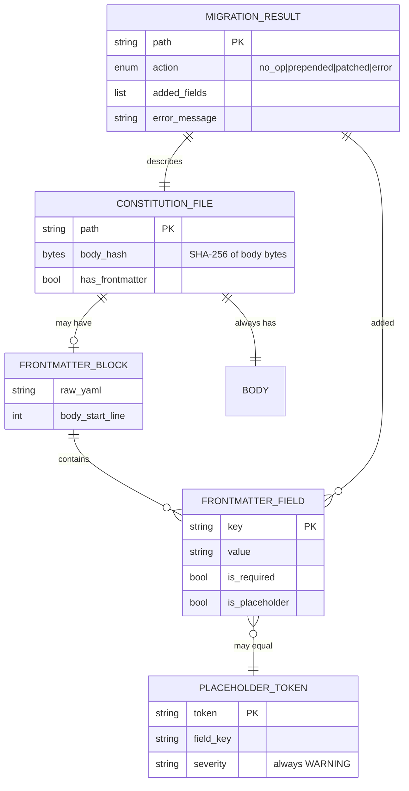
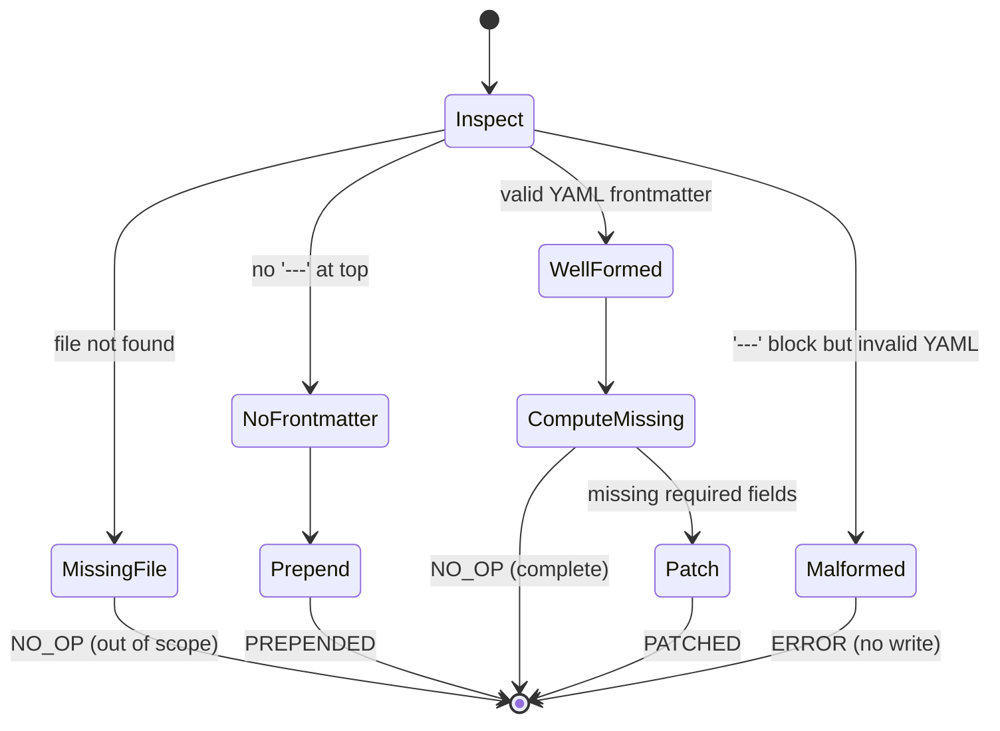

# Data Model: Constitution Frontmatter Migration

**Feature**: `059-constitution-frontmatter-migration`
**Date**: 2026-04-20

This feature operates on markdown files, not a database. "Entities" here are
structured in-memory objects the migration service manipulates. The ER
diagram below shows how they relate.

## Entity Relationships

<!-- BEGIN:AUTO-GENERATED section="er-diagram" -->

<!-- END:AUTO-GENERATED -->

## Entities

### ConstitutionFile

Represents `.doit/memory/constitution.md` on disk.

| Attribute | Type | Notes |
|:----------|:-----|:------|
| `path` | `Path` | Absolute path; always `<project>/.doit/memory/constitution.md`. |
| `raw_bytes` | `bytes` | Full file contents read once at the start of migration; used for atomic write comparison and body-hash verification. |
| `has_frontmatter` | `bool` | True iff the file starts with a `---\n` line and a second `---\n` delimiter is found. |
| `body_bytes` | `bytes` | Every byte after the closing `---\n` of an existing frontmatter block; equals `raw_bytes` when no frontmatter. |
| `body_hash` | `bytes` | SHA-256 of `body_bytes`, computed before and after migration to prove preservation (SC-002). |

### FrontmatterBlock

An in-memory representation of the parsed YAML frontmatter.

| Attribute | Type | Notes |
|:----------|:-----|:------|
| `raw_yaml` | `str` | The text between the two `---` lines, not including them. |
| `parsed` | `dict[str, Any]` | Result of `yaml.safe_load(raw_yaml)`. Empty dict when frontmatter absent. |
| `body_start_line` | `int` | 1-based line number where the body begins in the source file. |
| `well_formed` | `bool` | False when YAML parsing raised `yaml.YAMLError`; triggers FR-009 error path. |

Validation invariants:

- When `well_formed` is False, migration MUST abort without writing (FR-009,
  SC-007).
- `parsed` is always a `dict`; if YAML produced anything else (scalar,
  list) the block is treated as malformed.

### FrontmatterField

One key-value pair within a `FrontmatterBlock`.

| Attribute | Type | Notes |
|:----------|:-----|:------|
| `key` | `str` | Field name, e.g. `id`, `name`. |
| `value` | `Any` | The parsed YAML value. |
| `is_required` | `bool` | True iff `key` is in `REQUIRED_FIELDS` from the schema. |
| `is_placeholder` | `bool` | True iff `value` exact-matches a token in the `PLACEHOLDER_REGISTRY`. |

Required fields (source: `src/doit_cli/schemas/frontmatter.schema.json`
line 7):

| Key | Type | Constraint |
|:----|:-----|:-----------|
| `id` | string | matches `^(app\|platform)-[a-z][a-z0-9-]+$` |
| `name` | string | `minLength: 1` |
| `kind` | string | enum `application`, `service` |
| `phase` | integer | `1`–`4` |
| `icon` | string | matches `^[A-Z0-9]{2,4}$` |
| `tagline` | string | `minLength: 1` |
| `dependencies` | array of strings | |

### PlaceholderToken

Static registry of sentinel values the migrator emits and both the
validator and the `/doit.constitution` skill recognize.

| Key | Token value | YAML type |
|:----|:------------|:----------|
| `id` | `[PROJECT_ID]` | string |
| `name` | `[PROJECT_NAME]` | string |
| `kind` | `[PROJECT_KIND]` | string |
| `phase` | `[PROJECT_PHASE]` | string *(the schema demands integer; the placeholder is a string and validates as WARNING — "placeholder present" — instead of ERROR "wrong type", per §3 of research.md)* |
| `icon` | `[PROJECT_ICON]` | string |
| `tagline` | `[PROJECT_TAGLINE]` | string |
| `dependencies` | `[[PROJECT_DEPENDENCIES]]` | single-item list `[[PROJECT_DEPENDENCIES]]` |

The registry lives in
`src/doit_cli/services/constitution_migrator.py` as a module-level
`PLACEHOLDER_REGISTRY: Final[Mapping[str, Any]]` constant. The validator
imports it to avoid drift.

### MigrationResult

Return type of `ConstitutionMigrator.migrate(path)`.

| Attribute | Type | Notes |
|:----------|:-----|:------|
| `path` | `Path` | The file acted on. |
| `action` | `MigrationAction` | Enum: `NO_OP`, `PREPENDED`, `PATCHED`, `ERROR`. |
| `added_fields` | `list[str]` | Keys added by this run, in schema order. Empty for `NO_OP`. |
| `preserved_body_hash` | `bytes \| None` | Body SHA-256 (unchanged before/after when `action ∈ {PREPENDED, PATCHED, NO_OP}`); `None` for `ERROR`. |
| `error` | `DoitError \| None` | Populated only when `action == ERROR`. |

## State transitions

The migrator has a simple three-state decision tree per input file:

State semantics:

- **Inspect**: read `raw_bytes`, detect frontmatter delimiter.
- **NoFrontmatter → Prepend**: emit fresh placeholder block, then
  `body = raw_bytes`, write atomically.
- **WellFormed → ComputeMissing**: diff `parsed` against `REQUIRED_FIELDS`.
- **ComputeMissing → Patch**: add only missing fields with placeholder
  values; preserve field order (existing keys first in source order, new
  keys appended in schema order).
- **Malformed → ERROR**: surface the `yaml.YAMLError` line/column as a
  `DoitError` subclass; do not write.

## Derived invariants

1. **Body preservation** (FR-004, SC-002): `sha256(body_bytes_before) ==
   sha256(body_bytes_after)` for every `action ∈ {NO_OP, PREPENDED,
   PATCHED}`.
2. **Idempotency** (FR-010, SC-005): running migrate twice in a row on
   the same file produces `action = NO_OP` on the second run.
3. **Existing value immutability** (FR-005, FR-007): if a key is present
   in the input frontmatter — required or unknown — its value is
   identical in the output frontmatter.
4. **Atomic write** (SC-007): when `action = ERROR`, no write occurs;
   file bytes on disk are unchanged.
5. **Schema-order emission**: freshly prepended or patched frontmatter
   emits required fields in the order declared by
   `frontmatter.schema.json`'s `required` array.
