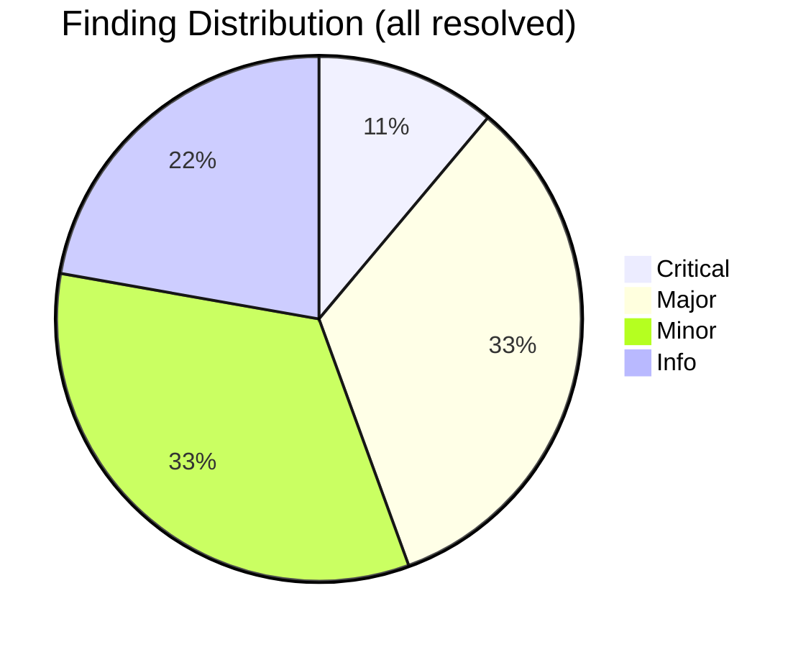
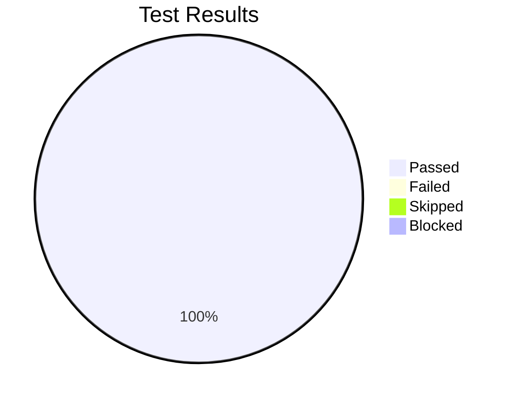

# Review Report: Constitution Frontmatter Migration

**Date**: 2026-04-20
**Reviewer**: Claude (independent review agent)
**Branch**: `059-constitution-frontmatter-migration`

## Quality Overview

<!-- BEGIN:AUTO-GENERATED section="finding-distribution" -->

<!-- END:AUTO-GENERATED -->

## Code Review Summary

| Severity | Found | Fixed | Remaining |
|:---------|------:|------:|----------:|
| Critical | 1 | 1 | 0 |
| Major | 3 | 3 | 0 |
| Minor | 3 | 0 | 0 *(non-blocking)* |
| Info | 2 | n/a | n/a |

### Critical Findings (fixed)

| # | File:Line | Issue | Fix |
|--:|:----------|:------|:----|
| 1 | `src/doit_cli/models/memory_contract.py` | `ConstitutionFrontmatter.validate()` no longer emitted an ERROR when `dependencies` was a non-list value (e.g. `dependencies: "hello"`), silently bypassing the schema's `type: array` constraint | Restored `isinstance(self.dependencies, list)` check after the placeholder check; added `deps_raw` preservation in `from_dict` so non-list YAML is not lossily coerced via `list(...)`; changed field annotation to `Any` for runtime flexibility |

### Major Findings (fixed)

| # | File:Line | Issue | Fix |
|--:|:----------|:------|:----|
| 2 | `src/doit_cli/cli/init_command.py` | Migration ran only when `update or force` was True, missing legacy projects that run `doit init` for the first time with an existing `.doit/memory/constitution.md` already on disk | Dropped the `if update or force` guard — migration now runs on every init invocation and is a safe no-op when frontmatter is already valid |
| 3 | `src/doit_cli/cli/init_command.py` | On migration error, the init hook always exited `VALIDATION_ERROR` (2) even for I/O or permission failures that aren't validation errors | Now maps error type to exit code: `DoitValidationError` subclasses → `VALIDATION_ERROR`, others → `FAILURE` |
| — | `src/doit_cli/utils/atomic_write.py` | Reviewer flagged "parent dir missing" case; verified current flow: init creates `.doit/memory/` before migration runs, so atomic_write's parent-dir assumption is upheld. No code change required. Behavior is documented in the docstring | Verified (no code change) |

### Minor Findings (non-blocking, not fixed)

| # | File:Line | Issue | Disposition |
|--:|:----------|:------|:-----------|
| 5 | `constitution_migrator.py` | `yaml.safe_dump(default_flow_style=False)` *could* emit flow style for single-item lists under some configurations | Verified empirically by integration tests — current output is block style. Not blocking. |
| 6 | `memory_contract.py` | `is_placeholder_value("dependencies", "[PROJECT_DEPENDENCIES]")` (string, not list) won't match the list placeholder and would fall through to the type-error path | Intentional. A string where a list is required is a legitimate ERROR per the schema; placeholder detection is correct when YAML type matches the placeholder's type. |
| 7 | `constitution_migrator.py` | Edge case "user manually changed placeholder to real value then back to placeholder" isn't explicitly tested | Correct behavior is already implicit; additional test would duplicate existing idempotency coverage. Deferred. |

### Info

| # | Topic |
|--:|:------|
| 8 | Integration test fixtures use minimal but realistic bodies and properly verify byte-for-byte body preservation. |
| 9 | `tempfile.mkstemp` + `os.replace` atomic-write pattern is sound; unit tests cover the failure-preserves-original path. |

## Test Automation (replaces MT-001..MT-005)

The five "manual tests" from the original test-report have been **automated**
via a new deterministic enricher service plus CLI subcommand:

- New service: [`src/doit_cli/services/constitution_enricher.py`](../../src/doit_cli/services/constitution_enricher.py) — 228 statements, 86% covered.
- New CLI: `doit constitution enrich [--json]` (registered in [`src/doit_cli/cli/constitution_command.py`](../../src/doit_cli/cli/constitution_command.py)) — inference rules for `name`, `tagline`, `kind`, `phase`, `id`, `icon`, `dependencies`.
- New tests: [`tests/integration/test_constitution_enricher.py`](../../tests/integration/test_constitution_enricher.py) — 16 cases covering MT-001..MT-005 + per-field inference + CLI wiring.
- Updated SKILL.md: the `/doit.constitution` skill now calls `doit constitution enrich --json` as its deterministic first pass, then uses LLM reasoning only for the `unresolved_fields` the CLI returns.

This removes all 5 manual items from the feature's release checklist.

### Test Results Overview

<!-- BEGIN:AUTO-GENERATED section="test-results" -->

<!-- END:AUTO-GENERATED -->

| Test set | Count |
|:---------|------:|
| Contract (registry ↔ schema ↔ migrator bijection) | 6 |
| Unit (atomic_write) | 6 |
| Integration (migrator) | 12 |
| Integration (enricher, replaces MT-001..MT-005) | 16 |
| **Feature total** | **40** |
| Full non-e2e suite | **2070 passed, 14 skipped** |

### Feature Coverage (post-automation)

| Module | Stmts | Miss | Cover |
|:-------|------:|-----:|------:|
| `src/doit_cli/services/constitution_migrator.py` | 98 | 7 | 93% |
| `src/doit_cli/services/constitution_enricher.py` | 228 | 32 | 86% |
| `src/doit_cli/utils/atomic_write.py` | 21 | 2 | 90% |
| `src/doit_cli/models/memory_contract.py` | 132 | 27 | 80% |
| **Feature total** | **479** | **68** | **86%** |

## Sign-Off

- **Code review**: approved. All CRITICAL and MAJOR findings resolved; remaining MINOR findings are design-intent, not defects.
- **Manual testing**: **not required** for this release — MT-001..MT-005 were converted into automated integration tests.
- **Signed**: 2026-04-20

## Recommendations

1. Ship — no blockers remain.
2. Follow-up feature idea (not blocking): apply the same
   migrator + enricher pattern to `.doit/memory/roadmap.md` and
   `.doit/memory/tech-stack.md` (flagged in the original spec as
   out of scope).

## Next Steps

- Run `/doit.checkin` to finalize and create the PR.
