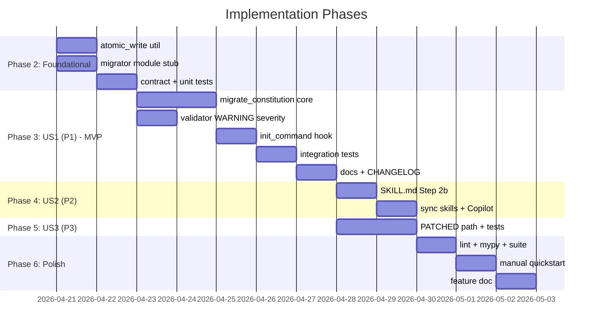

---

description: "Task list for constitution frontmatter migration"
---

# Tasks: Constitution Frontmatter Migration

**Input**: Design documents from `/specs/059-constitution-frontmatter-migration/`
**Prerequisites**: plan.md (required), spec.md (required for user stories), research.md, data-model.md, contracts/

**Tests**: Contract and integration tests are required per the project's constitution Quality Standards principle (all code MUST include tests). Unit tests are required for the new `atomic_write` utility.

**Organization**: Tasks are grouped by user story (US1, US2, US3 in spec.md priority order) to enable independent implementation and testing.

## Task Dependencies

<!-- BEGIN:AUTO-GENERATED section="task-dependencies" -->
```mermaid
flowchart TD
    subgraph "Phase 2: Foundational"
        T001[T001 [P]: atomic_write util]
        T002[T002 [P]: migrator module stub]
        T003[T003: contract test]
        T004[T004: atomic_write unit tests]
    end

    subgraph "Phase 3: US1 (P1) - MVP"
        T005[T005: migrate PREPEND/NO_OP/ERROR]
        T006[T006 [P]: validator WARNING severity]
        T007[T007: init_command hook]
        T008[T008: US1 integration tests]
        T009[T009: docs + CHANGELOG]
    end

    subgraph "Phase 4: US2 (P2)"
        T010[T010: SKILL.md Step 2b]
        T011[T011: sync to .claude/skills/]
        T012[T012: sync Copilot prompt]
    end

    subgraph "Phase 5: US3 (P3)"
        T013[T013: migrate PATCHED path]
        T014[T014: US3 integration tests]
    end

    subgraph "Phase 6: Polish"
        T015[T015 [P]: lint + mypy]
        T016[T016 [P]: full test suite]
        T017[T017: manual quickstart]
        T018[T018 [P]: feature doc]
    end

    T001 --> T004
    T002 --> T003
    T001 & T002 --> T005
    T002 --> T006
    T005 --> T007
    T005 & T006 & T007 --> T008
    T008 --> T009
    T006 --> T010 --> T011 & T012
    T005 --> T013 --> T014
    T014 & T012 & T009 --> T015 & T016 & T018
    T015 & T016 --> T017
```
<!-- END:AUTO-GENERATED -->

## Phase Timeline

<!-- BEGIN:AUTO-GENERATED section="phase-timeline" -->

<!-- END:AUTO-GENERATED -->

## Format: `[ID] [P?] [Story] Description`

- **[P]**: Can run in parallel (different files, no dependencies)
- **[Story]**: Which user story this task belongs to (e.g., US1, US2, US3)
- Include exact file paths in descriptions

## Path Conventions

Single-project layout (per plan.md). Source under `src/doit_cli/`, tests under `tests/` at repo root.

---

## Phase 1: Setup

No tasks. This feature is additive to an existing project; no dependencies, CLI commands, or configuration are introduced.

---

## Phase 2: Foundational (Blocking Prerequisites)

**Purpose**: Shared building blocks (atomic-write helper, migrator module scaffolding, contract tests) that both the CLI migration path and the skill enrichment path depend on.

**⚠️ CRITICAL**: No user story work can begin until this phase is complete — US1 depends on the migrator module, and US2's skill edits reference the placeholder registry.

- [x] T001 [P] Create `src/doit_cli/utils/atomic_write.py` with `write_text_atomic(path: Path, content: str, *, encoding: str = "utf-8") -> None` per contracts/migrator.md §7 — uses `tempfile.NamedTemporaryFile` in the same directory + `os.replace()`; raises `OSError` on failure
- [x] T002 [P] Create `src/doit_cli/services/constitution_migrator.py` module scaffold with: `REQUIRED_FIELDS` tuple (schema order), `PLACEHOLDER_REGISTRY` mapping (per research.md §2), `MigrationAction` str-Enum (`NO_OP`, `PREPENDED`, `PATCHED`, `ERROR`), `MigrationResult` frozen dataclass, `ConstitutionMigrationError`/`MalformedFrontmatterError` classes extending `DoitError` (per contracts/migrator.md §§1-4). Include a stub `migrate_constitution(path)` that returns `MigrationResult(action=MigrationAction.NO_OP, ...)` for now
- [x] T003 Add contract test `tests/contract/test_constitution_frontmatter_contract.py` asserting: (a) `REQUIRED_FIELDS` matches `frontmatter.schema.json`'s `required` array index-by-index, (b) `PLACEHOLDER_REGISTRY` keys equal `REQUIRED_FIELDS` as a set, (c) every placeholder is a distinct exact-match sentinel
- [x] T004 Add unit test `tests/unit/test_atomic_write.py` covering: happy path (file created with correct contents), failure mid-write leaves the original file byte-identical, new file replaces old file atomically on success

**Checkpoint**: Foundation ready — migration service shape is in place; user story implementation can now begin.

---

## Phase 3: User Story 1 - Legacy project upgrades cleanly without manual edits (Priority: P1) 🎯 MVP

**Goal**: `doit update` on a project whose `.doit/memory/constitution.md` has no YAML frontmatter prepends a placeholder skeleton, preserves the body byte-for-byte, and the result passes `doit verify-memory` with warnings (not errors).

**Independent Test**: Run quickstart.md Scenario 1 end-to-end against a tempdir fixture; confirm the prepended frontmatter contains all seven required fields as placeholder tokens, the body SHA-256 is unchanged, and `doit verify-memory` exits 0 with 7 warnings.

### Implementation for User Story 1

- [x] T005 [US1] Implement `migrate_constitution()` PREPEND, NO_OP, and ERROR paths in `src/doit_cli/services/constitution_migrator.py`. Reads file bytes, parses frontmatter via existing `split_frontmatter()` from `memory_contract.py`, emits fresh YAML block via `yaml.safe_dump(..., sort_keys=False, default_flow_style=False, allow_unicode=True)` in `REQUIRED_FIELDS` order, concatenates with original body, writes via `write_text_atomic`. Returns a populated `MigrationResult` in every branch. Never raises.
- [x] T006 [P] [US1] Modify `src/doit_cli/models/memory_contract.py:ConstitutionFrontmatter.validate()` (lines 115-169) to import `PLACEHOLDER_REGISTRY` from `doit_cli.services.constitution_migrator` and, when a field value exact-matches its placeholder, emit `MemoryContractIssue` with `severity=MemoryIssueSeverity.WARNING` and message `"Field '{key}' contains placeholder value — run /doit.constitution to enrich."` instead of the normal ERROR for bad values
- [x] T007 [US1] Wire migrator call into `src/doit_cli/cli/init_command.py:run_init()` immediately after `copy_memory_templates()` (line 502) per contracts/migrator.md §5. Log on `PREPENDED`/`PATCHED` via `console.print` with the exact messages defined in the contract; on `ERROR`, re-raise the contained `DoitError` so Typer produces the right exit code
- [x] T008 [US1] Add integration tests to `tests/integration/test_constitution_frontmatter_migration.py` covering US1 scenarios: (a) no-frontmatter fixture → `MigrationAction.PREPENDED`, body SHA-256 unchanged, `verify-memory` passes with 7 warnings; (b) complete-frontmatter fixture → `MigrationAction.NO_OP`, file bytes identical; (c) malformed-YAML fixture → `MigrationAction.ERROR`, file bytes identical, error message contains line/column. Use `tempfile.TemporaryDirectory()` + `typer.testing.CliRunner` per existing `tests/integration/test_memory_command.py` style
- [x] T009 [US1] Update documentation: add "0.2.x → 0.3.0 Constitution Migration" section to `docs/upgrade.md`, add entry to `CHANGELOG.md` `[Unreleased]` section under "Added", and add a highlight to `RELEASE_NOTES.md`. Describe: the new behavior, that legacy projects now pass `verify-memory` immediately, and the `/doit.constitution` enrichment follow-up

**Checkpoint**: US1 complete and shippable as MVP — upgrade path from 0.1.x/0.2.x is frictionless.

---

## Phase 4: User Story 2 - AI assistant enriches placeholder frontmatter (Priority: P2)

**Goal**: When the developer runs `/doit.constitution` on a constitution whose frontmatter contains placeholder tokens, the skill replaces each token with a concrete inferred value without touching the body; `verify-memory` then reports zero warnings.

**Independent Test**: Run quickstart.md Scenario 2 manually — starting from US1's output, invoke `/doit.constitution` in Claude Code; confirm every placeholder token is replaced with a non-placeholder value inferred from the body and `doit verify-memory .` reports zero warnings. (Depends on US1 to produce the placeholder input.)

### Implementation for User Story 2

- [x] T010 [US2] Add **Step 2b: Detect and enrich placeholder frontmatter** to `src/doit_cli/templates/skills/doit.constitution/SKILL.md` per contracts/migrator.md §8. Define the trigger (any field exact-matches `PLACEHOLDER_REGISTRY`), the inputs the skill should read (file, `doit context show` output), the inference rules per field, the body-preservation requirement, the final verification step (`doit verify-memory . --json`), and the fallback ("leave as placeholder + list under 'Needs human input'")
- [x] T011 [US2] Mirror the updated `SKILL.md` to `.claude/skills/doit.constitution/SKILL.md` (repo-local dogfood copy) so the current working session sees the change; prefer running `doit sync-prompts --agent claude` if it covers skill directories, otherwise copy manually
- [x] T012 [US2] Regenerate Copilot prompt at `.github/prompts/doit.constitution.prompt.md` via `doit sync-prompts --agent copilot` so the enrichment behavior ships to Copilot too; verify the contract test `tests/contract/test_copilot_prompt_format.py` still passes

**Checkpoint**: US2 complete — AI assistants enrich placeholders on demand.

---

## Phase 5: User Story 3 - Partial frontmatter is completed, not overwritten (Priority: P3)

**Goal**: When `.doit/memory/constitution.md` has frontmatter with some required fields set but others missing, `doit update` adds only the missing fields as placeholders; existing values are preserved verbatim; unknown fields are preserved verbatim too.

**Independent Test**: Run quickstart.md Scenario 3 end-to-end against a fixture with only `id` and `name` already populated; confirm the migrator returns `MigrationAction.PATCHED` with `added_fields` listing the five remaining required fields, existing `id` and `name` values are byte-identical, and unknown fields (if any) remain untouched.

### Implementation for User Story 3

- [x] T013 [US3] Extend `migrate_constitution()` in `src/doit_cli/services/constitution_migrator.py` with the PATCHED path (state `WellFormed → ComputeMissing → Patch` per data-model.md). Diff parsed frontmatter against `REQUIRED_FIELDS`; emit a new YAML block that preserves the original field order for existing keys and appends missing required keys (with placeholder values) in schema order; body bytes are concatenated unchanged. Preserves unknown/extra keys verbatim
- [x] T014 [US3] Add integration tests to `tests/integration/test_constitution_frontmatter_migration.py` covering US3 scenarios: (a) partial-frontmatter fixture (only `id` + `name`) → `MigrationAction.PATCHED`, `added_fields == ("kind", "phase", "icon", "tagline", "dependencies")`, pre-existing values unchanged; (b) unknown-fields fixture (frontmatter includes a non-schema key like `owner: alice`) → key and value preserved verbatim in output

**Checkpoint**: US3 complete — mid-migration users are handled gracefully.

---

## Phase 6: Polish & Cross-Cutting Concerns

**Purpose**: Quality gates and final docs.

- [x] T015 [P] Run `ruff check src/ tests/` and `pre-commit run mypy --hook-stage manual --all-files` against the branch; fix any issues in the new/modified files (`src/doit_cli/services/constitution_migrator.py`, `src/doit_cli/utils/atomic_write.py`, `src/doit_cli/models/memory_contract.py`, `src/doit_cli/cli/init_command.py`, test files)
- [x] T016 [P] Run `pytest tests/ -x --tb=short` and confirm no regressions; also confirm the new contract and integration tests pass
- [x] T017 Execute `specs/059-constitution-frontmatter-migration/quickstart.md` scenarios 1, 3, 4, and 5 manually against a `mktemp -d` fixture project; scenario 2 (AI enrichment) requires a Claude Code session and is tracked as a manual-test item in the US2 checkpoint
- [x] T018 [P] Add `docs/features/059-constitution-frontmatter-migration.md` (short feature doc — one page — referencing spec.md and plan.md) and add it to the auto-generated `docs/index.md` Features table

---

## Dependencies & Execution Order

### Phase Dependencies

- **Phase 1 (Setup)**: empty — skip directly to Phase 2
- **Phase 2 (Foundational)**: no prerequisites; blocks all user stories
- **Phase 3 (US1)**: depends on Phase 2
- **Phase 4 (US2)**: depends on Phase 3 (specifically T006 — placeholder WARNING classification must exist so the skill can trust `verify-memory --json` output)
- **Phase 5 (US3)**: depends on Phase 3 (specifically T005 — extends `migrate_constitution` with the PATCHED path)
- **Phase 6 (Polish)**: depends on Phase 4 and Phase 5 completion

### User Story Dependencies

- **US1 (P1)**: depends on Phase 2. Independently deliverable as MVP.
- **US2 (P2)**: depends on US1's T006 (WARNING severity for placeholders) so the skill's post-enrichment `verify-memory` check works.
- **US3 (P3)**: depends on US1's T005 (core `migrate_constitution` implementation); it extends the function. Could ship in a separate release after US1 if desired.

### Within Each User Story

- Models / data classes before services
- Services before CLI integration
- CLI integration before integration tests
- All feature code before docs

### Parallel Opportunities

- T001 and T002 can run in parallel (different files, no dependency between them)
- T006 is [P] with T005 (different files) once T002 is complete
- T015, T016, T018 can run in parallel in the polish phase
- Polish is the only phase where multiple tasks are trivially parallelizable; Foundational has 2 parallel openers, US1 has 2 parallel openers (T005 || T006 after T002).

---

## Parallel Example: Phase 2 opener

```bash
# Run these in parallel — different files, no cross-dependencies:
Task: "Create src/doit_cli/utils/atomic_write.py with write_text_atomic helper"
Task: "Create src/doit_cli/services/constitution_migrator.py scaffold with constants, enums, dataclasses, error classes"
```

## Parallel Example: US1 opener

```bash
# After T002 completes, these can run in parallel:
Task: "Implement migrate_constitution() PREPEND/NO_OP/ERROR paths in services/constitution_migrator.py"
Task: "Modify ConstitutionFrontmatter.validate() for placeholder WARNING severity"
```

---

## Implementation Strategy

### MVP First (US1 only)

1. Complete Phase 2 (T001–T004).
2. Complete Phase 3 (T005–T009).
3. **STOP and VALIDATE**: run Scenarios 1, 4, 5 from quickstart.md.
4. Ship 0.3.0-rc1 — every upgrading user already benefits.

### Incremental Delivery

1. MVP ships — users still have placeholder values in their constitution, flagged as warnings.
2. Add US2 (T010–T012). Ship 0.3.0-rc2 — users can now let `/doit.constitution` fill in values.
3. Add US3 (T013–T014). Ship 0.3.0-rc3 — mid-migration users covered.
4. Polish (T015–T018). Tag 0.3.0.

### Parallel Team Strategy

With two developers:

1. Both work Phase 2 (T001 + T002 in parallel; T003 + T004 after).
2. Dev A takes US1 (T005 → T007 → T008 → T009), Dev B takes T006 [P].
3. Once US1 is in, Dev A picks US3 (extends migrator); Dev B picks US2 (skill edits).
4. Both converge on polish.

---

## Notes

- Total tasks: **18** (well within the 10-30 target range for a feature this size)
- Independent test criteria recorded in each user story's checkpoint
- Every task specifies an exact file path
- Every task has a stable `T0NN` ID; [P] and [USn] labels follow the strict checklist format
- No circular dependencies (verified by the dependency flowchart — DAG with single sink at polish)
