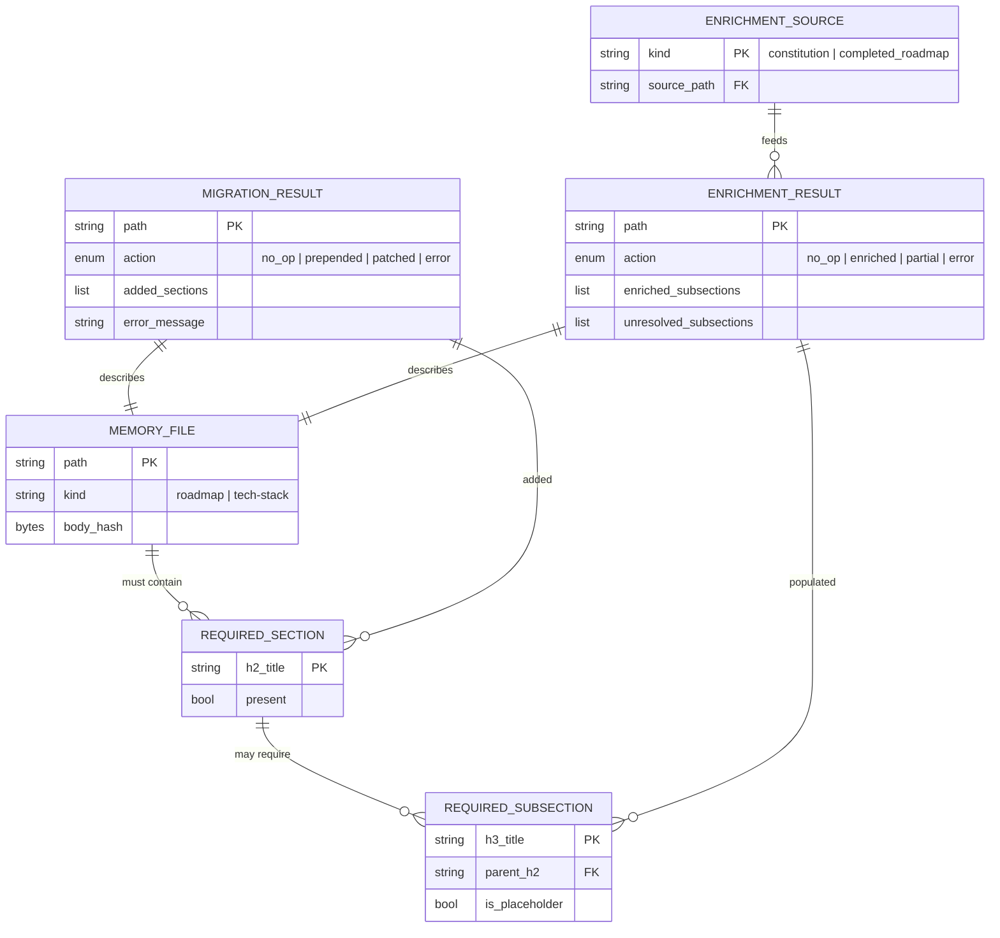
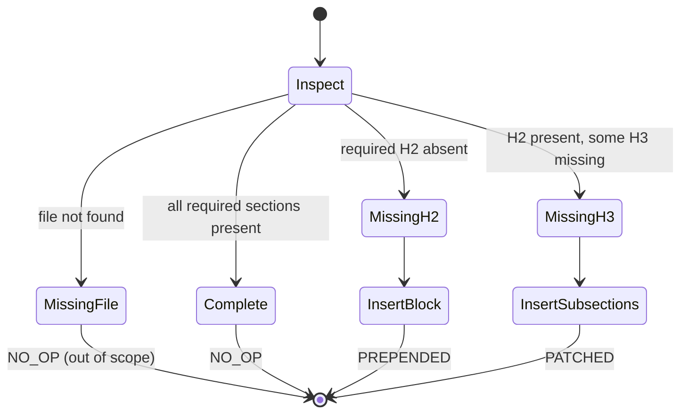
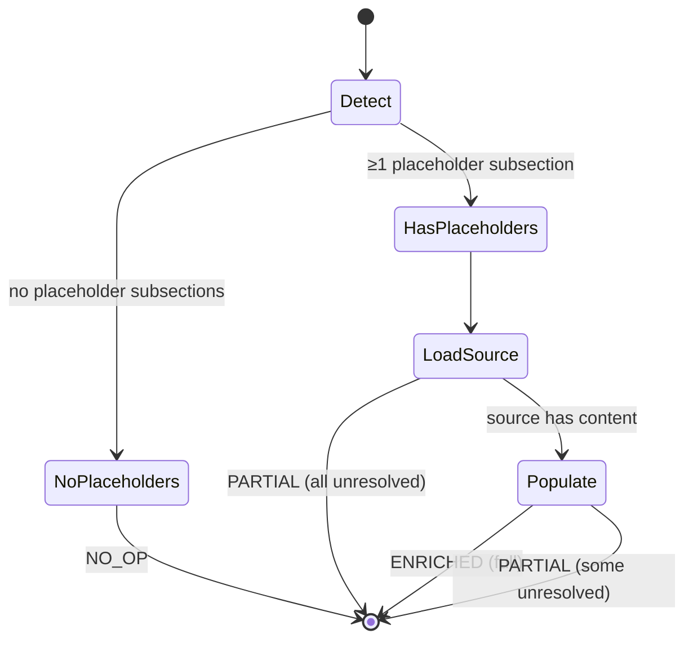

# Data Model: Memory Files Migration

**Feature**: `060-memory-files-migration`
**Date**: 2026-04-21

Like spec 059, this feature operates on markdown files, not a database.
"Entities" are structured in-memory objects the migrators and enrichers
manipulate.

## Entity Relationships

<!-- BEGIN:AUTO-GENERATED section="er-diagram" -->

<!-- END:AUTO-GENERATED -->

## Entities

### MemoryFile

Abstract supertype for `roadmap.md` and `tech-stack.md`.

| Attribute | Type | Notes |
|:----------|:-----|:------|
| `path` | `Path` | Absolute path; always under `<project>/.doit/memory/`. |
| `kind` | `Literal["roadmap", "tech-stack"]` | Which migrator/enricher handles this file. |
| `raw_bytes` | `bytes` | Full file contents read once at the start of migration. |
| `body_hash` | `bytes` | SHA-256 of `raw_bytes`, used to prove preservation. |

### RequiredSection

An H2 heading the memory contract enforces on a given file.

| File | `h2_title` | Required subsections | Source of truth |
|:-----|:-----------|:---------------------|:----------------|
| roadmap.md | `Active Requirements` | `P1`, `P2`, `P3`, `P4` | `_validate_roadmap` in `memory_validator.py` |
| tech-stack.md | `Tech Stack` | `Languages`, `Frameworks`, `Libraries` | `_validate_tech_stack` |

A contract test enforces that `REQUIRED_ROADMAP_H2` /
`REQUIRED_TECHSTACK_H2` match the validator's expectations.

### RequiredSubsection

An H3 heading that must appear under a specific `RequiredSection`.

| Attribute | Type | Notes |
|:----------|:-----|:------|
| `h3_title` | `str` | Case-insensitive comparison when checking presence (matches validator behaviour). |
| `parent_h2` | `str` | Must match its `RequiredSection.h2_title`. |
| `is_placeholder` | `bool` | `True` when the body of the subsection contains an entry from `PLACEHOLDER_TOKENS` — enrichers use this to decide whether to overwrite. |

### MigrationResult

Return type of `RoadmapMigrator.migrate()` / `TechStackMigrator.migrate()`.

Schema-identical to spec 059's `MigrationResult` — the same frozen
dataclass is **reused** (imported from
`doit_cli.services.constitution_migrator` rather than redefined). Fields:

| Attribute | Type | Notes |
|:----------|:-----|:------|
| `path` | `Path` | The file acted on. |
| `action` | `MigrationAction` | `NO_OP`, `PREPENDED`, `PATCHED`, `ERROR`. |
| `added_fields` | `tuple[str, ...]` | H2 and H3 headings added this run (schema order). |
| `preserved_body_hash` | `bytes \| None` | SHA-256 of the pre-existing body bytes. |
| `error` | `DoitError \| None` | Populated only when `action == ERROR`. |

### EnrichmentResult

Return type of `RoadmapEnricher.enrich()` / `TechStackEnricher.enrich()`.
Schema-identical to spec 059's `EnrichmentResult` — reused from
`doit_cli.services.constitution_enricher`.

| Attribute | Type | Notes |
|:----------|:-----|:------|
| `path` | `Path` | Target file. |
| `action` | `EnrichmentAction` | `NO_OP`, `ENRICHED`, `PARTIAL`, `ERROR`. |
| `enriched_fields` | `tuple[str, ...]` | Subsection titles populated this run. |
| `unresolved_fields` | `tuple[str, ...]` | Subsection titles where source was empty or missing. |
| `preserved_body_hash` | `bytes \| None` | SHA-256 of bytes outside the modified regions. |
| `error` | `DoitError \| None` | |

### EnrichmentSource

A read-only projection of another memory file used as inference source.

| Source | Used by | Parsed for |
|:-------|:--------|:-----------|
| `.doit/memory/constitution.md` | `TechStackEnricher` | `## Tech Stack`, `## Infrastructure`, `## Deployment` H2 sections and their bullet children |
| `.doit/memory/constitution.md` | `RoadmapEnricher` | `### Project Purpose` first sentence (for Vision replacement) |
| `.doit/memory/completed_roadmap.md` | `RoadmapEnricher` | Table rows under `## Recently Completed` |

## State Transitions

Both migrators follow the same four-state decision tree (identical to
spec 059's `migrate_constitution`):

State semantics:

- **Inspect**: scan for `## <h2_title>` and, if present, scan
  `_subheadings_under(source, h2_title)` for the required H3 set.
- **MissingH2 → InsertBlock**: emit the full H2 + H3 block (with
  placeholder stubs) at end-of-file, preserve body.
- **MissingH3 → InsertSubsections**: emit only the missing H3 stubs,
  inserted at the end of the existing H2 section.
- Error branch: mirrors spec 059 — I/O failures become `ERROR` with a
  populated `DoitError`.

The enrichers have a simpler three-state flow:

## Derived Invariants

1. **Body preservation** (FR-007, FR-017, SC-002): SHA-256 of
   byte-ranges outside modified sections is unchanged.
2. **Idempotency** (FR-008, FR-009, SC-005): running migrate twice
   produces `NO_OP` on the second run with zero-byte diff.
3. **No partial writes on error** (FR-011, SC-007): `write_text_atomic`
   guarantees original bytes survive any I/O failure.
4. **No H3 reordering**: when patching missing subsections, existing H3
   ordering is preserved; new H3s are appended at the end of the H2
   section in canonical (schema) order.
5. **Enricher non-overwrite** (FR-013): only subsections flagged
   `is_placeholder=True` are written; all other subsections are
   preserved byte-for-byte.
