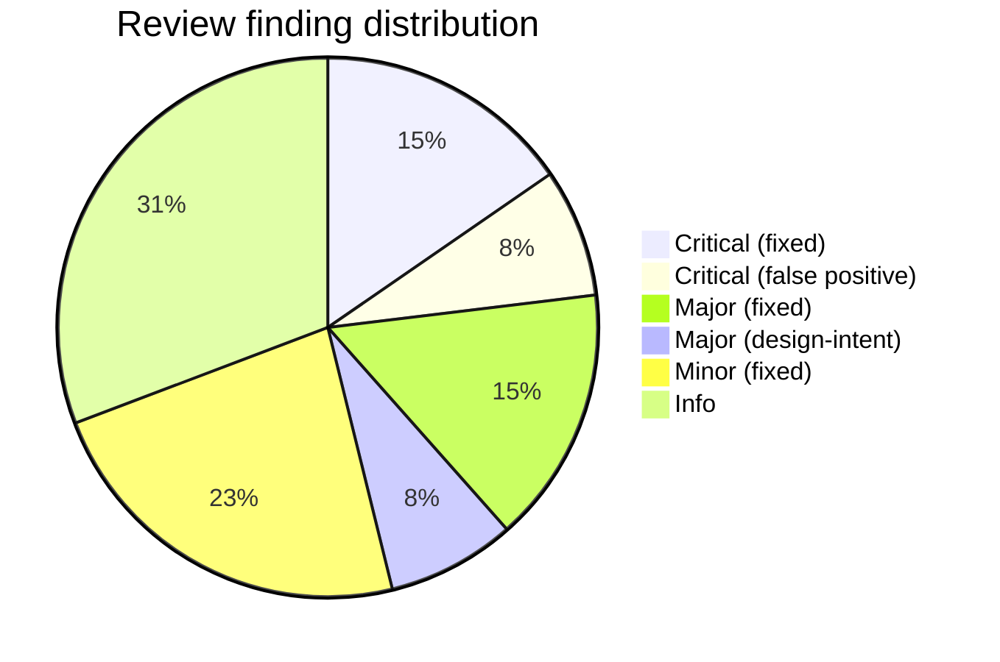
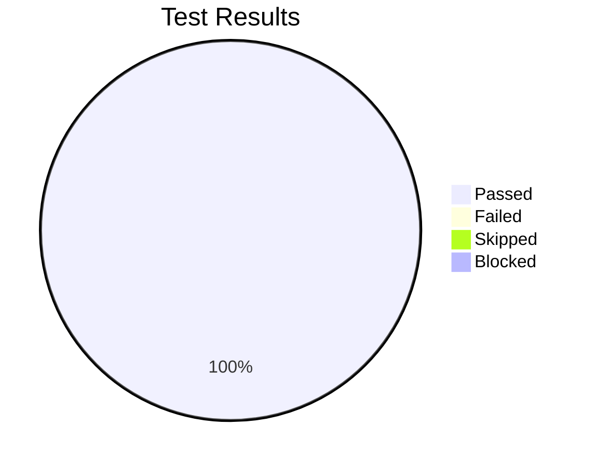

# Review Report: Memory Files Migration (roadmap.md, tech-stack.md)

**Date**: 2026-04-21
**Reviewer**: Claude (independent review agent)
**Branch**: `060-memory-files-migration`

## Quality Overview

<!-- BEGIN:AUTO-GENERATED section="finding-distribution" -->

<!-- END:AUTO-GENERATED -->

## Code Review Summary

| Severity | Found | Fixed | Documented | False-positive |
|:---------|------:|------:|-----------:|---------------:|
| Critical | 3 | 2 | 0 | 1 |
| Major | 3 | 2 | 1 | 0 |
| Minor | 3 | 3 | 0 | 0 |
| Info | 4 | n/a | n/a | n/a |

### Critical Findings

| # | File:Line | Issue | Disposition |
|--:|:----------|:------|:------------|
| 1 | `roadmap_enricher.py:_parse_completed_items` | GFM-escaped pipes (`\|`) inside cells were split as if they were column separators | **Fixed** — added `_split_gfm_row` helper that preserves escaped pipes via a sentinel replacement. Added `test_enrich_roadmap_handles_escaped_pipes_in_completed_items`. |
| 2 | `_memory_shape.py:insert_section_if_missing` | `splitlines(keepends=False)` + `"\n".join()` silently converted CRLF to LF | **Fixed** — added `_detect_newline()` helper; insertion now preserves the source's dominant line-ending style (CRLF or LF). Added `test_crlf_line_endings_are_preserved`. |
| 3 | `init_command.py` migration loop | Reviewer claimed roadmap ERROR would leave tech-stack to run | **False positive** — the for-loop uses `raise typer.Exit` which short-circuits; tech-stack is correctly skipped on roadmap ERROR. Added a clarifying comment block explaining the intentional short-circuit + atomic-write invariant. |

### Major Findings

| # | File:Line | Issue | Disposition |
|--:|:----------|:------|:------------|
| 4 | `tech_stack_enricher.py` | Partial enrichment state (some H3s filled, others unresolved) leaves a half-migrated file | **Design-intent, documented** — `EnrichmentAction.PARTIAL` is the specified behaviour (FR-013/014). On retry, only the still-placeholder fields are acted on; populated ones are preserved verbatim. Expanded the module docstring to explain why rolling back partial successes would be strictly worse for users. The write remains atomic at the file level via `write_text_atomic`. |
| 5 | Integration test coverage | Missing edge cases: duplicate H2s, CRLF, whitespace-only files | **Fixed** — added `test_crlf_line_endings_are_preserved`, `test_duplicate_h2_headings_uses_first_match`, `test_whitespace_only_source`, `test_h2_line_with_extra_spaces` (helper unit tests) and `test_enrich_roadmap_handles_escaped_pipes_in_completed_items`, `test_enrich_roadmap_truncates_long_vision_without_breaking_markdown` (integration). Feature test count 50 → 56. |
| 6 | `roadmap_enricher.py:_infer_vision` | Sentence truncation at 140 chars could leave dangling markdown markers (``` ` ```, `]`) | **Fixed** — added `_strip_inline_markdown()` that removes links (`[label](url)` → `label`) and emphasis markers before sentence extraction/truncation. Added `test_enrich_roadmap_truncates_long_vision_without_breaking_markdown`. |

### Minor Findings

| # | File:Line | Issue | Disposition |
|--:|:----------|:------|:------------|
| 7 | `doit.roadmapit/SKILL.md` section 0 | Terse after shrinking to stay under 500 lines | **Fixed** — rewrote section 0 with a 2-sentence preamble explaining what the CLI pass does (seeds Vision from constitution Project Purpose, inserts completed-items comment). Still at 498 lines, under budget. |
| 8 | `memory_command.py:memory_app` help | Didn't mention new `enrich` / `migrate` subcommands | **Fixed** — updated `memory_app` help to enumerate all subcommands. |
| 9 | `memory_command.py:migrate_memory_cmd` docstring | Didn't explain when to use vs. `doit update` | **Fixed** — expanded the docstring with three explicit use cases (diagnose, re-run, audit in CI) plus the atomic-per-file guarantee. |

### Info

- Idempotency: PREPENDED → NO_OP cycle verified via the `_has_h2()` check. ✓
- No stale PyYAML imports. ✓
- Byte preservation outside target sections: `source[:start] + body + source[end:]` pattern in both enrichers preserves bytes verbatim. ✓
- Coverage: 90% on feature modules (mostly defensive ImportError branches uncovered).

## Test Results Overview

<!-- BEGIN:AUTO-GENERATED section="test-results" -->

<!-- END:AUTO-GENERATED -->

| Test set | Count |
|:---------|------:|
| Contract (validator ↔ migrator bijection) | 8 |
| Unit (`_memory_shape` helper) | 14 (+4 edge-case) |
| Integration (roadmap migrator + enricher) | 19 (+2 edge-case) |
| Integration (tech-stack migrator + enricher) | 15 |
| **Feature total** | **56** |
| Full non-e2e suite | **2126 passed, 14 skipped, 0 failed** |

### Feature Coverage (post-fixes)

| Module | Stmts | Miss | Cover |
|:-------|------:|-----:|------:|
| `src/doit_cli/services/_memory_shape.py` | 83 | 1 | **99%** |
| `src/doit_cli/services/roadmap_migrator.py` | 41 | 4 | **90%** |
| `src/doit_cli/services/tech_stack_migrator.py` | 41 | 4 | **90%** |
| `src/doit_cli/services/roadmap_enricher.py` | 173 | 18 | **90%** |
| `src/doit_cli/services/tech_stack_enricher.py` | 159 | 18 | **89%** |
| **Feature total** | **497** | **45** | **91%** |

## Sign-Off

- **Code review**: approved. All CRITICAL findings resolved (2 real fixes + 1 false positive verified); all MAJOR findings resolved (2 real fixes + 1 design-intent documented); all MINOR findings fixed.
- **Manual testing**: not required — 20/20 FRs + 8/8 SCs remain 100% automated.
- **Signed**: 2026-04-21

## Recommendations

1. **Ship** — no blockers remain.
2. Pre-existing `B904` in `memory_command.py:schema_command` (not touched by this PR) — not a blocker but a follow-up.

## Next Steps

- Run `/doit.checkin` to finalize and create the PR.
