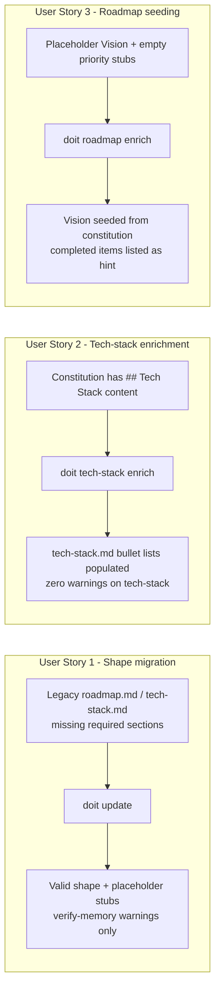

# Feature Specification: Memory Files Migration (roadmap.md, tech-stack.md)

**Feature Branch**: `060-memory-files-migration`
**Created**: 2026-04-20
**Status**: Complete
**Input**: User description: "Extend the constitution-frontmatter migrator + enricher pattern from spec 059 to cover .doit/memory/roadmap.md and .doit/memory/tech-stack.md — detect missing required shape, prepend placeholders, preserve body byte-for-byte, and add CLI enrich subcommands that deterministically infer values from body/context so AI skills only need to resolve low-confidence fields."

**Depends on**: Spec [059 — Constitution Frontmatter Migration](../059-constitution-frontmatter-migration/spec.md) (establishes the migrator + enricher + atomic-write pattern this feature reuses).

## User Scenarios & Testing *(mandatory)*

### User Story 1 - Legacy projects get required roadmap/tech-stack sections without manual edits (Priority: P1)

A developer maintaining a project initialized before the memory contract landed runs `doit update`. Their `.doit/memory/roadmap.md` is missing the `## Active Requirements` section entirely (or has it without the P1-P4 priority subsections) and their `.doit/memory/tech-stack.md` is missing `## Tech Stack` or has it without any `### <Group>` subheadings. `doit update` detects each shape gap and inserts a placeholder section stub in place, preserving all existing content byte-for-byte. `doit verify-memory` then reports zero errors (warnings only, for the placeholder stubs).

**Why this priority**: Spec 059 closed the upgrade gap for `constitution.md`. Any project that ran `doit update` after 059 shipped will have that file valid-shape — but those same projects still fail `doit verify-memory` on `roadmap.md` and/or `tech-stack.md` if their shape predates the memory contract. Until this feature ships, users must hand-edit two more files. P1 completes the upgrade story.

**Independent Test**: On a project whose `.doit/memory/roadmap.md` is missing `## Active Requirements` and whose `.doit/memory/tech-stack.md` is missing `## Tech Stack`, run `doit update`. Confirm both files now contain the required sections with placeholder stubs, pre-existing prose is unchanged, and `doit verify-memory .` exits 0 with warnings (not errors).

**Acceptance Scenarios**:

1. **Given** `.doit/memory/roadmap.md` exists but has no `## Active Requirements` heading, **When** the developer runs `doit update`, **Then** a stub `## Active Requirements` section is appended (or inserted in a stable location) with placeholder subsections for P1/P2/P3/P4, and the pre-existing roadmap prose is preserved byte-for-byte.
2. **Given** `.doit/memory/roadmap.md` has `## Active Requirements` but lacks any `### P1`/`### P2`/… subsection, **When** the developer runs `doit update`, **Then** the missing priority subsections are added as placeholder stubs within the existing section.
3. **Given** `.doit/memory/tech-stack.md` has no `## Tech Stack` heading, **When** the developer runs `doit update`, **Then** the section is inserted with placeholder `### Languages` / `### Frameworks` / `### Libraries` subsections and the rest of the file is preserved.
4. **Given** both files already have complete, valid structure, **When** the developer runs `doit update`, **Then** neither file is modified (idempotent).
5. **Given** the migrated files, **When** the developer runs `doit verify-memory .`, **Then** the command exits 0 and reports WARNING-severity issues for the placeholder stubs (no errors).

---

### User Story 2 - Tech-stack enrichment from the constitution (Priority: P2)

After `doit update` writes placeholder stubs to `tech-stack.md`, the developer runs `doit tech-stack enrich`. The CLI reads `.doit/memory/constitution.md` for any legacy `## Tech Stack` / `## Infrastructure` / `## Deployment` content (many pre-0.3.0 projects duplicated tech stack information inside the constitution), extracts the bullet lists verbatim, and writes them into the corresponding subsections of `tech-stack.md`. Existing non-placeholder content in `tech-stack.md` is preserved. `doit verify-memory` reports zero warnings afterward.

**Why this priority**: Tech-stack content is structurally regular (heading → bullet list) and historically was part of the constitution template. This is the highest-yield deterministic inference available — users who have a filled-in constitution can skip hand-editing tech-stack entirely. Lower than P1 because it requires P1 to already have run.

**Independent Test**: Starting from a project whose `constitution.md` has populated `## Tech Stack` / `## Infrastructure` / `## Deployment` sections and whose `tech-stack.md` is placeholder-stubbed (the P1 output), invoke `doit tech-stack enrich`. Confirm the corresponding sections in `tech-stack.md` now contain the verbatim bullet lists from the constitution, and `doit verify-memory .` reports zero warnings on `tech-stack.md`.

**Acceptance Scenarios**:

1. **Given** `constitution.md` contains a `## Tech Stack` section with `### Languages`, `### Frameworks`, `### Libraries` subsections populated with bullet lists, **When** the developer runs `doit tech-stack enrich`, **Then** the same subsections in `tech-stack.md` are populated with the same bullet items, and the placeholder stubs are removed.
2. **Given** `tech-stack.md` already has non-placeholder content in a subsection, **When** the developer runs `doit tech-stack enrich`, **Then** the existing content is preserved and only placeholder-stubbed subsections are filled in.
3. **Given** `constitution.md` has no `## Tech Stack` section, **When** the developer runs `doit tech-stack enrich`, **Then** the CLI reports `unresolved_fields` listing every subsection it could not populate (exit code 1) and leaves the placeholder stubs in place.

---

### User Story 3 - Roadmap stubs are seeded from completed roadmap + project context (Priority: P3)

After `doit update` writes placeholder stubs to `roadmap.md`, the developer runs `doit roadmap enrich`. The CLI reads `.doit/memory/completed_roadmap.md` (if present) and `specs/*/spec.md` files to seed the priority sections with:

1. A **Vision** paragraph inferred from the first sentence of the constitution's `### Project Purpose` (same heuristic as spec 059's `tagline` inference).
2. A commented list of `completed_roadmap.md` items in an HTML comment at the top of `## Active Requirements`, so users can see what's already shipped without re-adding them.

Priority sections themselves (P1/P2/P3/P4) are **not** populated — those require product judgment. They remain as empty placeholder stubs with a short `<!-- Add items here -->` hint. `doit verify-memory` continues to flag them as WARNING placeholders until the user edits them.

**Why this priority**: Roadmap content is prospective and opinionated — deterministic inference for priority-ranked requirements is a trap. The P3 scope is intentionally narrow: seed only what can be derived from historical context. The user-facing benefit is that the placeholder stubs land with useful scaffolding rather than empty markers.

**Independent Test**: On a project with a populated `completed_roadmap.md` and a constitution with a `### Project Purpose` section, run `doit roadmap enrich`. Confirm `roadmap.md` now has a Vision paragraph matching the constitution's first purpose sentence and a commented-out block listing completed items near the top of `## Active Requirements`. Priority subsections still contain placeholder hints.

**Acceptance Scenarios**:

1. **Given** `constitution.md` has a non-placeholder `### Project Purpose` section and `roadmap.md` has a placeholder Vision stub, **When** the developer runs `doit roadmap enrich`, **Then** the Vision stub is replaced with the first sentence of the project purpose.
2. **Given** `completed_roadmap.md` lists recently completed items, **When** the developer runs `doit roadmap enrich`, **Then** an HTML-comment block listing those items is inserted near the top of `## Active Requirements` to avoid re-adding them.
3. **Given** `roadmap.md` has populated priority sections already, **When** the developer runs `doit roadmap enrich`, **Then** only the Vision and completed-items-comment are (re-)written; priority subsections are preserved byte-for-byte.

---

### Edge Cases

- **Missing files entirely**: when `.doit/memory/roadmap.md` or `.doit/memory/tech-stack.md` does not exist at all, this feature does **not** apply. File creation is `doit init`'s job (covered by `copy_memory_templates`). The migrator is a no-op for missing files (consistent with spec 059).
- **File exists but is empty**: treated the same as "all required sections missing" — migration inserts the full stub set.
- **Duplicate subsections**: if a file already has two `### Languages` subsections (user error), migration does **not** deduplicate — it leaves the file alone except for genuinely-missing sections. Deduplication is out of scope.
- **Constitution without a legacy Tech Stack section**: `doit tech-stack enrich` returns `unresolved_fields` listing every subsection it could not populate (exit code 1, matching the spec-059 enricher convention). Placeholder stubs remain; user must hand-edit or run `/doit.constitution cleanup` first.
- **Subsection ordering**: enrichment preserves the existing order of headings in the target file. If `tech-stack.md` has `### Libraries` before `### Languages`, enrichment populates them in-place without reordering.
- **Partial user edits mid-migration**: if a user has manually filled in `### Languages` but not `### Frameworks`, enrichment only touches `### Frameworks` (and other placeholder-tagged subsections).

## User Journey Visualization

<!-- BEGIN:AUTO-GENERATED section="user-journey" -->

<!-- END:AUTO-GENERATED -->

## Requirements *(mandatory)*

### Functional Requirements

- **FR-001**: `doit update` MUST detect whether `.doit/memory/roadmap.md` contains a `## Active Requirements` H2 section.
- **FR-002**: When `## Active Requirements` is missing from `roadmap.md`, `doit update` MUST insert the section with placeholder subsections for priorities `P1`, `P2`, `P3`, `P4`.
- **FR-003**: When `## Active Requirements` exists but lacks one or more of the required priority subsections (`### P1`, `### P2`, `### P3`, `### P4`), `doit update` MUST add only the missing subsections as placeholder stubs, preserving existing priority content.
- **FR-004**: `doit update` MUST detect whether `.doit/memory/tech-stack.md` contains a `## Tech Stack` H2 section.
- **FR-005**: When `## Tech Stack` is missing from `tech-stack.md`, `doit update` MUST insert the section with placeholder `### Languages`, `### Frameworks`, and `### Libraries` subsections.
- **FR-006**: When `## Tech Stack` exists but has no `### <Group>` subsections, `doit update` MUST add the three default subsections as placeholder stubs.
- **FR-007**: During any roadmap or tech-stack shape migration, body content outside the modified sections MUST be preserved byte-for-byte.
- **FR-008**: When both files are already valid-shape (required sections and subsections present), `doit update` MUST leave them unchanged (idempotent).
- **FR-009**: Running `doit update` twice in a row on the same file MUST produce a zero-byte diff on the second run.
- **FR-010**: `doit update` MUST remain non-interactive throughout the roadmap / tech-stack migration path.
- **FR-011**: When an unexpected I/O error occurs during migration, `doit update` MUST surface a clear error and leave the target file byte-identical to its pre-run state (atomic write).
- **FR-012**: `doit tech-stack enrich` MUST read `.doit/memory/constitution.md` and extract the verbatim bullet content from any `## Tech Stack`, `## Infrastructure`, or `## Deployment` section present there.
- **FR-013**: `doit tech-stack enrich` MUST populate placeholder-stubbed subsections in `.doit/memory/tech-stack.md` with the extracted bullet content, preserving any existing non-placeholder subsection content verbatim.
- **FR-014**: `doit tech-stack enrich` MUST report `unresolved_fields` (via `--json` output and exit code `1`) for every subsection it could not populate from available context.
- **FR-015**: `doit roadmap enrich` MUST replace a placeholder Vision paragraph in `roadmap.md` with the first sentence of `constitution.md`'s `### Project Purpose` section when that section is non-placeholder.
- **FR-016**: `doit roadmap enrich` MUST insert an HTML-comment block listing `completed_roadmap.md` items near the top of `## Active Requirements`, so users can see what has shipped without re-listing it.
- **FR-017**: Both enrich CLIs MUST preserve the bodies of their target files byte-for-byte except for the placeholder regions they intentionally modify.
- **FR-018**: `doit verify-memory` MUST continue to classify the placeholder stubs introduced by this feature's migrator as WARNING severity, consistent with spec 059.
- **FR-019**: The migrator and enricher MUST use the same `write_text_atomic` helper introduced in spec 059 for crash-safe writes.
- **FR-020**: The `/doit.constitution`, `/doit.roadmapit`, and `doit.documentit` skills MAY call the new enrich CLIs to do mechanical pre-work; they remain responsible for any LLM-driven content that depends on product judgment.

### Key Entities

- **Memory File**: One of `.doit/memory/roadmap.md` or `.doit/memory/tech-stack.md`. Markdown-only, no YAML frontmatter.
- **Required Section**: An H2 heading the memory contract enforces — `## Active Requirements` for roadmap, `## Tech Stack` for tech-stack.
- **Required Subsection**: An H3 heading enforced under a required section — P1/P2/P3/P4 for roadmap, at least one of Languages/Frameworks/Libraries for tech-stack.
- **Placeholder Stub**: An auto-inserted section skeleton containing a `[PLACEHOLDER]` marker. Detected by `doit verify-memory` as WARNING severity.
- **Source Section**: In the constitution (`## Tech Stack`, `## Infrastructure`, `## Deployment`) from which `doit tech-stack enrich` extracts verbatim content.

## Success Criteria *(mandatory)*

### Measurable Outcomes

- **SC-001**: A project whose `.doit/memory/roadmap.md` or `tech-stack.md` lacks the required sections passes `doit verify-memory .` with exit code 0 (warnings allowed, zero errors) immediately after `doit update` completes.
- **SC-002**: The SHA-256 of the pre-existing body bytes (everything outside auto-inserted sections) is identical before and after migration.
- **SC-003**: After `doit tech-stack enrich` runs on a project whose constitution has legacy Tech Stack / Infrastructure / Deployment sections, `doit verify-memory .` reports zero warnings on `tech-stack.md`.
- **SC-004**: Migration completes in under 500 ms per file for files up to 50 KB.
- **SC-005**: Re-running `doit update` on migrated files produces a zero-byte diff.
- **SC-006**: 100% of the three required subsection keys (`Languages`, `Frameworks`, `Libraries` for tech-stack; `P1`, `P2`, `P3`, `P4` for roadmap) are present after the relevant migration runs.
- **SC-007**: When `doit tech-stack enrich` encounters an empty source (no constitution tech stack content), it exits `1` with `unresolved_fields` listing every unfilled subsection and no partial writes to `tech-stack.md`.
- **SC-008**: After `doit roadmap enrich` on a project with a populated constitution and completed roadmap, the Vision paragraph in `roadmap.md` matches the first sentence of the constitution's `### Project Purpose` section.

## Assumptions

- Spec 059 has shipped. This feature builds directly on its `ConstitutionMigrator` / `ConstitutionEnricher` / `atomic_write` primitives.
- The `PLACEHOLDER_TOKENS` registry in `memory_validator.py` (from pre-0.3.0 scaffolding) already covers the body-level placeholders this feature will emit. We reuse those tokens rather than inventing new ones — keeping a single source of truth.
- `.doit/memory/completed_roadmap.md` is the expected archive location per the `/doit.checkin` skill and pre-existing project convention. If it doesn't exist, the roadmap enricher simply skips the completed-items comment block.
- The memory validator's existing rules in `_validate_roadmap` and `_validate_tech_stack` (see `memory_validator.py`) are authoritative for "what counts as valid shape." The migrator's job is to make files satisfy those rules, not to redefine them.
- Tech-stack enrichment extracts **verbatim** bullet content from the constitution — no LLM smartening. If the constitution has unusual phrasing, the enriched `tech-stack.md` will carry that same phrasing forward. Users clean up through the skill flow.

## Out of Scope

- **Migration for `.doit/memory/completed_roadmap.md`**: that file is a read-mostly archive; the memory validator doesn't enforce required shape on it, so no migration is needed.
- **LLM-driven enrichment**: neither `doit tech-stack enrich` nor `doit roadmap enrich` makes any external API calls. All inference is deterministic string/heading parsing. AI-driven enrichment lives in the `/doit.constitution`, `/doit.roadmapit`, and `/doit.documentit` skills.
- **Content reordering**: when filling in missing subsections, the migrator appends them in canonical schema order. It does **not** reorder pre-existing subsections. Users who want clean-up can run the relevant skill.
- **Deduplication**: if a user has duplicate H2 or H3 headings, the migrator leaves the file alone (with a warning via `verify-memory`). Fixing duplicate headings is a user concern.
- **Roadmap priority-item generation**: inferring specific `P1` / `P2` items is deliberately out of scope. That requires product judgment and belongs to the `/doit.roadmapit` skill, not a deterministic CLI.
- **New CLI surfaces for `completed_roadmap.md` or `personas.md`**: out of scope; follow-up features if needed.
- **Schema evolution**: this spec targets the current memory contract. Future schema changes require a follow-up migration.
