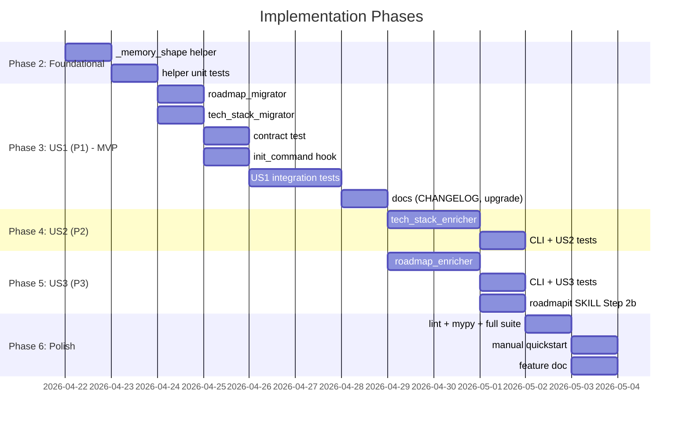

---

description: "Task list for memory-files migration (roadmap.md + tech-stack.md)"
---

# Tasks: Memory Files Migration (roadmap.md, tech-stack.md)

**Input**: Design documents from `/specs/060-memory-files-migration/`
**Prerequisites**: plan.md (required), spec.md (required for user stories), research.md, data-model.md, contracts/
**Depends on**: Spec [059](../059-constitution-frontmatter-migration/) — reuses `write_text_atomic`, `MigrationAction/Result`, `EnrichmentAction/Result`, `PLACEHOLDER_TOKENS`.

**Tests**: Contract + unit + integration tests are required per the project's Quality Standards principle.

**Organization**: Tasks grouped by user story (US1, US2, US3 in priority order) for independent implementation.

## Task Dependencies

<!-- BEGIN:AUTO-GENERATED section="task-dependencies" -->
```mermaid
flowchart TD
    subgraph "Phase 2: Foundational"
        T001[T001: _memory_shape helper]
        T002[T002 [P]: helper unit tests]
    end

    subgraph "Phase 3: US1 (P1) - MVP"
        T003[T003: roadmap_migrator]
        T004[T004 [P]: tech_stack_migrator]
        T005[T005: contract test]
        T006[T006: init_command hook]
        T007[T007 [P]: US1 roadmap integration tests]
        T008[T008 [P]: US1 tech-stack integration tests]
        T009[T009: CHANGELOG + upgrade.md]
    end

    subgraph "Phase 4: US2 (P2)"
        T010[T010: tech_stack_enricher]
        T011[T011: CLI enrich tech-stack]
        T012[T012: US2 integration tests]
    end

    subgraph "Phase 5: US3 (P3)"
        T013[T013: roadmap_enricher]
        T014[T014: CLI enrich roadmap + migrate]
        T015[T015: US3 integration tests]
        T016[T016: roadmapit SKILL Step 2b]
    end

    subgraph "Phase 6: Polish"
        T017[T017 [P]: ruff + mypy]
        T018[T018 [P]: full suite]
        T019[T019: manual quickstart]
        T020[T020 [P]: feature doc]
    end

    T001 --> T002
    T001 --> T003 & T004
    T003 & T004 --> T005
    T003 & T004 --> T006
    T006 --> T007 & T008
    T007 & T008 --> T009
    T004 --> T010 --> T011 --> T012
    T003 --> T013 --> T014 --> T015
    T013 --> T016
    T009 & T012 & T015 & T016 --> T017 & T018 & T020
    T017 & T018 --> T019
```
<!-- END:AUTO-GENERATED -->

## Phase Timeline

<!-- BEGIN:AUTO-GENERATED section="phase-timeline" -->

<!-- END:AUTO-GENERATED -->

## Format: `[ID] [P?] [Story] Description`

- **[P]**: Can run in parallel (different files, no dependencies)
- **[Story]**: `[US1]` / `[US2]` / `[US3]` on user-story tasks only
- Include exact file paths in descriptions

## Path Conventions

Single-project layout (per plan.md). All source under `src/doit_cli/`, all tests under `tests/` at repo root.

---

## Phase 1: Setup

No tasks. This feature is additive to an existing project; no dependencies, CLI top-level commands, or configuration are introduced.

---

## Phase 2: Foundational (Blocking Prerequisites)

**Purpose**: Shared section-insertion helper that both migrators depend on. No user story work can begin until this phase is complete.

- [x] T001 Create `src/doit_cli/utils/_memory_shape.py` (or `src/doit_cli/services/_memory_shape.py` per plan — pick the location spec 059 would have used for a shared helper; align with the existing pattern) with `insert_section_if_missing(source, h2_title, h3_titles, *, stub_body) -> tuple[str, list[str]]` per contracts/migrators.md §2. Case-insensitive heading match (mirroring `memory_validator._has_heading`). Appends missing H2 block at end-of-file; inserts missing H3 subsections at end of existing H2 section in canonical order; preserves all other bytes.
- [x] T002 [P] Add `tests/unit/services/test_memory_shape.py` covering: (a) H2 absent → full block appended at EOF; (b) H2 present + all H3s present → no change; (c) H2 present, some H3s missing → only missing H3s inserted at end of H2 section; (d) case-insensitive H2/H3 matching; (e) existing H3 ordering preserved; (f) body bytes outside the target section unchanged (SHA-256 comparison).

**Checkpoint**: Foundation ready — migrators can now be built on top of the shared helper.

---

## Phase 3: User Story 1 - Legacy roadmap/tech-stack get required sections (Priority: P1) 🎯 MVP

**Goal**: `doit update` detects `.doit/memory/roadmap.md` missing `## Active Requirements` (or lacking P1–P4 subsections) and `.doit/memory/tech-stack.md` missing `## Tech Stack` (or lacking Languages/Frameworks/Libraries subsections), inserts placeholder stubs in place, preserves existing prose byte-for-byte, and the result passes `doit verify-memory` with warnings only.

**Independent Test**: Run quickstart.md Scenario 1 + Scenario 5 end-to-end. Confirm both files gain required sections; pre-existing prose SHA-256 is unchanged; `doit verify-memory` exits 0 with WARNINGs only; re-running `doit update` is a zero-byte diff.

### Implementation for User Story 1

- [x] T003 [US1] Implement `src/doit_cli/services/roadmap_migrator.py` with `REQUIRED_ROADMAP_H2`, `REQUIRED_ROADMAP_H3_UNDER_ACTIVE_REQS` constants and `migrate_roadmap(path) -> MigrationResult` per contracts/migrators.md §3. Reuses `MigrationAction` / `MigrationResult` from `doit_cli.services.constitution_migrator`. Uses the shared `_memory_shape.insert_section_if_missing` for section insertion. Uses `write_text_atomic` for crash safety. Returns NO_OP for missing files. Never raises.
- [x] T004 [P] [US1] Implement `src/doit_cli/services/tech_stack_migrator.py` with `REQUIRED_TECHSTACK_H2`, `REQUIRED_TECHSTACK_H3_UNDER_TECH_STACK` constants and `migrate_tech_stack(path) -> MigrationResult` following the same pattern as T003. Stub body for each `### <Group>` subsection: `<!-- Add [PROJECT_NAME]'s <Group> here -->` (plus enough `[PROJECT_*]` tokens to cross the existing `PLACEHOLDER_THRESHOLD=3`). Never raises.
- [x] T005 [US1] Add `tests/contract/test_memory_files_migration_contract.py` asserting: (a) `REQUIRED_ROADMAP_H2 == ("Active Requirements",)` matches what `memory_validator._validate_roadmap` checks for (via behavioural test: build a minimal roadmap without it, verify the validator errors); (b) `REQUIRED_ROADMAP_H3_UNDER_ACTIVE_REQS == ("P1","P2","P3","P4")` — same pattern; (c) `REQUIRED_TECHSTACK_H2 == ("Tech Stack",)`; (d) `REQUIRED_TECHSTACK_H3_UNDER_TECH_STACK` covers at least `Languages` (matching `_validate_tech_stack`'s minimum-one-subheading rule); (e) both migrators import and reuse `MigrationAction` / `MigrationResult` from `constitution_migrator` (no duplicate class definitions).
- [x] T006 [US1] Modify `src/doit_cli/cli/init_command.py` to call `migrate_roadmap(project.doit_folder / "memory" / "roadmap.md")` and `migrate_tech_stack(project.doit_folder / "memory" / "tech-stack.md")` immediately after the existing spec-059 constitution migrator block. Per contracts/migrators.md §5: log on PREPENDED/PATCHED with the exact messages; on ERROR, map `DoitValidationError` → `ExitCode.VALIDATION_ERROR` and other errors → `ExitCode.FAILURE`; short-circuit on first ERROR.
- [x] T007 [P] [US1] Add `tests/integration/test_roadmap_migration.py` covering the US1 scenarios: (a) roadmap without `## Active Requirements` → PREPENDED, body preserved; (b) roadmap with `## Active Requirements` but no P1–P4 → PATCHED with all four added; (c) roadmap with partial P1–P4 → PATCHED with only missing ones; (d) complete roadmap → NO_OP with zero-byte diff; (e) malformed / missing-file edge cases → NO_OP. Use `tmp_path` fixtures and assert via `migrate_roadmap` direct call.
- [x] T008 [P] [US1] Add `tests/integration/test_tech_stack_migration.py` mirroring T007 for tech-stack: missing `## Tech Stack` → PREPENDED; missing subsections → PATCHED; complete → NO_OP; body preservation verified by SHA-256. Both test files also assert `doit verify-memory` on the tempdir fixture passes with warnings only after migration.
- [x] T009 [US1] Update `CHANGELOG.md` `[Unreleased]` section to note the two new migrators and the ensured shape. Update `docs/upgrade.md` by adding a short "0.3.x → 0.4.0 memory files migration" paragraph after the existing 059 section, pointing at `doit update` as the automatic path.

**Checkpoint**: US1 ships independently. Users on legacy projects run `doit update` and their two remaining memory files gain required shape, preserving user content.

---

## Phase 4: User Story 2 - Tech-stack enrichment from the constitution (Priority: P2)

**Goal**: After `doit update` stubs tech-stack.md, `doit memory enrich tech-stack` reads the constitution's `## Tech Stack` / `## Infrastructure` / `## Deployment` sections, extracts bullet content verbatim, and fills the matching subsections — leaving non-placeholder subsections untouched.

**Independent Test**: Run quickstart.md Scenario 2 and Scenario 4 end-to-end. Confirm populated constitution → populated tech-stack.md with verbatim bullets and zero `verify-memory` warnings; empty constitution source → PARTIAL (exit 1) with `unresolved_fields` listing every subsection and tech-stack.md byte-identical.

### Implementation for User Story 2

- [x] T010 [US2] Implement `src/doit_cli/services/tech_stack_enricher.py` with `enrich_tech_stack(path, *, project_root=None) -> EnrichmentResult` per contracts/migrators.md §4. Reuses `EnrichmentAction` / `EnrichmentResult` from `constitution_enricher`. Internal helpers to parse the three source sections (`## Tech Stack` with any `### <Group>` children, `## Infrastructure`, `## Deployment`) from `project_root / .doit/memory/constitution.md` — small regex-based markdown parsing, no external library. Auto-creates `### Infrastructure` / `### Deployment` subsections in tech-stack.md when constitution has that content but tech-stack doesn't yet.
- [x] T011 [US2] Extend `src/doit_cli/cli/memory_command.py` to register a new `enrich_app = typer.Typer(...)` subgroup and add `enrich tech-stack [PATH] [--json]` command invoking `enrich_tech_stack`. Exit codes: 0 (ENRICHED/NO_OP), 1 (PARTIAL), 2 (ERROR). Rich table output by default, JSON when `--json` passed. Wire `enrich_app` into `memory_app` via `memory_app.add_typer(enrich_app, name="enrich")`.
- [x] T012 [US2] Extend `tests/integration/test_tech_stack_migration.py` with US2 scenarios: (a) constitution has `## Tech Stack` + `### Languages / Frameworks / Libraries` bullets → ENRICHED, placeholders replaced with verbatim bullets, zero placeholder warnings; (b) constitution has `## Infrastructure` / `## Deployment` content → those subsections auto-created in tech-stack.md; (c) constitution without tech-stack content → PARTIAL, exit 1, `unresolved_fields` lists every subsection, tech-stack.md bytes unchanged; (d) tech-stack.md has existing non-placeholder subsection content → that subsection preserved; (e) CLI test via `CliRunner` exercising `doit memory enrich tech-stack --json`.

**Checkpoint**: US2 ships independently. Users with populated constitutions get tech-stack.md filled deterministically.

---

## Phase 5: User Story 3 - Roadmap Vision + completed-items seeding (Priority: P3)

**Goal**: `doit memory enrich roadmap` replaces a placeholder Vision paragraph with the first sentence of the constitution's `### Project Purpose`, and inserts an HTML-comment block listing `completed_roadmap.md` items near the top of `## Active Requirements`. Priority subsections (P1/P2/P3/P4) are intentionally not auto-populated.

**Independent Test**: Run quickstart.md Scenario 3 end-to-end. Confirm Vision paragraph is replaced with first sentence of Project Purpose; commented-out completed-items list appears near the top of Active Requirements; priority subsection hints remain untouched.

### Implementation for User Story 3

- [x] T013 [US3] Implement `src/doit_cli/services/roadmap_enricher.py` with `enrich_roadmap(path, *, project_root=None) -> EnrichmentResult` per contracts/migrators.md §4. Uses `constitution_enricher._infer_tagline` helper (expose it via `from .constitution_enricher import _infer_tagline` or lift into a shared util — prefer the latter if it cleans the interface). Parses `.doit/memory/completed_roadmap.md`'s "Recently Completed" GFM table rows. Emits HTML-comment block listing completed items; replaces placeholder Vision sentence; leaves priority subsections untouched.
- [x] T014 [US3] Extend `src/doit_cli/cli/memory_command.py` to add `enrich roadmap [PATH] [--json]` to the `enrich_app` subgroup (same file as T011 — task is sequential after T011), and add top-level `migrate [PATH] [--json]` umbrella that calls all three migrators (constitution, roadmap, tech-stack) in order and emits a combined report. Exit codes: 0 success; 1 if any migrator returned PARTIAL/NO_OP-with-unresolved (n/a for migrators — use 0); 2 if any errored (return first error's code).
- [x] T015 [US3] Extend `tests/integration/test_roadmap_migration.py` with US3 scenarios: (a) placeholder Vision + non-placeholder constitution Project Purpose → Vision replaced; (b) populated `completed_roadmap.md` → HTML-comment block inserted near top of `## Active Requirements`; (c) priority subsections remain untouched; (d) missing `completed_roadmap.md` → enricher still runs Vision replacement and reports no completed-items block; (e) CLI test via `CliRunner` exercising `doit memory enrich roadmap --json`; (f) `doit memory migrate` umbrella CLI test.
- [x] T016 [US3] Add **Step 2b: Detect and enrich roadmap placeholders** to `src/doit_cli/templates/skills/doit.roadmapit/SKILL.md` and `src/doit_cli/templates/commands/doit.roadmapit.md` (same content, mirrored). Step describes: (1) call `doit memory enrich roadmap --json` for deterministic pre-pass; (2) if exit 1, the `unresolved_fields` are the placeholders the skill should now address with LLM reasoning; (3) body preservation guarantee. Then run `uv build && uv tool install . --reinstall --force && doit sync-prompts --agent claude --skills --force doit.roadmapit && doit sync-prompts --agent copilot --force doit.roadmapit` to propagate to `.claude/skills/`, `.claude/commands/`, and `.github/prompts/`.

**Checkpoint**: US3 ships independently. `/doit.roadmapit` gains a deterministic first pass; LLM is used only for genuine priority-item judgment.

---

## Phase 6: Polish & Cross-Cutting Concerns

- [x] T017 [P] Run `ruff check src/ tests/` and fix any new-code lint errors (ignore pre-existing errors in files not touched by this PR). Run `pre-commit run mypy --hook-stage manual --files <every-file-this-feature-touched>` and fix type errors.
- [x] T018 [P] Run `pytest tests/ -x --tb=short --ignore=tests/e2e` and confirm no regressions. Expected: all new tests pass, plus the full existing suite (including the 40 spec-059 feature tests).
- [x] T019 Execute `specs/060-memory-files-migration/quickstart.md` scenarios 1, 4, and 5 manually against a `mktemp -d` fixture project. Scenarios 2 and 3 are covered by automated integration tests; only run them manually if smoke-testing end-to-end behavior. Record results in `specs/060-memory-files-migration/test-report.md`.
- [x] T020 [P] Add `docs/features/060-memory-files-migration.md` (short feature doc, one page, referencing spec.md, plan.md, and the three enricher CLIs) and add its row to the auto-generated `docs/index.md` Features table.

---

## Dependencies & Execution Order

### Phase Dependencies

- **Phase 1 (Setup)**: empty — skip directly to Phase 2.
- **Phase 2 (Foundational)**: no prerequisites; blocks all user stories (migrators depend on the shared helper).
- **Phase 3 (US1)**: depends on Phase 2.
- **Phase 4 (US2)**: depends on Phase 3 T004 (tech_stack_migrator must exist for enricher to have a target file shape). US2 can start in parallel with US3.
- **Phase 5 (US3)**: depends on Phase 3 T003 (roadmap_migrator).
- **Phase 6 (Polish)**: depends on US1 + US2 + US3 completion.

### User Story Dependencies

- **US1 (P1)**: depends on Phase 2. Independently deliverable as MVP.
- **US2 (P2)**: depends on US1's `tech_stack_migrator` producing placeholder-stubbed output. Independently testable via `enrich_tech_stack` direct calls on hand-crafted fixtures.
- **US3 (P3)**: depends on US1's `roadmap_migrator` for the same reason. Independent of US2.

### Within Each User Story

- Migrator / enricher implementation before CLI registration.
- Implementation before integration tests.
- Feature code before docs / CHANGELOG.

### Parallel Opportunities

- T003 and T004 are different files — can run in parallel.
- T007 and T008 are different files — can run in parallel once T006 is done.
- US2 and US3 implementation (T010–T012 and T013–T016) are disjoint and can run in parallel after Phase 3.
- T017, T018, T020 in polish phase are independent.

---

## Parallel Example: Phase 3 opener

```bash
# After T002 completes, these run in parallel — different files, no dependencies:
Task: "Implement migrate_roadmap in src/doit_cli/services/roadmap_migrator.py"
Task: "Implement migrate_tech_stack in src/doit_cli/services/tech_stack_migrator.py"
```

## Parallel Example: US1 integration tests

```bash
# After T006 (init hook) lands, these run in parallel:
Task: "US1 integration tests for roadmap in tests/integration/test_roadmap_migration.py"
Task: "US1 integration tests for tech-stack in tests/integration/test_tech_stack_migration.py"
```

---

## Implementation Strategy

### MVP First (US1 only)

1. Complete Phase 2 (T001, T002).
2. Complete Phase 3 (T003–T009).
3. **STOP and VALIDATE**: run quickstart.md Scenarios 1 and 5.
4. Ship 0.4.0-rc1 — every legacy upgrading user benefits.

### Incremental Delivery

1. MVP ships (US1).
2. Add US2 (T010–T012). Ship 0.4.0-rc2 — tech-stack enrichment available.
3. Add US3 (T013–T016). Ship 0.4.0-rc3 — roadmap enrichment + unified migrate CLI.
4. Polish (T017–T020). Tag 0.4.0.

### Parallel Team Strategy

With two developers after Phase 3 lands:

1. Dev A: US2 (T010 → T011 → T012).
2. Dev B: US3 (T013 → T014 → T015 → T016).
3. T011 and T014 touch the same file (`memory_command.py`). Sequence them or merge into a single CLI-wiring task.
4. Both converge on polish.

---

## Notes

- Total tasks: **20** (within the 10–30 target range).
- Every task has a stable `T0NN` ID, exact file path, and correct `[P]`/`[USn]` labeling.
- No circular dependencies (verified by the dependency flowchart — DAG with single sink at polish).
- All manual-testable items (skill-side Step 2b) have an automated counterpart via the new CLI enrichers — no MT-* items required, consistent with the practice established by spec 059.
