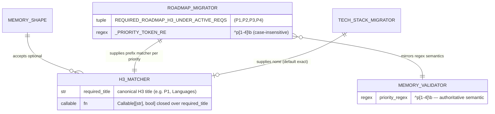
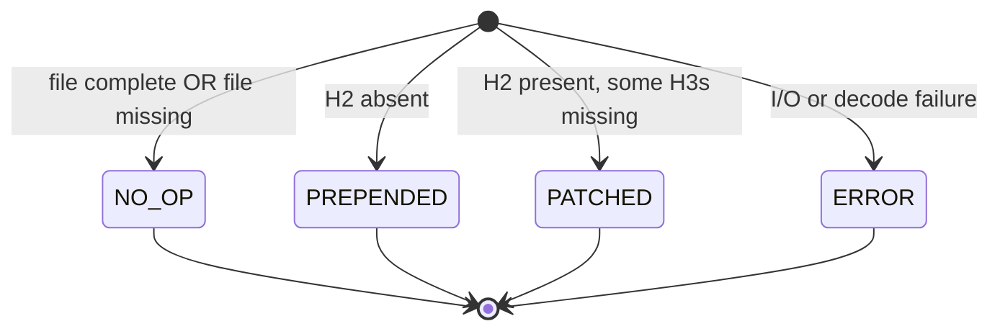

# Data Model: Fix Roadmap Migrator H3 Matching

**Feature**: 061-fix-roadmap-h3-matching
**Date**: 2026-04-21

This feature is a behavioural fix at the matching layer. No persistent data
schema changes — no new fields in `MigrationResult`, no new files on disk,
no new validator issue codes. The only "model" is a new type alias and a
per-H3 matcher mapping in the migrator.

---

## ER Diagram

<!-- BEGIN:AUTO-GENERATED section="er-diagram" -->

<!-- END:AUTO-GENERATED -->

---

## Types (in-memory only — no persistence)

### `H3Matcher` type alias

**Location**: `src/doit_cli/services/_memory_shape.py`

```python
from collections.abc import Callable, Mapping

H3Matcher = Callable[[str], bool]
"""Predicate applied to an existing H3 heading title.

Receives the existing H3 heading text (already stripped of leading/trailing
whitespace by the caller). Returns True when the existing heading should be
treated as satisfying the required H3 that the matcher is associated with.

Used as the value type in the ``matchers`` mapping passed to
``insert_section_if_missing``.
"""
```

### `insert_section_if_missing` parameter addition

**Location**: `src/doit_cli/services/_memory_shape.py`

New keyword-only parameter:

```python
def insert_section_if_missing(
    source: str,
    h2_title: str,
    h3_titles: tuple[str, ...],
    *,
    stub_body: Callable[[str], str],
    matchers: Mapping[str, H3Matcher] | None = None,
) -> tuple[str, list[str]]:
    ...
```

**Semantics**:

- `matchers is None` (default): current spec-060 behaviour. Every required H3
  is checked with exact case-insensitive equality against existing H3 titles.
- `matchers[required_title]` present: when checking whether the required H3
  titled `required_title` is satisfied, iterate the existing H3 titles and
  consider the required one present iff any existing title makes the matcher
  return True.
- `matchers[required_title]` absent (key not in mapping): fall back to
  exact-case-insensitive equality. This lets callers override matching
  selectively per H3 without having to supply matchers for all of them.

**Invariants**:

- The helper never calls a matcher on a stripped title containing a newline
  — it always stripes before comparison.
- Matchers only influence the "is present?" decision. They do NOT influence
  insertion ordering, stub body, or H2 handling.
- Matchers are closed under identity for the default (`None` ≡ empty
  mapping ≡ no override).

### `_PRIORITY_MATCHERS` in `roadmap_migrator`

**Location**: `src/doit_cli/services/roadmap_migrator.py`

```python
import re
from collections.abc import Mapping

from ._memory_shape import H3Matcher

def _priority_matcher(required_title: str) -> H3Matcher:
    token = required_title.strip().lower()
    pattern = re.compile(rf"^{re.escape(token)}\b", re.IGNORECASE)
    return lambda existing: bool(pattern.match(existing.strip()))

_PRIORITY_MATCHERS: Mapping[str, H3Matcher] = {
    p: _priority_matcher(p) for p in REQUIRED_ROADMAP_H3_UNDER_ACTIVE_REQS
}
```

The mapping is frozen at module import (safe: `REQUIRED_ROADMAP_H3_UNDER_ACTIVE_REQS`
is a `Final[tuple]`). `migrate_roadmap` passes this mapping straight through
to `insert_section_if_missing`.

---

## State Machine

No state transitions added or modified. The existing `MigrationAction`
state machine from spec 059 continues unchanged:

<!-- BEGIN:AUTO-GENERATED section="migration-action-state" -->

<!-- END:AUTO-GENERATED -->

The only behavioural shift is which (source, required) combinations route to
NO_OP vs PATCHED: decorated headings that currently route to PATCHED will
post-fix route to NO_OP. No new action variants.

---

## Relationships (textual)

- `_memory_shape.insert_section_if_missing` is called by exactly two modules
  today: `roadmap_migrator.migrate_roadmap` (opts into custom matchers) and
  `tech_stack_migrator.migrate_tech_stack` (does not — uses default).
- `memory_validator._validate_roadmap` remains the authoritative source of
  truth for "valid priority H3" semantics. `roadmap_migrator._PRIORITY_MATCHERS`
  mirrors its regex; drift between the two is prevented by the new contract
  test in US3.
- No changes to `constitution_migrator`, `roadmap_enricher`,
  `tech_stack_enricher`, or the `MigrationResult` / `EnrichmentResult`
  dataclasses.

---

## Validation rules (unchanged)

The `memory_validator` rules for roadmap priority subsections remain:

- `## Active Requirements` must exist → ERROR when missing.
- At least one `### P[1-4]` subsection must exist under it → WARNING when
  missing (via `^p[1-4]\b` regex). Post-fix, the migrator makes this warning
  unlikely to fire in practice because it always ensures stubs.

The new contract test asserts the bijection: any title the validator's
regex accepts is treated as present by the migrator.
