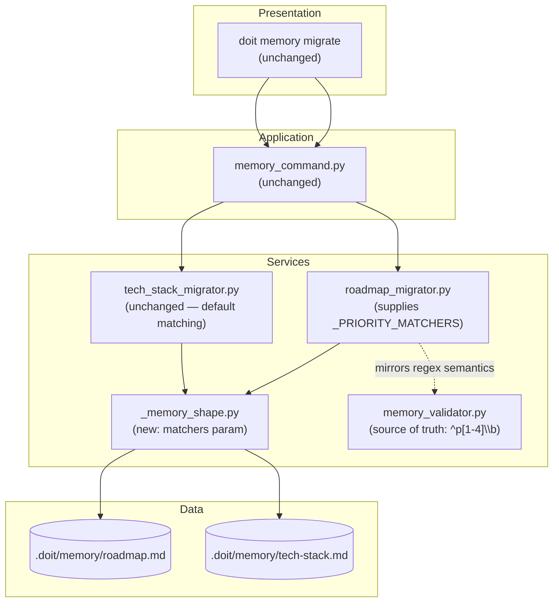

# Implementation Plan: Fix Roadmap Migrator H3 Matching for Decorated Priority Headings

**Branch**: `061-fix-roadmap-h3-matching` | **Date**: 2026-04-21 | **Spec**: [spec.md](spec.md)
**Input**: Feature specification from `specs/061-fix-roadmap-h3-matching/spec.md`

## Summary

Teach `roadmap_migrator` to recognize decorated priority H3 headings (`### P1 - Critical (Must Have for MVP)`, etc.) as satisfying the required `P1..P4` subsections, matching the semantics of `memory_validator._validate_roadmap`'s `^p[1-4]\b` regex. The shared `_memory_shape.insert_section_if_missing` helper gains an optional per-H3 `matchers` parameter (default `None` preserves current exact-case-insensitive behaviour). `roadmap_migrator` opts in with a regex-based prefix matcher closed over each required priority title; `tech_stack_migrator` continues using the default exact-match. A new contract test locks the validator ↔ migrator bijection for future regressions.

## Technical Context

**Language/Version**: Python 3.11+ (constitution baseline)
**Primary Dependencies**: Typer (CLI), Rich (logging), standard library `re` / `collections.abc` — no new deps
**Storage**: File-based — markdown in `.doit/memory/roadmap.md` (no schema changes)
**Testing**: pytest with existing markers; new tests go under `tests/unit/test_memory_shape.py`, `tests/integration/test_roadmap_migrator.py`, and `tests/contract/test_roadmap_validator_migrator_alignment.py`
**Target Platform**: Cross-platform CLI (macOS, Linux, Windows)
**Project Type**: single (services + CLI; no web/mobile surfaces)
**Performance Goals**: No new hot paths; regex compilation cached at import; helper remains O(n) over source lines
**Constraints**: Zero new public CLI surface, zero new dependencies, zero data-model changes, tech-stack migrator behaviour preserved byte-for-byte
**Scale/Scope**: ~40 LOC change across `_memory_shape.py` + `roadmap_migrator.py`; ~80 LOC of new tests (unit + contract + integration)

## Architecture Overview

<!-- BEGIN:AUTO-GENERATED section="architecture" -->

<!-- END:AUTO-GENERATED -->

## Constitution Check

*GATE: Must pass before Phase 0 research. Re-check after Phase 1 design.*

| Principle | Gate | Verdict |
| --------- | ---- | ------- |
| I. Specification-First | Spec approved before implementation | ✅ `spec.md` complete, checklist passes |
| II. Persistent Memory | No new out-of-tree state | ✅ Fix is services-layer only; no new state files |
| III. Auto-Generated Diagrams | Diagrams come from spec via Mermaid | ✅ Architecture + ER + state diagrams auto-generated in this plan |
| IV. Opinionated Workflow | Follows specit → planit → taskit → … | ✅ This is planit output |
| V. AI-Native Design | No new user-facing CLI behaviour that needs a slash-command contract | ✅ Fix is transparent to users; `doit memory migrate` surface unchanged |

**Tech Stack alignment** (from `.doit/memory/constitution.md` §Tech Stack):

- Python 3.11+ ✅
- Typer/Rich/pytest/Hatchling/ruff ✅
- `pathlib.Path`, `re`, `dataclasses` — all stdlib ✅
- No new runtime deps, no infrastructure changes ✅

**Quality gates**: tests pass, ruff clean, mypy manual hook green, existing spec-060 integration tests (20 roadmap + 15 tech-stack) pass unchanged.

**Result**: No violations. Proceed to Phase 0 — already complete. See [research.md](research.md).

## Project Structure

### Documentation (this feature)

```text
specs/061-fix-roadmap-h3-matching/
├── plan.md                    # This file (/doit.planit output)
├── research.md                # Phase 0 — 6 design decisions
├── data-model.md              # Phase 1 — H3Matcher type, helper signature change
├── contracts/
│   └── migrators.md           # Phase 1 — API contract: helper + roadmap migrator
├── quickstart.md              # Phase 1 — 10 manual/integration scenarios
├── spec.md                    # /doit.specit output (already written)
├── checklists/
│   └── requirements.md        # /doit.specit quality gate (already passes)
└── tasks.md                   # Phase 2 output (/doit.taskit — NOT created by planit)
```

### Source Code (repository root)

```text
src/doit_cli/
├── services/
│   ├── _memory_shape.py            # MODIFY: add H3Matcher alias + matchers param
│   ├── roadmap_migrator.py         # MODIFY: add _priority_matcher + _PRIORITY_MATCHERS; pass through helper
│   ├── tech_stack_migrator.py      # UNCHANGED (uses default matching)
│   └── memory_validator.py         # UNCHANGED (authoritative regex source)
└── cli/
    └── memory_command.py           # UNCHANGED (no new surface)

tests/
├── unit/
│   └── test_memory_shape.py        # MODIFY: new parameterized tests for matchers param
├── integration/
│   └── test_roadmap_migrator.py    # MODIFY: new decorated-priority scenarios
└── contract/
    └── test_roadmap_validator_migrator_alignment.py   # NEW: bidirectional invariant
```

**Structure Decision**: single-project layout (existing doit-cli `src/doit_cli/`). All changes live in `src/doit_cli/services/` and the three test tiers. No new modules, no new CLI subcommands, no schema files.

## Complexity Tracking

> **Fill ONLY if Constitution Check has violations that must be justified**

No constitution violations. Nothing to track.

## Phase 0 — Outline & Research

Complete. See [research.md](research.md). Key decisions:

1. Customization point: optional `matchers` mapping on the shared helper, not a per-migrator reimplementation.
2. Matcher semantics: `re.compile(rf"^{re.escape(target)}\b", IGNORECASE)` closure per priority — mirrors validator.
3. Matcher signature: `Callable[[str], bool]` closed over required title (vs two-arg variant).
4. Test tiers: unit (helper contract) + contract (validator↔migrator bijection) + integration (decorated-priority scenarios).
5. CRLF / atomic-write: unchanged — fix is matching-layer only.
6. Tech-stack: unchanged — validator has no prefix semantics there; exact match is correct default.

All NEEDS CLARIFICATION markers resolved at the spec stage.

## Phase 1 — Design & Contracts

Complete.

- **Data model**: [data-model.md](data-model.md) — introduces `H3Matcher` type alias and the `_PRIORITY_MATCHERS` module-level mapping. No persistent schema changes; existing `MigrationAction` state machine unchanged.
- **Contracts**: [contracts/migrators.md](contracts/migrators.md) — updated `insert_section_if_missing` signature, `matchers` parameter contract, roadmap migrator's new internal symbols, tech-stack guarantees (unchanged), validator↔migrator alignment invariant.
- **Quickstart**: [quickstart.md](quickstart.md) — 10 end-to-end scenarios covering the bug reproduction, regression guards (bare priorities, genuine-missing, H2-absent, CRLF, tech-stack unaffected), dogfood on the doit repo, and full-suite baseline.
- **Agent context update**: will run `.doit/scripts/bash/update-agent-context.sh claude` after this plan is written.

### Post-design constitution re-check

Re-reading the Constitution Check table after Phase 1: all gates still green. No design artifact introduces new tech, new surface, or new state. Proceed to Phase 2 (taskit).

## Phase 2 — (handed off to `/doit.taskit`)

Not produced by planit. The taskit command will read these artifacts and produce `tasks.md` with the usual US1/US2/US3 breakdown.

---

## Next Steps

┌─────────────────────────────────────────────────────────────┐
│  Workflow Progress                                          │
│  ● specit → ● planit → ○ taskit → ○ implementit → ○ checkin │
└─────────────────────────────────────────────────────────────┘

**Recommended**: Run `/doit.taskit` to create implementation tasks from this plan.
