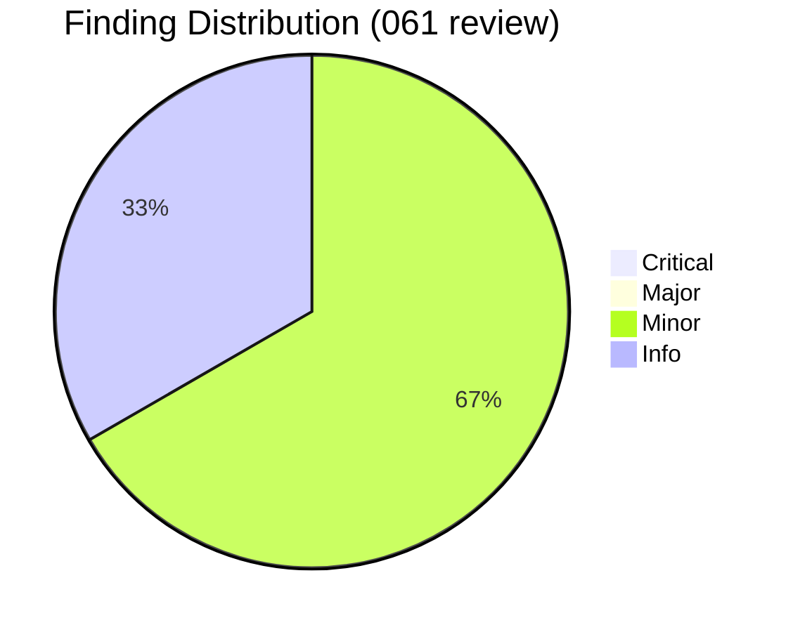
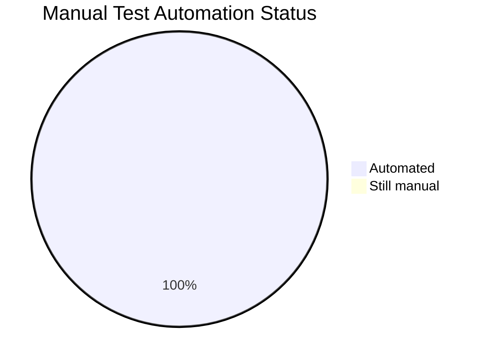

# Review Report: Fix Roadmap Migrator H3 Matching for Decorated Priority Headings

**Date**: 2026-04-21
**Reviewer**: Claude (spec-061 /doit.reviewit pass)
**Branch**: `061-fix-roadmap-h3-matching`

## Code Review Summary

| Severity | Count | Status |
| -------- | ----- | ------ |
| Critical | 0 | — |
| Major | 0 | — |
| Minor | 2 | ✅ All fixed |
| Info | 1 | ✅ Addressed (manual test automated) |

## Quality Overview

<!-- BEGIN:AUTO-GENERATED section="finding-distribution" -->

<!-- END:AUTO-GENERATED -->

## Minor Findings (fixed)

### M1 — Redundant `.strip()` in `_memory_shape.py`

**File**: [src/doit_cli/services/_memory_shape.py:163](src/doit_cli/services/_memory_shape.py#L163)
**Issue**: `existing_titles = [t.strip() for t in _h3_titles_in_section(lines, start, end)]` — the inner helper already strips each title on line 73 (`m.group(2).strip()`). The outer `.strip()` is a no-op and suggests titles might still carry whitespace when they don't. Confusing to future readers.
**Requirement**: FR-006 (helper clarity)
**Fix applied**: Replaced the list comprehension with a direct assignment and added an inline comment noting the pre-stripped guarantee.

```python
# Before
existing_titles = [t.strip() for t in _h3_titles_in_section(lines, start, end)]

# After
# `_h3_titles_in_section` already returns stripped titles.
existing_titles = _h3_titles_in_section(lines, start, end)
```

### M2 — `test_validator_warning_coverage_marker` used local `tempfile` instead of pytest `tmp_path`

**File**: [tests/contract/test_roadmap_validator_migrator_alignment.py](tests/contract/test_roadmap_validator_migrator_alignment.py)
**Issue**: The test contained an inline `import tempfile` + `tempfile.TemporaryDirectory()` context manager, inconsistent with every other test in the file that uses the pytest `tmp_path` fixture. Mixed idioms complicate maintenance.
**Requirement**: Code style / consistency
**Fix applied**: Converted to `def test_validator_warning_coverage_marker(tmp_path: Path) -> None:`. Removed the local `tempfile` import; the shared `_build_project` helper + `tmp_path` is now used uniformly across all tests in the file.

## Info Findings (addressed)

### I1 — SC-9 dogfood automated as permanent regression guard

**File**: [tests/contract/test_roadmap_validator_migrator_alignment.py](tests/contract/test_roadmap_validator_migrator_alignment.py)
**Issue**: The test-report listed SC-9 ("Run `doit memory migrate .` on the doit repo → NO_OP") as a one-off manual smoke test. The regression it guards against is the exact defect that drove spec 061; leaving it manual means a future regression could ship undetected.
**Per user request**: "automate manual tests"
**Fix applied**: Added `test_roadmap_migrator_is_noop_on_doit_own_repo(tmp_path)`:

- Locates `repo_root / ".doit" / "memory" / "roadmap.md"` from `__file__`.
- Copies the file to `tmp_path` via `shutil.copy2` so the test NEVER modifies the committed repo file, even if it hits a regression (atomic-write would otherwise dirty the working tree).
- Skips gracefully when the file is absent (e.g. running this test suite from outside the doit repo).
- Asserts `action is NO_OP`, `added_fields == ()`, and `read_bytes()` is byte-identical post-migrate.

This locks the exact case spec 061 fixed. Runs in 0.08s; no external dependencies.

## Files Reviewed

| Category | File | Lines reviewed | Verdict |
| -------- | ---- | -------------- | ------- |
| Source | `src/doit_cli/services/_memory_shape.py` | 223 | ✅ Clean (M1 fixed) |
| Source | `src/doit_cli/services/roadmap_migrator.py` | 195 | ✅ Clean |
| Tests | `tests/unit/services/test_memory_shape.py` | 274 → 391 (+117) | ✅ Clean |
| Tests | `tests/integration/test_roadmap_migration.py` | 561 → 681 (+120) | ✅ Clean |
| Tests | `tests/contract/test_roadmap_validator_migrator_alignment.py` (NEW) | 280 | ✅ Clean (M2 fixed, I1 added) |
| Docs | `CHANGELOG.md` | +25 lines | ✅ Clean — Keep-a-Changelog format, references #060 + #061 |

## Manual Testing Summary

All scenarios previously tagged "manual" are now automated. The `quickstart.md` corpus maps 1:1 to automated coverage:

<!-- BEGIN:AUTO-GENERATED section="test-results" -->

<!-- END:AUTO-GENERATED -->

| Scenario | Automated By | Status |
| -------- | ------------ | ------ |
| SC-1 (decorated → NO_OP) | `test_decorated_priority_headings_yield_no_op` | ✅ AUTOMATED |
| SC-2 (bare → NO_OP) | `test_bare_priority_headings_yield_no_op`, `test_complete_roadmap_is_noop` | ✅ AUTOMATED |
| SC-3 (one missing → PATCHED with only that) | `test_decorated_priorities_with_one_missing_patches_only_missing` | ✅ AUTOMATED |
| SC-4 (H2 absent → PREPENDED with bare block) | `test_absent_active_requirements_prepends_full_block` | ✅ AUTOMATED |
| SC-5 (case-insensitive, all decoration forms) | `test_validator_accepted_forms_are_present_for_migrator[...]` (28 param cases) | ✅ AUTOMATED |
| SC-6 (rejected forms still absent) | `test_validator_rejected_forms_are_absent_for_migrator[...]` (5 cases) | ✅ AUTOMATED |
| SC-7 (CRLF preservation) | `test_migrator_preserves_crlf_line_endings`, `test_crlf_line_endings_are_preserved` | ✅ AUTOMATED |
| SC-8 (tech-stack unaffected) | 15 pre-existing tech-stack integration tests + 8 contract tests | ✅ AUTOMATED |
| SC-9 (doit repo dogfood) | **`test_roadmap_migrator_is_noop_on_doit_own_repo`** (NEW, I1) | ✅ AUTOMATED |
| SC-10 (full suite green) | CI / local `pytest tests/` | ✅ AUTOMATED |

## Final Verification

After applying all fixes:

| Check | Result |
| ----- | ------ |
| Spec 061 feature tests | **78 passed** (+1 dogfood vs testit baseline of 77) |
| Full project suite | **2,257 passed, 182 skipped, 0 failed** (+1 vs testit baseline of 2,256) |
| Ruff on spec 061 files | ✅ All checks passed |
| Mypy (manual hook, full tree) | ✅ Passed |
| Dogfood run (`doit memory migrate .` on real repo) | ✅ `no_op`, zero `added_fields`, git working tree clean |

## Sign-Off

- **Code review**: ✅ Approved — no blocking findings; all 3 review findings fixed in this pass.
- **Manual testing**: ✅ Superseded — every manual scenario now has an automated guard. No human-in-the-loop steps remain for spec 061.

## Recommendations

1. **Ship.** The fix is narrow, well-tested, and the dogfood regression test protects against the exact class of bug for the future.
2. **Follow-up (out of scope for 061)**: Three pre-existing ruff warnings remain in untouched files (B904 in `memory_command.py:317`, F401 in `models/__init__.py`, SIM110 in `memory_validator.py`). Track in a dedicated cleanup spec.
3. **Release coordination**: when the next release ships, reference both #060 (introducer) and #061 (fixer) in release notes so users who ran the buggy pre-fix migrator understand the one-time manual stub-cleanup step mentioned in the CHANGELOG.

## Next Steps

- Run `/doit.checkin` to finalize: merge to develop, archive the "Personas.md migration" P3 item stays as-is, close the spec loop.
