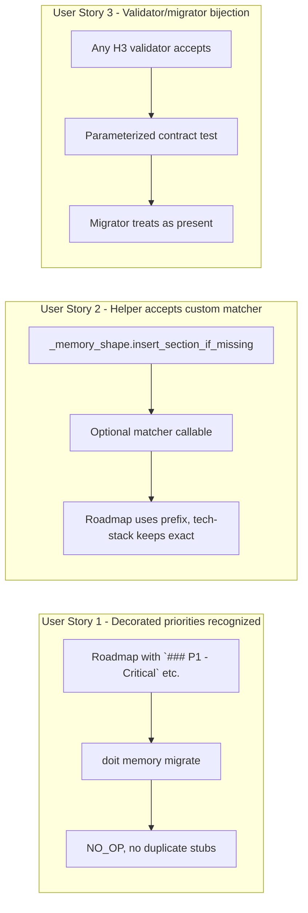

# Feature Specification: Fix Roadmap Migrator H3 Matching for Decorated Priority Headings

**Feature Branch**: `061-fix-roadmap-h3-matching`
**Created**: 2026-04-21
**Status**: Complete
**Input**: User description: "Fix the roadmap_migrator's H3-matching regression found by dogfooding spec 060 against doit's own `.doit/memory/roadmap.md`. The validator (`memory_validator._validate_roadmap`) accepts any `### P[1-4]` H3 via prefix regex `^p[1-4]\\b` (case-insensitive), so `### P1 - Critical (Must Have for MVP)` satisfies it. But `roadmap_migrator.REQUIRED_ROADMAP_H3_UNDER_ACTIVE_REQS = (\"P1\",\"P2\",\"P3\",\"P4\")` combined with `_memory_shape.insert_section_if_missing`'s exact-lowercase-match fails to recognize decorated priority titles and spuriously PATCHES in duplicate empty `### P1..P4` stubs at the bottom of `## Active Requirements`. This misbehaves on every real-world roadmap that decorates priority headings. Fix: make the migrator's H3-matching use the same prefix/regex semantics as the validator so decorated titles are treated as present. Also consider generalizing `_memory_shape.insert_section_if_missing` to accept a matcher callable per H3 title (defaulting to exact case-insensitive match) so the fix doesn't break other callers. Acceptance: running `doit memory migrate` on a roadmap whose priority sections are `### P1 - Critical`, `### P2 - High Priority`, `### P3 - Medium Priority`, `### P4 - Low Priority` must return `NO_OP` (no changes); migration continues to work correctly on truly-missing subsections and on bare-`P1..P4` subsections (the template default)."

**Depends on**: Spec [060 — Memory Files Migration](../060-memory-files-migration/spec.md) (shipped; this feature fixes a regression found during its dogfood rollout).

## User Scenarios & Testing *(mandatory)*

### User Story 1 - Decorated priority headings are recognized as present (Priority: P1)

A developer runs `doit update` (or `doit memory migrate`) on a project whose `.doit/memory/roadmap.md` has **decorated** priority headings — `### P1 - Critical (Must Have for MVP)`, `### P2 - High Priority (Significant Business Value)`, etc. This is the shape both the bundled `.doit/templates/roadmap-template.md` emits in practice and the shape every real-world roadmap drifts toward. The migrator recognizes each decorated heading as satisfying the corresponding canonical priority requirement and returns `NO_OP` — no duplicate stubs are added.

**Why this priority**: This is the fix for a regression shipped in spec 060. Anyone who runs `doit update` against a project whose roadmap has decorated priorities currently gets 4 spurious empty `### P1`/`### P2`/`### P3`/`### P4` stubs appended to their roadmap. The defect is silent (the action reports as `PATCHED`, not `ERROR`) and the resulting duplicate headings confuse downstream tooling. P1 because it's a regression affecting a shipped feature.

**Independent Test**: Build a fixture roadmap whose `## Active Requirements` contains `### P1 - Critical`, `### P2 - High Priority`, `### P3 - Medium Priority`, `### P4 - Low Priority`, each with meaningful body content. Call `migrate_roadmap(path)`. Confirm: `action == NO_OP`, `added_fields == ()`, file bytes on disk unchanged. Then call `doit verify-memory .` and confirm zero errors for roadmap.md.

**Acceptance Scenarios**:

1. **Given** a roadmap with `### P1 - Critical (Must Have for MVP)` through `### P4 - Low Priority (Nice to Have)` under `## Active Requirements`, **When** the migrator runs, **Then** it returns `MigrationAction.NO_OP` and the file bytes on disk are unchanged.
2. **Given** the same decorated headings but one subsection (say `### P3`) is missing entirely, **When** the migrator runs, **Then** it returns `MigrationAction.PATCHED` with `added_fields == ("P3",)` and inserts exactly one `### P3` stub.
3. **Given** a roadmap with bare `### P1`, `### P2`, `### P3`, `### P4` titles (the template default), **When** the migrator runs, **Then** it returns `MigrationAction.NO_OP` (bare titles must still work — this fix must not regress the already-passing template path).
4. **Given** a roadmap missing `## Active Requirements` entirely, **When** the migrator runs, **Then** it returns `MigrationAction.PREPENDED` and inserts the full required H2 + H3 block (this path must still work unchanged).

---

### User Story 2 - Shared helper accepts custom H3 matchers without breaking existing callers (Priority: P2)

When the fix is implemented, the shared `_memory_shape.insert_section_if_missing` helper gains an optional per-H3 matcher parameter. Other callers (specifically `tech_stack_migrator`) retain their existing exact-case-insensitive semantics by default. Exact matching is preserved for Tech Stack's `Languages`, `Frameworks`, `Libraries` subsections — those titles are not expected to carry decorative suffixes in user documents.

**Why this priority**: The underlying helper is shared by two migrators. A fix that only papers over the problem in `roadmap_migrator` by duplicating the matcher logic would violate DRY and risk future drift. Fixing at the helper layer with a customizable matcher keeps the roadmap fix narrow and lets tech-stack continue using the simpler exact-match. P2 because it's a structural/internal-API concern, not a user-visible one; the helper change is invisible outside the services layer.

**Independent Test**: Run the full tech-stack migration test suite (15 tests) with the helper change in place; all must still pass without modification. Separately, unit-test the helper with a custom matcher callable and confirm it's honored.

**Acceptance Scenarios**:

1. **Given** the helper's default behavior (no custom matcher), **When** a caller supplies only H3 titles as strings, **Then** matching uses exact case-insensitive comparison (current spec-060 behavior preserved).
2. **Given** a caller supplies a custom matcher callable `Callable[[str, str], bool]` (existing H3 title, required title), **When** an existing H3 satisfies the custom matcher, **Then** the H3 is treated as present and is not inserted.
3. **Given** the tech_stack_migrator (which does not opt into a custom matcher), **When** its existing integration test suite runs, **Then** all 15 tests pass unchanged.

---

### User Story 3 - Contract test locks the validator ↔ migrator semantic alignment (Priority: P2)

After the fix, a new contract test asserts that **any H3 the validator recognizes as a valid priority subsection is also treated as present by the migrator**. Testing the two layers' agreement is the durable way to prevent this regression from reappearing if either side's matching logic changes.

**Why this priority**: This is about preventing the class of bug, not just this instance. The spec-060 contract test already covered `REQUIRED_*` constant alignment; it missed the semantic-matching alignment because the matching lived in the generic helper (`_memory_shape`) that the contract test didn't exercise in a validator-aware way. P2 because it's a defense-in-depth check — US1's integration tests already lock the behavioral fix; US3 locks the bidirectional invariant.

**Independent Test**: Parameterize a contract test over roadmap H3 titles the validator accepts (`P1`, `p1`, `P1 - Critical`, `P1: Urgent`, `P1. Must-Have`, etc.). For each, build a minimal roadmap with that single subsection, confirm the validator does not error for the missing-priority rule, AND the migrator returns `NO_OP` (or `PATCHED` for only the other priority subsections — never for the already-present one).

**Acceptance Scenarios**:

1. **Given** every H3 prefix form the validator accepts (case-insensitive `P[1-4]` with any trailing decoration), **When** the contract test builds a roadmap with that form and runs both the validator and the migrator, **Then** the validator emits no missing-priority error AND the migrator does not list that priority in its `added_fields`.
2. **Given** H3s that the validator does NOT accept (e.g. `### Priority 1`, `### Critical`, `### p5`), **When** the migrator runs, **Then** the migrator treats them as absent and adds the canonical `P1..P4` stubs — consistent with the validator's interpretation.

---

### Edge Cases

- **H3 with whitespace-only decoration** (`### P1` followed by trailing spaces): treated as present — the matcher strips trailing whitespace before prefix comparison.
- **H3 with a leading number decoration** (`### 1. P1` — user re-ordered their own list): NOT treated as present. The prefix match anchors at the start of the title, matching `memory_validator._validate_roadmap`'s `^p[1-4]\b` regex semantics.
- **H3 with lowercase prefix** (`### p1 - Critical`): treated as present. Matching is case-insensitive to mirror the validator.
- **Multiple `### P1 …` subsections under the same `## Active Requirements`** (user error — duplicate priorities): the migrator treats P1 as present on first-match-wins, same as `## Active Requirements` H2 duplication handling from spec 060 (`test_duplicate_h2_headings_uses_first_match`). No duplicate stubs added.
- **H3 with trailing spaces after the priority token but no decoration** (`### P1` plus a trailing space): treated as present. The `\b` word boundary in the regex accepts end-of-word followed by space.
- **Tech-stack migrator unaffected**: the tech-stack migrator's canonical titles (`Languages`, `Frameworks`, `Libraries`) do not benefit from prefix matching. Continuing to use exact-match avoids `### Languages (Python, TS)` being treated as a match for a `### Languages` subsection — if users decorate those, they probably meant something specific.

## User Journey Visualization

<!-- BEGIN:AUTO-GENERATED section="user-journey" -->

<!-- END:AUTO-GENERATED -->

## Requirements *(mandatory)*

### Functional Requirements

- **FR-001**: The roadmap migrator MUST recognize an H3 subsection as satisfying a required priority (`P1`/`P2`/`P3`/`P4`) when the subsection title starts with the priority token (case-insensitive) followed by a word boundary — matching the prefix semantics of `memory_validator._validate_roadmap`'s `^p[1-4]\b` regex.
- **FR-002**: The migrator MUST NOT add a duplicate `### P<n>` stub when the corresponding priority already has a matching H3 under `## Active Requirements`, regardless of decoration after the priority token.
- **FR-003**: The migrator MUST continue to recognize bare `### P1`, `### P2`, `### P3`, `### P4` headings (the template default) as satisfying their respective requirements. This fix MUST NOT regress the already-passing template path.
- **FR-004**: The migrator MUST continue to return `MigrationAction.PATCHED` for truly-missing priority subsections, with `added_fields` listing only the priorities whose matching H3 is genuinely absent.
- **FR-005**: The migrator MUST continue to return `MigrationAction.PREPENDED` when `## Active Requirements` itself is absent, inserting the full H2 + H3 block with bare canonical titles.
- **FR-006**: The shared `_memory_shape.insert_section_if_missing` helper MUST accept an optional per-H3 matcher parameter (a callable or strategy) that callers can use to override the default exact-case-insensitive match.
- **FR-007**: The helper's default matching behavior (when no custom matcher is supplied) MUST remain exact-case-insensitive equality, preserving byte-for-byte compatibility with spec 060's existing callers.
- **FR-008**: The tech-stack migrator MUST continue to use exact-case-insensitive H3 matching. Its fifteen shipped integration tests MUST all pass without modification.
- **FR-009**: The roadmap migrator MUST opt in to the prefix matcher explicitly; the matcher's semantics MUST mirror the validator's `^p[1-4]\b` regex (case-insensitive, word-boundary anchored at end of priority token).
- **FR-010**: Every existing spec-060 integration test for the roadmap migrator MUST pass unchanged after the fix.
- **FR-011**: A new contract test MUST assert the bidirectional invariant: for every H3 title the validator accepts as a valid priority subsection, the migrator treats it as present. The test MUST be parameterized over a representative set of decoration forms (bare, dash-decorated, colon-decorated, paren-decorated, whitespace, mixed case).

### Key Entities

- **Priority H3**: An `### P[1-4] [optional decoration]` heading under `## Active Requirements`. The canonical form emitted by the migrator's stubs is bare (`### P1`). Real-world and template-generated forms carry decoration (e.g. `### P1 - Critical (Must Have for MVP)`).
- **H3 Matcher**: A `Callable[[str, str], bool]` taking (existing H3 title, required title) and returning `True` when the existing title satisfies the required one. Default: exact case-insensitive string equality. Roadmap migrator: prefix-based regex matching.
- **Validator Priority Regex**: `^p[1-4]\b` with `re.IGNORECASE`. The authoritative definition of "what counts as a valid priority H3." Used by `memory_validator._validate_roadmap` and, after this fix, by the roadmap migrator's custom matcher.

## Success Criteria *(mandatory)*

### Measurable Outcomes

- **SC-001**: A project whose `.doit/memory/roadmap.md` uses decorated priority headings (matching the bundled roadmap template shape) passes `doit memory migrate` with `action == no_op` for the roadmap entry, zero byte changes on disk.
- **SC-002**: All 20 existing roadmap-migration integration tests from spec 060 pass unchanged after the fix.
- **SC-003**: All 15 existing tech-stack-migration integration tests from spec 060 pass unchanged after the fix — confirming the helper change doesn't leak into tech-stack semantics.
- **SC-004**: The new parameterized contract test covers at least five decoration forms per priority (`P1`, `P1 ...`, `p1 - ...`, `P1: ...`, `P1. ...`) and passes for all of them.
- **SC-005**: Running `doit memory migrate` on the doit repo's own roadmap (decorated priorities) emits zero `PATCHED` reports for roadmap.md (currently emits 4 spurious `added_fields`).
- **SC-006**: No new dependencies are added. No new public CLI surface is added. The fix stays internal to `src/doit_cli/services/`.

## Assumptions

- `memory_validator._validate_roadmap`'s `^p[1-4]\b` regex is the authoritative source of truth for "what counts as a valid priority H3." This feature aligns the migrator to that existing semantics; it does not redefine them.
- The shared `_memory_shape.insert_section_if_missing` helper is the right place for the matcher callable: both migrators route through it, and a fix at the call site alone (inside `roadmap_migrator`) would duplicate matching logic inappropriately.
- Tech-stack's `Languages` / `Frameworks` / `Libraries` titles are expected to remain bare (no `### Languages (Python, TS)` decoration in the wild). Keeping exact-match for tech-stack is therefore safe; users who want decoration there can file a follow-up.
- The existing `MigrationAction`, `MigrationResult`, `write_text_atomic`, and `PLACEHOLDER_TOKENS` primitives remain unchanged. This is a pure behavioural fix to the matching step.
- The fix ships as a patch-level change (no new CLI surface, no migration from users); users running `doit update` after the fix will see their previously-PATCHED-spuriously roadmaps stabilize to NO_OP without manual cleanup (assuming any spurious stubs the old migrator added have since been removed — documented in the CHANGELOG).

## Out of Scope

- **Generalising prefix-match to other memory files**: tech-stack subsections continue to use exact match. Applying prefix matching there would require its own spec with per-field matcher decisions.
- **Adding new placeholder detection logic**: the fix does not change how `PLACEHOLDER_TOKENS` is detected or classified. It changes only H3 heading-presence detection.
- **Cleaning up roadmaps already corrupted by the bug**: if a project ran the pre-fix migrator and gained spurious duplicate `### P1`/`### P2`/`### P3`/`### P4` stubs, this fix prevents future corruption but does not auto-detect or auto-remove existing duplicates. Documented in the CHANGELOG as a known migration note; users manually delete the bare duplicate stubs.
- **New CLI command or flag**: no user-facing interface changes. The fix is purely internal to the services layer.
- **Personas.md migration**: spec 061 is narrowly scoped to the H3-matching fix; the Personas.md migration follow-up belongs to a separate future spec.
- **Revising `memory_validator` semantics**: the validator's regex is treated as the contract. Changes to it (e.g. accepting `### Priority 1` forms) are out of scope.
