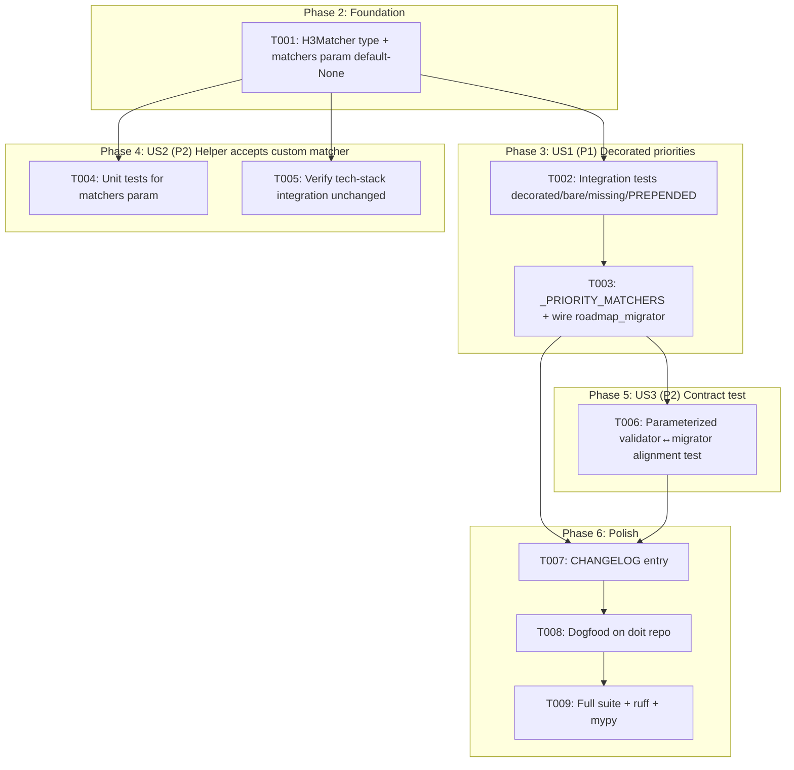
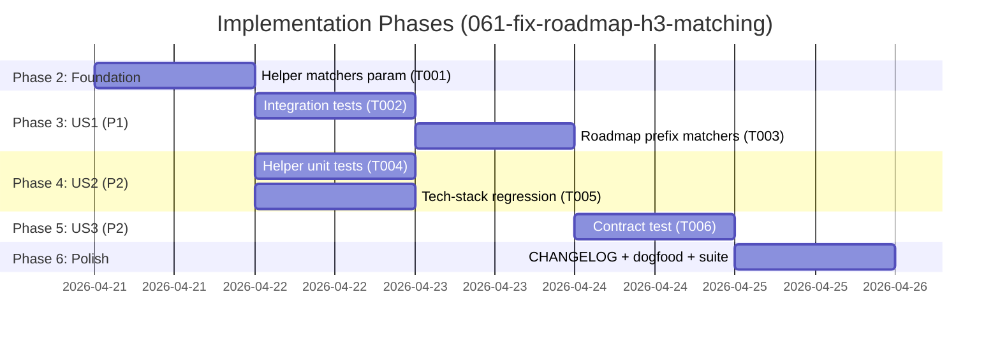

---

description: "Task list for 061-fix-roadmap-h3-matching"
---

# Tasks: Fix Roadmap Migrator H3 Matching for Decorated Priority Headings

**Input**: Design documents from `specs/061-fix-roadmap-h3-matching/`
**Prerequisites**: plan.md ✅, spec.md ✅, research.md ✅, data-model.md ✅, contracts/migrators.md ✅, quickstart.md ✅

**Tests**: Required. The spec explicitly requests three test tiers: unit (helper contract), integration (decorated priority scenarios), contract (validator↔migrator bijection). Test tasks come BEFORE implementation tasks in each story — TDD approach validates the bug reproduction first.

**Organization**: Tasks grouped by user story. Phase 2 (foundational) adds the `matchers` param plumbing to the shared helper with default-None behaviour (byte-for-byte compatible with spec 060). User stories then layer behaviour on top.

## Task Dependencies

<!-- BEGIN:AUTO-GENERATED section="task-dependencies" -->

<!-- END:AUTO-GENERATED -->

## Phase Timeline

<!-- BEGIN:AUTO-GENERATED section="phase-timeline" -->

<!-- END:AUTO-GENERATED -->

## Format: `[ID] [P?] [Story] Description`

- **[P]**: Can run in parallel (different files, no dependencies)
- **[Story]**: Which user story this task belongs to (US1, US2, US3)

## Path Conventions

Single project (per `plan.md`). Source under `src/doit_cli/`, tests under `tests/`.

---

## Phase 1: Setup

**Purpose**: None. This is an in-place fix to an existing service. No new packages, no new CLI surface, no new tooling — scaffolding is already in place from spec 060.

---

## Phase 2: Foundational (Blocking Prerequisites)

**Purpose**: Introduce the `matchers` parameter plumbing on `_memory_shape.insert_section_if_missing` with default-None behaviour. After this phase, the helper signature is extended but behaviour is byte-for-byte compatible with spec 060. No caller opts in yet.

**⚠️ CRITICAL**: No user story work can begin until this phase is complete — both roadmap and tech-stack migrators call through this helper.

- [X] T001 Extend `src/doit_cli/services/_memory_shape.py`: add `H3Matcher = Callable[[str], bool]` type alias (module-level), add keyword-only `matchers: Mapping[str, H3Matcher] | None = None` parameter to `insert_section_if_missing`; inside the H3-presence check, iterate existing H3 titles and use `matchers[required_h3](existing_title.strip())` when `matchers` is not None and `required_h3 in matchers`, otherwise fall back to current `_normalise` exact-match. Update module docstring and function docstring to describe the new contract (reference `contracts/migrators.md`). Do NOT change any caller yet — `roadmap_migrator` and `tech_stack_migrator` remain passing `matchers=None` implicitly. Run `pytest tests/unit/services/test_memory_shape.py tests/integration/test_roadmap_migration.py -x` and confirm all existing tests still pass (spec 060 regression guard).

**Checkpoint**: Helper signature extended, default behaviour preserved, all spec-060 tests still pass. User story work can now proceed.

---

## Phase 3: User Story 1 - Decorated priority headings are recognized as present (Priority: P1) 🎯 MVP

**Goal**: `doit memory migrate` returns `NO_OP` when `.doit/memory/roadmap.md` has decorated priority headings (`### P1 - Critical (Must Have for MVP)` etc.) — no duplicate stubs appended.

**Independent Test**: Build a fixture roadmap with the four decorated priority H3s, call `migrate_roadmap(path)`, assert `action == NO_OP`, `added_fields == ()`, file bytes unchanged (matches `quickstart.md` Scenario 1).

### Tests for User Story 1 ⚠️

> Write these tests FIRST, confirm they FAIL against current `develop`, then implement T003.

- [X] T002 [US1] Extend `tests/integration/test_roadmap_migration.py` with four new tests covering `quickstart.md` Scenarios 1-4: `test_decorated_priority_headings_yield_no_op` (decorated P1-P4 all present → NO_OP), `test_decorated_priorities_with_one_missing_patches_only_missing` (decorated P1/P2/P4, P3 absent → PATCHED with `added_fields == ("P3",)`), `test_bare_priority_headings_yield_no_op` (template default form still NO_OP — regression guard for FR-003), `test_absent_active_requirements_prepends_full_block` (PREPENDED path unchanged — regression guard for FR-005). Each test reads file bytes before and after, asserting byte-equality for NO_OP cases. Run `pytest tests/integration/test_roadmap_migration.py -k "decorated or bare or prepend" -x` and confirm the decorated tests FAIL against current `develop` (the bug) before T003 is written.

### Implementation for User Story 1

- [X] T003 [US1] Update `src/doit_cli/services/roadmap_migrator.py`: add private helper `_priority_matcher(required_title: str) -> H3Matcher` that returns `lambda existing: bool(re.compile(rf"^{re.escape(required_title.strip().lower())}\b", re.IGNORECASE).match(existing.strip()))` (import `re` and `H3Matcher` from `_memory_shape`). Build module-level `_PRIORITY_MATCHERS: Mapping[str, H3Matcher] = {p: _priority_matcher(p) for p in REQUIRED_ROADMAP_H3_UNDER_ACTIVE_REQS}`. Pass `matchers=_PRIORITY_MATCHERS` through to `insert_section_if_missing` in `migrate_roadmap`. Run `pytest tests/integration/test_roadmap_migration.py -x` and confirm the four T002 tests now PASS, plus all pre-existing roadmap-migration tests still pass (FR-010).

**Checkpoint**: User Story 1 fully functional — decorated priorities correctly detected as present; bare priorities still work; genuinely-missing subsections still patched; H2-absent still prepended.

---

## Phase 4: User Story 2 - Shared helper accepts custom H3 matchers without breaking existing callers (Priority: P2)

**Goal**: `_memory_shape.insert_section_if_missing` supports per-H3 custom matchers; tech-stack migrator's default exact-match semantics preserved byte-for-byte.

**Independent Test**: Unit-test the helper with a custom matcher mapping in isolation (no migrators involved); separately, run the full tech-stack integration test suite and confirm all 15 tests pass unchanged (matches `quickstart.md` Scenario 8 and FR-008).

### Tests for User Story 2 ⚠️

- [X] T004 [P] [US2] Extend `tests/unit/services/test_memory_shape.py` with five new parameterized tests exercising the `matchers` parameter directly: `test_matchers_none_preserves_exact_match` (default-None path byte-for-byte same as spec 060), `test_matcher_honoured_for_one_h3_only` (custom matcher for `P1` only — `P2/P3/P4` still use default exact match), `test_matcher_receives_stripped_existing_title` (matcher receives `"P1 - Critical"` not `"  P1 - Critical  \n"`), `test_matcher_extra_keys_ignored` (matcher mapping with a key not in `h3_titles` is silently ignored — contract point in `contracts/migrators.md` §1), `test_matcher_never_called_for_absent_h3` (when no existing H3 matches, matcher still allows insertion — missing → insertion, no matcher short-circuit). Run `pytest tests/unit/services/test_memory_shape.py -x` and confirm all new tests pass alongside the existing helper tests.

- [X] T005 [P] [US2] Verify tech-stack migration regression: run `pytest tests/integration/test_memory_files_migration.py -k "tech_stack" -x` (or whichever file holds the 15 tech-stack tests — locate via `grep -rn "migrate_tech_stack" tests/` first). Confirm ALL 15 tests pass unchanged. No code change in this task — this is purely the FR-008 regression check. If any test fails, the matcher plumbing leaked into tech-stack semantics; stop and diagnose before moving on.

**Checkpoint**: Helper API contract locked by unit tests; tech-stack migration unaffected; custom-matcher opt-in works correctly per `contracts/migrators.md`.

---

## Phase 5: User Story 3 - Contract test locks the validator ↔ migrator semantic alignment (Priority: P2)

**Goal**: A new contract test asserts that every H3 title the validator's `^p[1-4]\b` regex accepts is also treated as present by `migrate_roadmap`. Locks the bidirectional invariant for future regressions.

**Independent Test**: Run the new contract test in isolation; it exercises both `memory_validator._validate_roadmap` and `migrate_roadmap` across a corpus of decoration forms and passes for all cases (matches `quickstart.md` SC-004 requirement: ≥5 decoration forms per priority).

### Tests for User Story 3 ⚠️

- [X] T006 [US3] Create `tests/contract/test_roadmap_validator_migrator_alignment.py`. Define a `DECORATION_CORPUS` list of representative decoration forms: `["{p}", "{p} - Critical", "{p}: Urgent", "{p}. Must-Have", "{p} (MVP)", "{p}   ", "{P}", "{p} — Em-dashed"]` (lowercase token expanded for each P1-P4, includes trailing whitespace and uppercase cases). For each `(priority, decoration)` pair, build a minimal roadmap source with that single H3 under `## Active Requirements` and bare stubs for the other three priorities, write to a `tmp_path` fixture, run both `memory_validator.verify_memory_contract(tmp_path)` and `migrate_roadmap(tmp_path / ".doit/memory/roadmap.md")`, and assert: (a) validator emits no `missing required P{N}` error for the decorated priority, (b) `MigrationResult.action in {NO_OP, PATCHED}`, (c) the decorated priority is NOT in `added_fields`. Add a second negative-case test parameterized over `["### Priority 1", "### Critical", "### p5", "### 1. P1"]`: confirm the validator rejects them AND the migrator treats them as absent (priority added to `added_fields`). Run `pytest tests/contract/test_roadmap_validator_migrator_alignment.py -x` — all cases must pass.

**Checkpoint**: Bidirectional invariant locked. If either the validator's regex or the migrator's matcher logic drifts in a future change, this test fails fast.

---

## Phase 6: Polish & Cross-Cutting Concerns

**Purpose**: Ship the fix: document it, dogfood it, run the full gauntlet.

- [X] T007 [P] Update `CHANGELOG.md`: under the `[Unreleased]` section (or `[0.2.1]` if a post-0.2.0 bump is warranted), add a `### Fixed` entry: *"Roadmap migrator now recognizes decorated priority H3 headings (e.g. `### P1 - Critical (Must Have for MVP)`) as satisfying the `P1..P4` requirement, matching `memory_validator`'s `^p[1-4]\b` regex semantics. Fixes a regression from spec 060 that appended duplicate empty priority stubs to real-world roadmaps."* Add a `### Changed` entry noting the internal helper signature change (matchers param, default-None preserves behaviour) for framework maintainers. Reference spec `061-fix-roadmap-h3-matching`.

- [X] T008 Dogfood against the doit repo (`quickstart.md` Scenario 9). Rebuild and reinstall: `uv build && uv tool install . --reinstall --force`. Run `doit memory migrate .` in the repo root. Confirm output reports `roadmap.md: NO_OP` with zero `added_fields`. Check `git diff .doit/memory/roadmap.md` shows no changes. Run `doit verify-memory .` — confirm zero priority-related errors.

- [X] T009 Full quality gauntlet: `ruff check src/ tests/` (must pass), `pre-commit run mypy --hook-stage manual --all-files` (must pass), `pytest tests/ -x --tb=short` (all tests — including pre-existing 2127 baseline from spec 060 — must pass). Record final test count and coverage in `specs/061-fix-roadmap-h3-matching/reports/testit-report-{timestamp}.md` when `/doit.testit` runs later.

---

## Dependencies & Execution Order

### Phase Dependencies

- **Phase 2 (T001)**: No dependencies — start immediately. Blocks everything else.
- **Phase 3 (US1)**: Depends on T001. T002 (tests) before T003 (impl) inside US1.
- **Phase 4 (US2)**: Depends on T001. T004 and T005 are parallel — different files, no shared state.
- **Phase 5 (US3)**: Depends on T003 (needs the roadmap fix in place to pass).
- **Phase 6 (Polish)**: Depends on all user stories green.

### User Story Dependencies

- **US1 (P1)**: Primary deliverable. Depends on T001 only. MVP cut here.
- **US2 (P2)**: Can proceed in parallel with US1 once T001 lands. Independent — validates helper contract and tech-stack regression separately.
- **US3 (P2)**: Depends on US1's T003 — the contract test exercises the migrator's new behaviour end-to-end.

### Within Each User Story

- Tests FIRST (T002, T004, T006) — confirm they FAIL on `develop` before writing the fix.
- T005 is a regression verification, not a new test — runs in parallel with T004.
- Commit after each numbered task for clean bisection.

### Parallel Opportunities

- T004 and T005 (Phase 4): different test files, no shared state — run in parallel.
- T007 (CHANGELOG) can be drafted in parallel with T008/T009 but should be committed last so the commit message references the final test count.

---

## Parallel Example: Phase 4

```bash
# After T001 lands, launch both US2 verification tasks together:
Task: "T004 — Extend tests/unit/services/test_memory_shape.py with parameterized matcher tests"
Task: "T005 — Run tests/integration/test_memory_files_migration.py tech-stack leg and confirm 15/15 pass"
```

---

## Implementation Strategy

### MVP First (User Story 1 Only)

1. T001 — Foundational helper param.
2. T002 — Write failing integration tests for decorated priorities.
3. T003 — Wire up roadmap_migrator prefix matchers; confirm T002 passes.
4. **STOP and VALIDATE**: Run `doit memory migrate` on a fixture with decorated priorities → `NO_OP`.
5. This alone fixes the shipped regression. If time is constrained, this is a deployable slice.

### Incremental Delivery

1. MVP (T001–T003) — bug fixed.
2. Add US2 (T004, T005) — lock helper contract, regression-guard tech-stack.
3. Add US3 (T006) — lock bidirectional invariant.
4. Polish (T007–T009) — document, dogfood, ship.

### Sequencing note

T002 (tests) MUST be written and confirmed failing BEFORE T003. This is the authoritative bug reproduction — the red-to-green transition is the evidence the fix addresses the right defect. Do not write T003 first.

---

## Validation Summary

| Task | Validates | Measured by |
| ---- | --------- | ----------- |
| T001 | FR-006, FR-007 | helper signature compiles; existing tests pass |
| T002 | FR-001, FR-002, FR-003, FR-004, FR-005 | 4 integration tests pass post-T003 |
| T003 | FR-001, FR-002, FR-009 | T002 tests pass; migrator uses prefix matchers |
| T004 | FR-006, FR-007 | 5 new unit tests pass |
| T005 | FR-008 | all 15 tech-stack integration tests pass |
| T006 | FR-011 | ≥5 decoration forms per priority × 4 priorities = ≥20 contract assertions pass |
| T007 | SC-006 | CHANGELOG entry present |
| T008 | SC-001, SC-005 | `doit memory migrate .` on doit repo → NO_OP |
| T009 | SC-002, SC-003, SC-004 | 2127+ tests pass, ruff clean, mypy clean |

**Task count**: 9 total (1 foundational + 2 US1 + 2 US2 + 1 US3 + 3 polish). Narrow bug fix — no runtime, no new CLI surface, no data model changes.

---

## Notes

- `tests/unit/services/test_memory_shape.py` already exists from spec 060; T004 extends it.
- `tests/integration/test_roadmap_migration.py` already exists from spec 060; T002 extends it.
- `tests/contract/test_roadmap_validator_migrator_alignment.py` is NEW — created fresh in T006.
- No new source modules. All source changes are edits to `_memory_shape.py` (T001) and `roadmap_migrator.py` (T003).
- `tech_stack_migrator.py` and `memory_validator.py` are UNMODIFIED — verified by T005 and T006 respectively.
