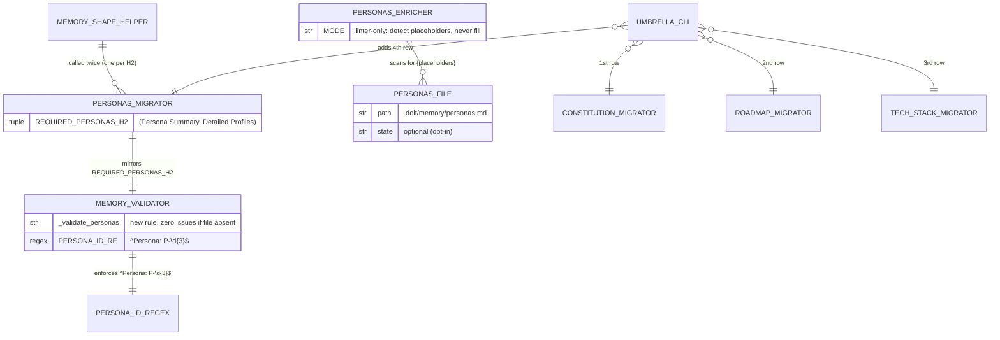
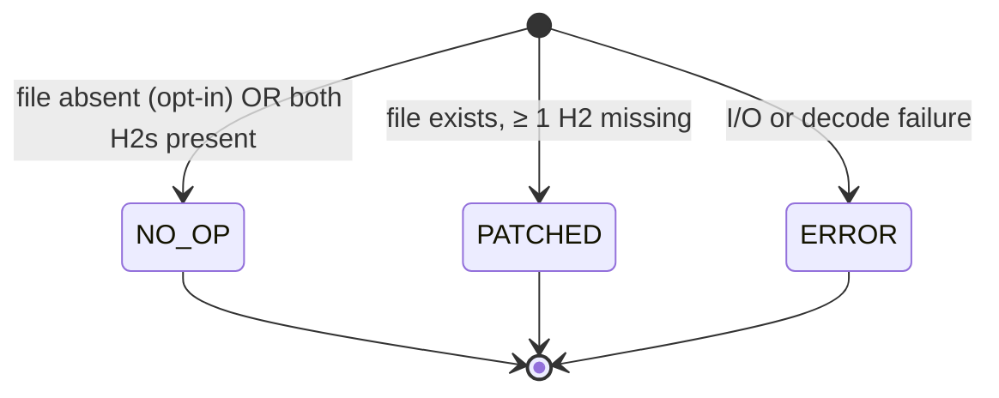
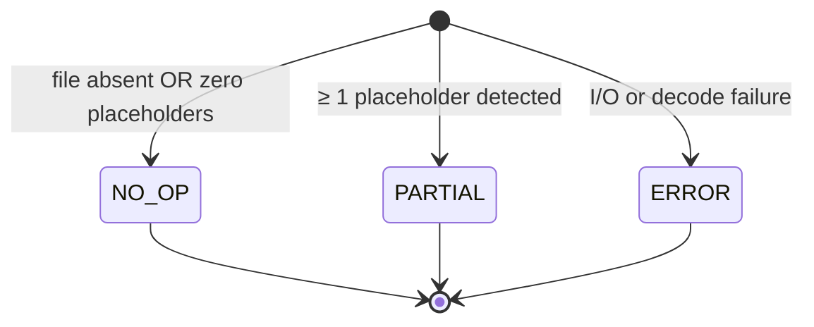
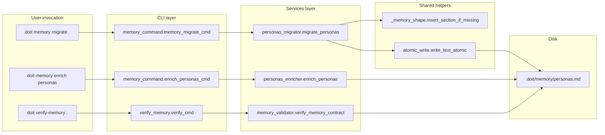

# Data Model: Personas.md Migration

**Feature**: 062-personas-migration
**Date**: 2026-04-21

This feature is a behavioural extension of the spec 060 pattern. No persistent schema changes — the `MigrationResult` and `EnrichmentResult` dataclasses from specs 059/060 are reused unchanged. The only new "model" is module-level constants, new service modules, and new validator-rule identifiers.

---

## ER Diagram

<!-- BEGIN:AUTO-GENERATED section="er-diagram" -->

<!-- END:AUTO-GENERATED -->

---

## New symbols (module-level)

### `personas_migrator.py`

**Location**: `src/doit_cli/services/personas_migrator.py` (NEW)

```python
from __future__ import annotations

from typing import Final

REQUIRED_PERSONAS_H2: Final[tuple[str, ...]] = (
    "Persona Summary",
    "Detailed Profiles",
)
"""H2 headings the memory contract requires in .doit/memory/personas.md.

Both are required. Ordered for deterministic stub insertion. Sourced from
``src/doit_cli/templates/personas-output-template.md``.
"""

def migrate_personas(path: Path) -> MigrationResult:
    """Migrate .doit/memory/personas.md in place. See contracts/migrators.md."""
```

**Public API**: `REQUIRED_PERSONAS_H2`, `migrate_personas`.

**Reuses** (imports):

- `from ._memory_shape import insert_section_if_missing`
- `from .constitution_migrator import ConstitutionMigrationError, MigrationAction, MigrationResult`
- `from ..utils.atomic_write import write_text_atomic`

No new result-type hierarchy; all types inherited from spec 059.

### `personas_enricher.py`

**Location**: `src/doit_cli/services/personas_enricher.py` (NEW)

```python
from __future__ import annotations

import re

_PLACEHOLDER_RE = re.compile(r"\{([A-Za-z_][A-Za-z0-9_ .-]*)\}")
"""Curly-brace template tokens (e.g. ``{Persona Name}``, ``{FEATURE_NAME}``).

Matches template-style placeholders; deliberately does NOT match JSON
objects (``{...}`` with non-identifier content inside) or shell variable
syntax (``${VAR}``). Scoped to identifier-like tokens to minimise false
positives from user prose.
"""

def enrich_personas(path: Path) -> EnrichmentResult:
    """Linter-mode enricher. See contracts/migrators.md."""
```

**Public API**: `enrich_personas`.

**Reuses** (imports):

- `from .constitution_enricher import EnrichmentAction, EnrichmentResult`
- `from ..errors import DoitError`

No new result-type hierarchy; all types inherited from spec 059.

### `memory_validator.py` — new private helper

```python
# Added to the existing _validate_* family.
def _validate_personas(
    memory_dir: Path, placeholder_files: list[str]
) -> list[MemoryContractIssue]:
    """Validate .doit/memory/personas.md when present; no-op when absent."""
```

**Constants** (private):

```python
_PERSONA_ID_RE = re.compile(r"^Persona: P-\d{3}$")
```

Called from `verify_memory_contract` after `_validate_roadmap`.

### `cli/memory_command.py` — new subcommand

```python
@enrich_app.command("personas")
def enrich_personas_cmd(
    project_dir: Path | None = ...,
    json_output: bool = ...,
) -> None:
    """Linter-mode enrichment of .doit/memory/personas.md."""
```

Umbrella `memory_migrate_cmd` extends its output list by appending a
fourth row for `personas.md`, calling `migrate_personas(...)` after the
tech-stack entry.

---

## State machines (unchanged from spec 059/060)

### `MigrationAction`

No new variants.



Note: Unlike constitution/roadmap/tech-stack, **personas never returns `PREPENDED`**. `PREPENDED` semantics ("file exists but has no matching H2 at all; append the full block") conflict with the opt-in semantic, because it would require the file to exist first. The personas migrator treats "file missing" as NO_OP and "file exists but H2s missing" as PATCHED (inserting stubs in the existing file).

### `EnrichmentAction`

Only two relevant variants used in this enricher:



`ENRICHED` is never returned — the enricher never modifies the file.
This is documented in the enricher module docstring.

---

## Data flow



---

## Relationships (textual)

- `personas_migrator.migrate_personas` is called by `memory_command.memory_migrate_cmd` as the fourth entry (after constitution → roadmap → tech-stack). Output order is fixed.
- `personas_enricher.enrich_personas` is called only by `memory_command.enrich_personas_cmd`. It never writes to disk.
- `memory_validator._validate_personas` is called by `verify_memory_contract` after the existing `_validate_roadmap` call. Its inputs are `memory_dir` and the shared `placeholder_files` list (same signature as the other `_validate_*` helpers).
- No changes to `_memory_shape.insert_section_if_missing`, `constitution_migrator`, `constitution_enricher`, `roadmap_migrator`, `roadmap_enricher`, `tech_stack_migrator`, or `tech_stack_enricher`.
- Feature-level `specs/{feature}/personas.md` is NOT touched by any service in this spec. It remains owned by `/doit.specit` and `/doit.researchit`.

---

## Validation rules (new)

The `_validate_personas` rule emits issues in this priority order (matches spec 060's rule ordering):

| Condition | Severity | Message |
| --------- | -------- | ------- |
| File does not exist | _(none — zero issues)_ | — |
| Placeholder threshold hit (≥ 3 distinct `[TOKEN]` names) | WARNING | "personas.md still contains template placeholders" |
| `## Persona Summary` missing | ERROR | "missing required `## Persona Summary` section" |
| `## Detailed Profiles` missing | ERROR | "missing required `## Detailed Profiles` section" |
| `### Persona: <bad-id>` heading under Detailed Profiles | ERROR per heading | "malformed persona ID `<bad-id>` — expected `P-NNN` (three-digit zero-padded)" |
| Zero `### Persona: P-NNN` entries under Detailed Profiles (shape OK, content empty) | WARNING | "`## Detailed Profiles` has no persona entries — nothing for the docs generator to pick up" |

No changes to existing `_validate_constitution`, `_validate_tech_stack`, or `_validate_roadmap` rules.

---

## Out of scope for the data model

- No changes to `MigrationResult`, `EnrichmentResult`, `MemoryContractIssue`, or `MemoryValidationReport` dataclasses.
- No new `MigrationAction` / `EnrichmentAction` / `MemoryIssueSeverity` variants.
- No changes to `PLACEHOLDER_TOKENS` or `PLACEHOLDER_REGISTRY`.
- No new frontmatter schema — personas.md is not frontmatter-bearing.
- No new CLI flags (only a new subcommand; no `--no-personas`, `--include-personas`, etc.).
