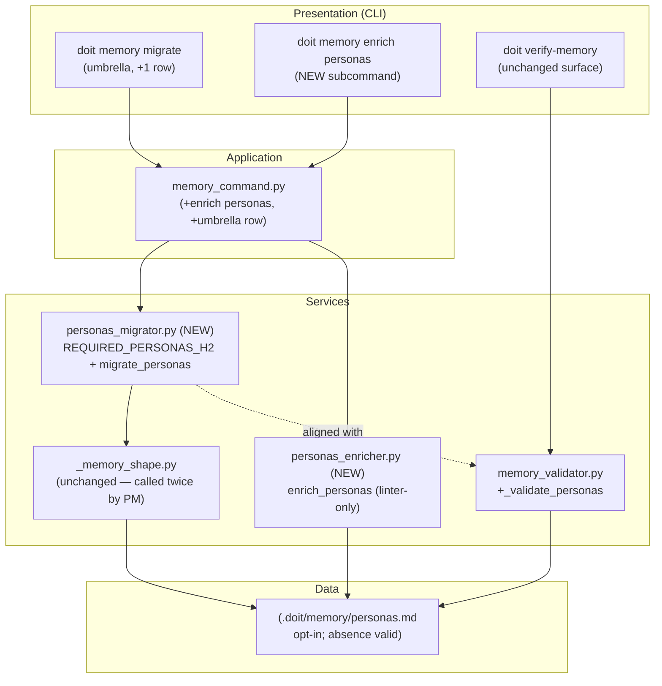

# Implementation Plan: Personas.md Migration (closes the memory-file-migration pattern)

**Branch**: `062-personas-migration` | **Date**: 2026-04-21 | **Spec**: [spec.md](spec.md)
**Input**: Feature specification from `specs/062-personas-migration/spec.md`

## Summary

Extend the migrator + enricher + validator pattern established by specs 059 (constitution) and 060 (roadmap, tech-stack) to the fourth and final `.doit/memory/*.md` file: `personas.md`. Implement:

- `personas_migrator.migrate_personas` — shape migrator (two required H2s; opt-in semantic: absent file = NO_OP).
- `personas_enricher.enrich_personas` — linter-only enricher (reports PARTIAL on `{placeholder}` tokens; never modifies file).
- `memory_validator._validate_personas` — structural + ID-regex enforcement when file exists; zero issues when absent.
- `doit memory enrich personas` — new CLI subcommand mirroring the existing enrich commands.
- `doit memory migrate` umbrella — gains a fourth output row (deterministic order: constitution → roadmap → tech-stack → personas).
- Contract tests locking the validator ↔ migrator ID bijection and required-H2 alignment.

No changes to shared primitives (`_memory_shape.insert_section_if_missing`, `MigrationResult`, `EnrichmentResult`, `write_text_atomic`, `PLACEHOLDER_TOKENS`). No new runtime dependencies.

## Technical Context

**Language/Version**: Python 3.11+ (constitution baseline)
**Primary Dependencies**: Typer (CLI), Rich (logging), standard library `re` / `collections.abc` — no new deps
**Storage**: File-based — markdown in `.doit/memory/personas.md` (opt-in; absence is valid)
**Testing**: pytest with existing markers; new tests under `tests/unit/services/` (migrator + enricher), `tests/integration/` (CLI round-trip), `tests/contract/` (validator↔migrator bijection)
**Target Platform**: Cross-platform CLI (macOS, Linux, Windows)
**Project Type**: single (services + CLI only; no web/mobile surfaces)
**Performance Goals**: No new hot paths; migrator is O(n) over source lines, called at most twice per invocation; enricher is a single regex scan
**Constraints**: Zero new public CLI surface beyond one `enrich personas` subcommand, zero new dependencies, zero changes to existing migrators/enrichers, spec 060's 39 tests + spec 061's 77 tests must remain green
**Scale/Scope**: ~120 LOC new source (personas_migrator ~70, personas_enricher ~50), ~25 LOC CLI wiring, ~50 LOC validator rule; ~200 LOC of new tests (unit + integration + contract)

## Architecture Overview

<!-- BEGIN:AUTO-GENERATED section="architecture" -->

<!-- END:AUTO-GENERATED -->

## Constitution Check

*GATE: Must pass before Phase 0 research. Re-check after Phase 1 design.*

| Principle | Gate | Verdict |
| --------- | ---- | ------- |
| I. Specification-First | Spec approved before implementation | ✅ `spec.md` complete; checklist passes 16/16 |
| II. Persistent Memory | No new out-of-tree state | ✅ Fix targets `.doit/memory/personas.md` — existing memory store, no new state |
| III. Auto-Generated Diagrams | Mermaid diagrams auto-generated in plan artifacts | ✅ Architecture + ER + data-flow diagrams emitted |
| IV. Opinionated Workflow | Follows specit → planit → taskit → … | ✅ This is planit output |
| V. AI-Native Design | Commands remain markdown-readable; slash-command contract unchanged | ✅ No skill surface changes; `/doit.roadmapit` and `/doit.researchit` stay the persona-authoring paths |

**Tech Stack alignment** (from `.doit/memory/constitution.md` §Tech Stack):

- Python 3.11+ ✅
- Typer/Rich/pytest/Hatchling/ruff/mypy ✅
- stdlib `re`, `pathlib.Path`, `collections.abc` ✅
- No new runtime deps, no infrastructure changes ✅

**Quality gates**: ruff clean, mypy clean, spec 060's 39 integration tests + spec 061's 77 tests remain green; new spec 062 tests pass.

**Result**: No violations. Proceed. See [research.md](research.md) — already complete.

## Project Structure

### Documentation (this feature)

```text
specs/062-personas-migration/
├── plan.md                    # This file (/doit.planit output)
├── research.md                # Phase 0 — 8 design decisions
├── data-model.md              # Phase 1 — new symbols, state machines (unchanged), data flow
├── contracts/
│   └── migrators.md           # Phase 1 — API contract: migrator, enricher, umbrella, validator
├── quickstart.md              # Phase 1 — 15 end-to-end scenarios
├── spec.md                    # /doit.specit output
├── checklists/
│   └── requirements.md        # /doit.specit quality gate (16/16 passes)
└── tasks.md                   # Phase 2 output (/doit.taskit — NOT created by planit)
```

### Source Code (repository root)

```text
src/doit_cli/
├── services/
│   ├── personas_migrator.py         # NEW
│   ├── personas_enricher.py         # NEW
│   ├── memory_validator.py          # MODIFY: add _validate_personas
│   ├── _memory_shape.py             # UNCHANGED
│   ├── constitution_migrator.py     # UNCHANGED (source of MigrationAction/MigrationResult)
│   ├── constitution_enricher.py     # UNCHANGED (source of EnrichmentAction/EnrichmentResult)
│   ├── roadmap_migrator.py          # UNCHANGED
│   ├── roadmap_enricher.py          # UNCHANGED
│   ├── tech_stack_migrator.py       # UNCHANGED
│   └── tech_stack_enricher.py       # UNCHANGED
└── cli/
    └── memory_command.py            # MODIFY: +enrich personas cmd, +umbrella row

tests/
├── unit/services/
│   ├── test_personas_migrator.py           # NEW
│   └── test_personas_enricher.py           # NEW
├── integration/
│   └── test_personas_migration.py          # NEW (CLI round-trip)
└── contract/
    ├── test_memory_files_migration_contract.py   # MODIFY: +2 tests (H2 alignment + type reuse)
    └── test_personas_validator_migrator_alignment.py   # NEW (ID bijection)
```

**Structure Decision**: single-project layout (existing doit-cli `src/doit_cli/`). All changes live in `src/doit_cli/services/`, one line in `src/doit_cli/cli/memory_command.py`, plus four tiers of tests. No new top-level modules, no new CLI subcommand namespaces, no new schema files.

## Complexity Tracking

> **Fill ONLY if Constitution Check has violations that must be justified**

No constitution violations. Nothing to track.

## Phase 0 — Outline & Research

Complete. See [research.md](research.md). Eight decisions pinned:

1. **Required shape**: two H2s (`Persona Summary`, `Detailed Profiles`); no required H3s.
2. **Opt-in semantic**: absent file = NO_OP (no auto-create); zero validator issues when absent.
3. **Migrator structure**: two sequential `insert_section_if_missing` calls with `h3_titles=()`; no helper changes.
4. **Enricher scope**: linter-only — detects `{placeholder}` tokens, never fills content.
5. **Persona ID regex**: `^Persona: P-\d{3}$` scoped to `## Detailed Profiles`.
6. **CLI surface**: one new subcommand (`doit memory enrich personas`); umbrella +1 row; no new flags.
7. **Contract tests**: bijective ID corpus + H2 header alignment (mirrors specs 060/061).
8. **Shared helper**: unchanged. Spec 061's `matchers` parameter unused (exact-match is correct here).

All NEEDS CLARIFICATION items resolved at the spec stage.

## Phase 1 — Design & Contracts

Complete.

- **Data model**: [data-model.md](data-model.md) — `REQUIRED_PERSONAS_H2`, `_PERSONA_ID_RE`, `_PLACEHOLDER_RE`, new `_validate_personas` function. No persistent schema changes; existing `MigrationAction` / `EnrichmentAction` state machines unchanged (personas migrator never returns `PREPENDED`; enricher never returns `ENRICHED`).
- **Contracts**: [contracts/migrators.md](contracts/migrators.md) — migrator behaviour matrix, enricher behaviour matrix, umbrella output order, validator rule ordering, stub-body format, six new contract tests.
- **Quickstart**: [quickstart.md](quickstart.md) — 15 end-to-end scenarios covering opt-in NO_OP, shape migration (both H2s), enricher PARTIAL/NO_OP, validator rules, spec-060/061 regression guard, doit-repo dogfood.
- **Agent context update**: will run `.doit/scripts/bash/update-agent-context.sh claude` after this plan is written.

### Post-design constitution re-check

Re-reading the Constitution Check table after Phase 1: all gates still green. No design artifact introduces new tech, new surface beyond one subcommand, or new state. Proceed to Phase 2 (taskit).

## Phase 2 — (handed off to `/doit.taskit`)

Not produced by planit. Taskit will read these artifacts and produce `tasks.md` with the usual four-user-story breakdown (US1 shape migration, US2 opt-in NO_OP, US3 enricher linter, US4 validator + umbrella).

---

## Next Steps

┌─────────────────────────────────────────────────────────────┐
│  Workflow Progress                                          │
│  ● specit → ● planit → ○ taskit → ○ implementit → ○ checkin │
└─────────────────────────────────────────────────────────────┘

**Recommended**: Run `/doit.taskit` to create implementation tasks from this plan.
