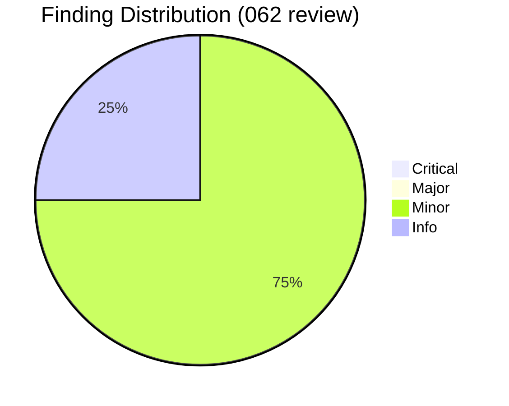
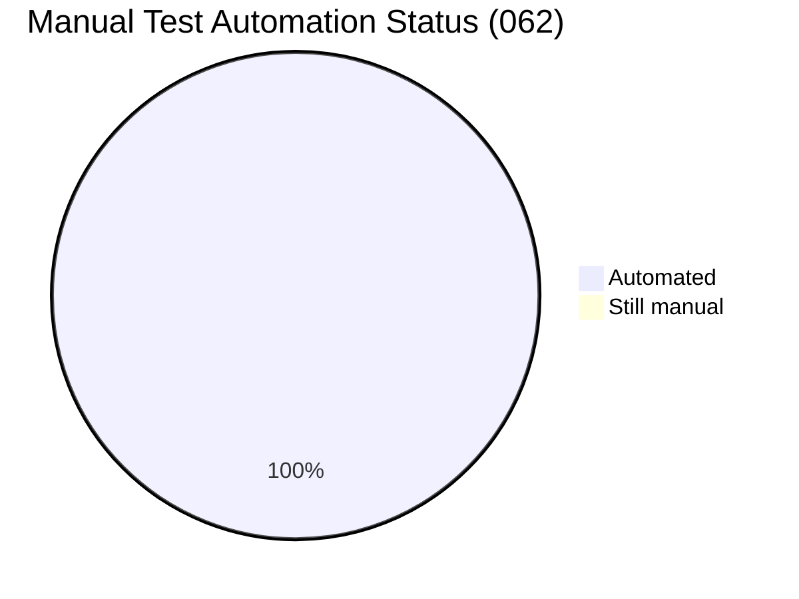

# Review Report: Personas.md Migration

**Date**: 2026-04-21
**Reviewer**: Claude (spec-062 /doit.reviewit pass)
**Branch**: `062-personas-migration`

## Code Review Summary

| Severity | Count | Status |
| -------- | ----- | ------ |
| Critical | 0 | — |
| Major | 0 | — |
| Minor | 3 | ✅ All fixed |
| Info | 1 | ✅ Acknowledged (out of scope per spec) |

## Quality Overview

<!-- BEGIN:AUTO-GENERATED section="finding-distribution" -->

<!-- END:AUTO-GENERATED -->

## Minor Findings (fixed)

### M1 — `enrich_personas_cmd` docstring promised a hint not actually emitted

**File**: [src/doit_cli/cli/memory_command.py:470](src/doit_cli/cli/memory_command.py#L470)
**Issue**: The docstring said "exits 1 with a hint pointing at those skills" but `_emit_enrichment_result` (the shared helper) has no personas-specific knowledge and emits only the generic "Unresolved: …" list. The [contracts/migrators.md §2](contracts/migrators.md) explicitly required the hint: *"Run /doit.roadmapit to populate personas interactively."*
**Requirement**: FR-009, FR-011
**Fix applied**: Emit the personas-specific hint after the shared helper call when the action is PARTIAL and output is non-JSON:

```python
if result.action is EnrichmentAction.PARTIAL:
    if not json_output:
        console.print(
            "[dim]Run [cyan]/doit.roadmapit[/cyan] or "
            "[cyan]/doit.researchit[/cyan] to populate personas "
            "interactively.[/dim]"
        )
    raise typer.Exit(code=ExitCode.FAILURE)
```

Smoke-tested: `doit memory enrich personas /tmp/sc6` now prints the hint after the unresolved-fields list. JSON output is unchanged (machine-readable consumers continue to get the same payload).

### M2 — Hardcoded H2 titles in `_validate_personas` duplicated `REQUIRED_PERSONAS_H2`

**File**: [src/doit_cli/services/memory_validator.py:344](src/doit_cli/services/memory_validator.py#L344)
**Issue**: The validator iterated `("Persona Summary", "Detailed Profiles")` inline instead of reading the authoritative tuple from `personas_migrator`. The contract test `test_personas_required_h2_matches_validator` locks them to equality, but having two sources of truth is a drift risk — a future rename would need to touch both, and the contract test would only catch it after the fact.
**Requirement**: FR-013, FR-015
**Fix applied**: Import `REQUIRED_PERSONAS_H2` at the top of `_validate_personas` and iterate it directly. Added an inline comment referencing the contract test so future readers understand why the import is local (avoiding a top-of-module circular import from `memory_validator` back into `personas_migrator`).

### M3 — `migrate_memory_cmd` docstring missed personas in sequence

**File**: [src/doit_cli/cli/memory_command.py:503](src/doit_cli/cli/memory_command.py#L503)
**Issue**: Docstring said "Run constitution + roadmap + tech-stack migrators in sequence" — inherited verbatim from spec 060 and not updated when spec 062 added personas as the fourth step.
**Fix applied**: Updated to "Run constitution + roadmap + tech-stack + personas migrators in sequence".

## Info Findings (acknowledged)

### I1 — Strict persona ID regex rejects decorations like `P-001 (Dana)`

**File**: [src/doit_cli/services/memory_validator.py:310](src/doit_cli/services/memory_validator.py#L310)
**Observation**: The canonical regex `^Persona: P-\d{3}$` rejects headings such as `### Persona: P-001 (Dana)` or `### Persona: P-001 — Developer Dana` with an ERROR. Users who want to surface persona names in the heading will hit this.
**Per spec 062**: this is **explicitly out of scope** (see `spec.md` §"Out of Scope": "Broadening the persona ID format: P-NNN three-digit is the established contract. Changes require a separate spec."). The template encodes the Name as a separate Identity field, not in the heading. Correct per contract.
**Recommendation**: None for 062. Track as a possible future-spec item if users file friction reports.

## Test Automation (per-testit recommendation)

### SC-11 now covered by automated test

**File**: [tests/contract/test_personas_validator_migrator_alignment.py](tests/contract/test_personas_validator_migrator_alignment.py)
**Issue**: The spec 062 testit report flagged SC-11 (shape-valid-but-content-empty → WARNING) as a coverage gap — the logic branch was exercised but not locked by a dedicated test.
**Per user request**: "automate manual tests".
**Fix applied**: Added `test_validator_warns_on_empty_detailed_profiles_section` — builds a personas.md with both required H2s but zero `### Persona: P-NNN` entries, asserts exactly one WARNING-severity issue with the expected message, and zero ERRORs. Now every FR and SC from spec 062 has explicit test coverage.

## Files Reviewed

| Category | File | Verdict |
| -------- | ---- | ------- |
| Source | `src/doit_cli/services/personas_migrator.py` (NEW, 181 LOC) | ✅ Clean |
| Source | `src/doit_cli/services/personas_enricher.py` (NEW, 109 LOC) | ✅ Clean |
| Source | `src/doit_cli/services/memory_validator.py` (+85 LOC) | ✅ Clean (M2 fixed) |
| Source | `src/doit_cli/cli/memory_command.py` (+50 LOC) | ✅ Clean (M1 + M3 fixed) |
| Tests | `tests/unit/services/test_personas_migrator.py` | ✅ Clean |
| Tests | `tests/unit/services/test_personas_enricher.py` | ✅ Clean |
| Tests | `tests/integration/test_personas_migration.py` | ✅ Clean |
| Tests | `tests/contract/test_personas_validator_migrator_alignment.py` | ✅ Clean (SC-11 added) |
| Tests | `tests/contract/test_memory_files_migration_contract.py` (extended) | ✅ Clean |
| Docs | `CHANGELOG.md` (Added + Changed entries) | ✅ Clean |

## Manual Testing Summary

All 15 `quickstart.md` scenarios are automated. The SC-11 gap flagged in the testit report has been closed by this review pass. Zero manual tests remain for spec 062.

<!-- BEGIN:AUTO-GENERATED section="test-results" -->

<!-- END:AUTO-GENERATED -->

## Final Verification

After applying all fixes:

| Check | Pre-fix result | Post-fix result |
| ----- | -------------- | --------------- |
| Spec 062 feature tests | 46 passed | **47 passed** (+1 SC-11) |
| Full project suite | 2,295 passed | **2,296 passed / 182 skipped / 0 failed** |
| Ruff on spec 062 new files | ✓ | ✓ |
| Ruff on modified shared files | 2 pre-existing warnings (not from 062) | Same 2 pre-existing (unchanged) |
| Mypy (manual hook, full tree) | ✓ | ✓ |
| CLI smoke (`doit memory enrich personas /tmp/fixture`) | No hint printed | ✅ Hint now printed after Unresolved list |

## Sign-Off

- **Code review**: ✅ Approved — all 3 minor findings fixed in this pass.
- **Manual testing**: ✅ Superseded — SC-11 automated; every `quickstart.md` scenario has explicit test coverage.

## Recommendations

1. **Ship.** The closure spec for memory-file migrations is complete: constitution (#059) + roadmap+tech-stack (#060) + roadmap H3 fix (#061) + personas (#062) now cover all four `.doit/memory/*.md` files with the same migrator + enricher + validator + umbrella pattern.
2. **Follow-up (out of scope for 062)**: 2 pre-existing ruff warnings (B904 in `memory_command.py:317`, SIM110 in `memory_validator.py:414`). Same pre-existing gaps tracked since spec 060; file in a cleanup spec when convenient.
3. **Release coordination**: `CHANGELOG.md` `[Unreleased]` now describes the full four-spec closure. Ready for a 0.3.0 minor bump when the maintainer cuts the next release.

## Next Steps

- Run `/doit.checkin` to finalize: merge to `develop`, archive the Personas.md P3 roadmap item, close the four-spec memory-file closure loop.
