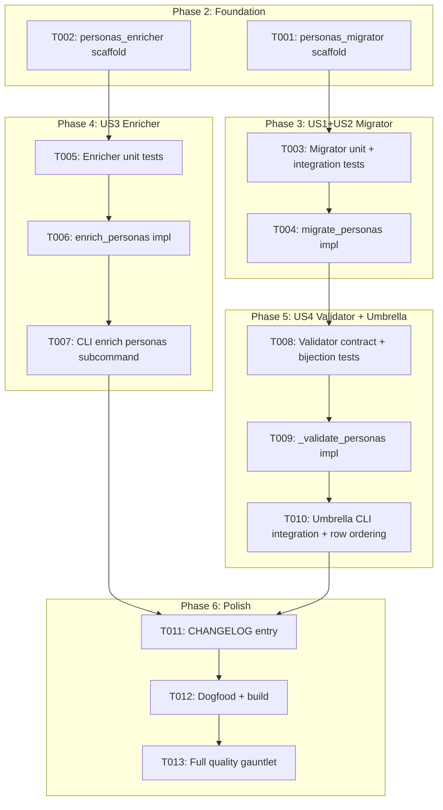
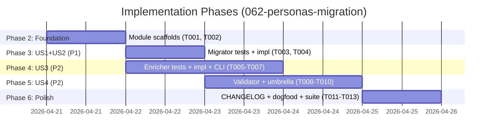

---

description: "Task list for 062-personas-migration"
---

# Tasks: Personas.md Migration (closes the memory-file-migration pattern)

**Input**: Design documents from `specs/062-personas-migration/`
**Prerequisites**: plan.md ✅, spec.md ✅, research.md ✅, data-model.md ✅, contracts/migrators.md ✅, quickstart.md ✅

**Tests**: Required. Spec calls for unit (migrator + enricher), integration (CLI round-trip), and contract (validator↔migrator bijection + required-H2 alignment). TDD: tests precede implementation inside each user story.

**Organization**: Tasks grouped by the four user stories. Phase 2 (foundational) creates the personas_migrator and personas_enricher module scaffolding so US1 and US3 can proceed in parallel.

## Task Dependencies

<!-- BEGIN:AUTO-GENERATED section="task-dependencies" -->

<!-- END:AUTO-GENERATED -->

## Phase Timeline

<!-- BEGIN:AUTO-GENERATED section="phase-timeline" -->

<!-- END:AUTO-GENERATED -->

## Format: `[ID] [P?] [Story] Description`

- **[P]**: Can run in parallel (different files, no dependencies)
- **[Story]**: Which user story this task belongs to (US1, US2, US3, US4)

## Path Conventions

Single project (per `plan.md`). Source under `src/doit_cli/`, tests under `tests/`.

---

## Phase 1: Setup

**Purpose**: None. In-place extension to existing services; no new packages, no new CLI namespace, no scaffolding required.

---

## Phase 2: Foundational (Blocking Prerequisites)

**Purpose**: Create empty module scaffolds for `personas_migrator.py` and `personas_enricher.py` with imports, `__all__` exports, and module docstrings. This unblocks parallel US1 (migrator) and US3 (enricher) work by letting tests import the symbols before the full implementations land.

**⚠️ CRITICAL**: No US work can begin until both scaffolds exist — tests import these modules.

- [X] T001 [P] Create `src/doit_cli/services/personas_migrator.py` with module docstring, `from __future__ import annotations`, imports (`hashlib`, `Path`, `Final`, `MigrationAction`, `MigrationResult`, `ConstitutionMigrationError`, `insert_section_if_missing`, `write_text_atomic`), `__all__ = ("REQUIRED_PERSONAS_H2", "migrate_personas")`, the `REQUIRED_PERSONAS_H2: Final[tuple[str, ...]] = ("Persona Summary", "Detailed Profiles")` constant, and a stub `def migrate_personas(path: Path) -> MigrationResult: raise NotImplementedError` placeholder. This task creates the import surface; T004 replaces the body.

- [X] T002 [P] Create `src/doit_cli/services/personas_enricher.py` with module docstring, `from __future__ import annotations`, imports (`re`, `Path`, `EnrichmentAction`, `EnrichmentResult`, `DoitError`), `__all__ = ("enrich_personas",)`, the `_PLACEHOLDER_RE = re.compile(r"\{([A-Za-z_][A-Za-z0-9_ .-]*)\}")` module constant, and a stub `def enrich_personas(path: Path) -> EnrichmentResult: raise NotImplementedError`. T006 replaces the body.

**Checkpoint**: Both modules import cleanly (`python -c "from doit_cli.services import personas_migrator, personas_enricher"` succeeds). `ruff check` passes on both.

---

## Phase 3: User Stories 1 & 2 — Migrator (Priority: P1) 🎯 MVP

**Goal**: `doit memory migrate` correctly handles all personas.md shape states: missing file → NO_OP (opt-in); file with missing H2(s) → PATCHED with stubs; complete file → NO_OP byte-identical. The migrator is the user-visible behavioural change and the MVP slice.

**Independent Test**: Combined across US1 + US2 scenarios in `quickstart.md` 1-5 and 12. Covered by T003's integration test fixtures; no manual test needed for this slice.

### Tests for US1 + US2 ⚠️

> Write tests FIRST. They MUST fail against T001's stub implementation before T004 lands.

- [X] T003 [US1] Create `tests/integration/test_personas_migration.py`. Add fixtures `tmp_personas` (returns `tmp_path / ".doit" / "memory" / "personas.md"` with parent dirs created) and `_sha` SHA-256 helper. Write the following test functions covering quickstart.md Scenarios 1-5 and 12: `test_missing_file_is_noop` (opt-in — US2), `test_missing_persona_summary_is_patched` (US1 — `added_fields == ("Persona Summary",)`), `test_missing_detailed_profiles_is_patched` (US1 — `added_fields == ("Detailed Profiles",)`), `test_both_h2s_missing_patches_both` (US1 — `added_fields == ("Persona Summary", "Detailed Profiles")`), `test_complete_personas_is_noop` (US1 regression — byte-identical), `test_migration_is_idempotent` (rerun → NO_OP), `test_migrator_preserves_crlf_line_endings` (CRLF regression guard — reuse the pattern from `test_roadmap_migration.py`). Run `pytest tests/integration/test_personas_migration.py -x` and confirm all tests currently FAIL against T001's stub (NotImplementedError). Also add `tests/unit/services/test_personas_migrator.py` with a single smoke test `test_required_personas_h2_constant_is_two_h2s` asserting `REQUIRED_PERSONAS_H2 == ("Persona Summary", "Detailed Profiles")`.

### Implementation for US1 + US2

- [X] T004 [US1] Replace the stub in `src/doit_cli/services/personas_migrator.py` with the full `migrate_personas(path: Path) -> MigrationResult` implementation. Follow the `tech_stack_migrator.migrate_tech_stack` pattern exactly: file-missing → NO_OP, `read_bytes().decode("utf-8")` with OSError + UnicodeDecodeError branches, SHA-256 `_body_hash` helper, byte-preserved NO_OP when both H2s already present. KEY DIFFERENCE: call `insert_section_if_missing` TWICE (once per required H2) with `h3_titles=()` and `matchers=None`, threading the updated source through. Both stub bodies are generated by a shared `_personas_stub_body(h2_title: str) -> str` helper that returns a multi-line comment with exactly three `[TOKEN]` placeholders (e.g. `[PROJECT_NAME]`, `[PERSONA_EXAMPLE]`, `[SEE_ROADMAPIT]`) — this triggers the validator's `_is_placeholder` threshold for freshly-migrated files. The Persona Summary stub ALSO includes the `| ID | Name | Role | Archetype | Primary Goal |` markdown table header + separator. If either helper call returns added titles, collect them into the result's `added_fields` tuple in canonical order. Compute `action = NO_OP` when no H2s added; `PATCHED` when any added. Atomic write via `write_text_atomic`. NEVER return `PREPENDED` (opt-in semantic — file must exist before migrator touches it). Run `pytest tests/integration/test_personas_migration.py tests/unit/services/test_personas_migrator.py -x` and confirm all tests now PASS.

**Checkpoint**: Migrator complete. US1 + US2 fully functional. Running `doit memory migrate .` (once umbrella is wired in T010) reports correct personas.md rows for all four input states.

---

## Phase 4: User Story 3 — Enricher (Priority: P2)

**Goal**: `doit memory enrich personas` detects `{placeholder}` tokens and reports PARTIAL with deterministic `unresolved_fields`. Never modifies the file.

**Independent Test**: `quickstart.md` Scenarios 6-8. Covered by T005's unit tests + T007's CLI test.

### Tests for US3 ⚠️

- [X] T005 [US3] Create `tests/unit/services/test_personas_enricher.py`. Write tests covering quickstart.md Scenarios 6-8: `test_missing_file_returns_no_op` (US3 + opt-in), `test_file_with_no_placeholders_returns_no_op` (byte-identical), `test_file_with_placeholders_returns_partial_with_unresolved_fields` (placeholders extracted without braces, deduplicated, sorted alphabetically), `test_enricher_never_modifies_file` (write a fixture with placeholders, assert bytes unchanged after enrich), `test_enricher_handles_crlf_encoding` (file read via `read_bytes().decode("utf-8")` path works on CRLF input), `test_enricher_handles_oserror` (patch `Path.read_bytes` to raise OSError → result.action == ERROR, error is set), `test_enricher_rejects_shell_variable_syntax` (a fixture with `${VAR}` MUST NOT be listed in unresolved_fields — only plain `{…}` tokens count), `test_enricher_deduplicates_same_token` (a fixture with three copies of `{Persona Name}` → `unresolved_fields == ("Persona Name",)`). Run `pytest tests/unit/services/test_personas_enricher.py -x` and confirm all FAIL against T002's stub.

### Implementation for US3

- [X] T006 [US3] Replace the stub in `src/doit_cli/services/personas_enricher.py` with the full `enrich_personas(path: Path) -> EnrichmentResult` body. Pattern: file-missing → NO_OP (exit-0-compatible), `read_bytes().decode("utf-8")` with OSError + UnicodeDecodeError branches returning ERROR, scan the source with `_PLACEHOLDER_RE.finditer()` to collect group-1 captures, deduplicate via `sorted(set(...))`, if zero placeholders → NO_OP (with `preserved_body_hash`), else PARTIAL with `unresolved_fields` tuple and `preserved_body_hash`. Never call `write_text_atomic` — this enricher is pure read. Never set `enriched_fields` (always empty tuple). Run `pytest tests/unit/services/test_personas_enricher.py -x` — all tests pass.

- [X] T007 [US3] Add the `doit memory enrich personas` subcommand to `src/doit_cli/cli/memory_command.py`. Mirror the existing `enrich_roadmap_cmd` pattern exactly: `@enrich_app.command("personas")`, accepts `project_dir: Path | None` and `json_output: bool`, calls `enrich_personas(target)` where `target = project_dir / ".doit" / "memory" / "personas.md"`, emits via `_emit_enrichment_result`. Exit codes: `0` for NO_OP / ENRICHED, `1` for PARTIAL, `2` for ERROR — matches spec 060/061 convention. Add a one-line integration test `test_cli_memory_enrich_personas` in `tests/integration/test_personas_migration.py` that uses `CliRunner` to invoke the subcommand on a fixture personas.md with placeholders and asserts exit code `1` + JSON body shape. Run `pytest tests/integration/test_personas_migration.py -k enrich -x` — passes.

**Checkpoint**: Enricher complete. `doit memory enrich personas --help` shows the new subcommand. Running it on a file with placeholders exits 1 with PARTIAL JSON.

---

## Phase 5: User Story 4 — Validator + Umbrella CLI (Priority: P2)

**Goal**: `memory_validator` gains `_validate_personas`; umbrella `doit memory migrate` includes personas.md as the 4th row. Contract tests lock validator↔migrator alignment.

**Independent Test**: `quickstart.md` Scenarios 9-12 and 15. Covered by T008's contract tests.

### Tests for US4 ⚠️

- [X] T008 [US4] Create `tests/contract/test_personas_validator_migrator_alignment.py` (NEW file, mirrors `test_roadmap_validator_migrator_alignment.py` from spec 061). Define `_PERSONA_ID_RE = re.compile(r"^P-\d{3}$")`, `_CONSTITUTION_MINIMAL` and `_TECH_STACK_MINIMAL` fixtures (copy from the spec-061 test), and a `_build_project_with_personas(tmp_path, personas_body)` helper. Write parameterized tests: `test_validator_accepted_ids_round_trip` over `["P-001", "P-042", "P-099", "P-100", "P-500", "P-999"]` asserting validator emits no ERROR for personas.md and `migrate_personas` returns NO_OP with `added_fields == ()`; `test_validator_rejected_ids_error` over `["P-1", "P-01", "P-1000", "p-001", "Persona-001", "X-001", "P001", "P 001"]` asserting validator emits exactly one ERROR per personas.md mentioning the malformed ID in the message; `test_personas_absent_emits_no_issues` asserting zero issues when the file is missing from an otherwise-valid project; `test_umbrella_migrator_output_order` invoking `doit memory migrate` via CliRunner and asserting the four-row order. Also extend `tests/contract/test_memory_files_migration_contract.py` with `test_personas_required_h2_matches_validator` (assert the `REQUIRED_PERSONAS_H2` tuple matches the H2 titles checked by `_validate_personas`) and `test_personas_migrator_reuses_constitution_migration_types` (mirrors the existing reuse tests for roadmap/tech-stack). Run all five tests — they MUST fail against the current (unchanged) validator, confirming the bug/gap these tests encode.

### Implementation for US4

- [X] T009 [US4] Extend `src/doit_cli/services/memory_validator.py`: import `re` (already imported), add module-level `_PERSONA_ID_RE = re.compile(r"^P-\d{3}$")` and `_PERSONAS_H2_REQUIRED = ("Persona Summary", "Detailed Profiles")`, add new function `_validate_personas(memory_dir: Path, placeholder_files: list[str]) -> list[MemoryContractIssue]` following the exact behaviour matrix from `contracts/migrators.md` §4 (file-absent → `[]`; placeholder-heavy file → single WARNING + early return; missing either required H2 → ERROR; malformed `### Persona: X` under `## Detailed Profiles` → ERROR per heading; zero valid persona entries → WARNING). Use the existing `_has_heading`, `_is_placeholder`, and `_subheadings_under` helpers; add a new `_persona_headings_under_detailed_profiles(source)` helper if needed (reuses the existing `_subheadings_under("Detailed Profiles")` pattern — scan the group-2 title for `Persona: <id>` prefix). Wire the call into `verify_memory_contract` immediately after `_validate_roadmap(...)` (deterministic file order). Run the T008 contract tests — all now PASS.

- [X] T010 [US4] Extend `doit memory migrate` in `src/doit_cli/cli/memory_command.py` to include personas.md as the 4th row. Locate the existing umbrella (`memory_migrate_cmd`) and add a fourth `migrate_personas(target / ".doit" / "memory" / "personas.md")` call after `migrate_tech_stack(...)`. Emit its result via the same reporting path used for the other three files — same JSON row shape, same Rich table row. Verify order via T008's `test_umbrella_migrator_output_order` (should already pass after this task). Also add a smoke test `test_cli_memory_migrate_includes_personas` in `tests/integration/test_personas_migration.py` that runs the umbrella against a 3-file project (no personas.md) and asserts JSON has 4 rows with personas.md showing `action: no_op`.

**Checkpoint**: Full spec 062 feature complete. Migrator + enricher + validator + umbrella all wired. Every scenario in `quickstart.md` passes.

---

## Phase 6: Polish & Cross-Cutting Concerns

**Purpose**: Ship it.

- [X] T011 [P] Update `CHANGELOG.md`: under `[Unreleased]`, add `### Added` entry for `doit memory enrich personas` subcommand + `_validate_personas` rule + `personas_migrator.migrate_personas` / `personas_enricher.enrich_personas` services; add `### Changed` entry noting that `doit memory migrate` now reports four rows instead of three (umbrella widened to include personas). Reference spec `062-personas-migration`. Call out the opt-in semantic clearly so users don't panic about a missing file.

- [X] T012 Dogfood against the doit repo (`quickstart.md` Scenario 15). Rebuild: `uv build && uv tool install . --reinstall --force`. Run `doit memory migrate . --json` — confirm JSON has four rows and personas.md row is `no_op` (doit repo doesn't use personas). Run `doit verify-memory . --json` — confirm zero errors and zero warnings for personas.md (absence path). Run `git status` — confirm working tree clean (no personas.md created, no other files modified by dogfood).

- [X] T013 Full quality gauntlet: `ruff check src/ tests/` (must pass on spec 062 files — pre-existing warnings in unrelated files tracked separately), `pre-commit run mypy --hook-stage manual --all-files` (must pass), `pytest tests/ --ignore=tests/unit/test_mcp_server.py -q` (must pass — baseline is 2,257 pre-062; target is 2,257 + new spec-062 tests). Record final test count in the eventual `/doit.testit` report.

---

## Dependencies & Execution Order

### Phase Dependencies

- **Phase 2 (T001, T002)**: No dependencies — start immediately. Run in parallel (different files).
- **Phase 3 (US1+US2)**: Depends on T001. T003 (tests) before T004 (impl) inside US1+US2.
- **Phase 4 (US3)**: Depends on T002. T005 before T006, T006 before T007.
- **Phase 5 (US4)**: Depends on T004 (migrator must exist for bijection tests to call it). T008 before T009, T009 before T010.
- **Phase 6 (Polish)**: Depends on all user stories green (T007 + T010 at minimum).

### Parallelism

- T001 and T002 run in parallel (both [P]): different files, no dependencies.
- After T001 + T002 land, US1+US2 (T003→T004) and US3 (T005→T006→T007) run in parallel: touch different service files and different test files.
- T008 can begin as soon as T004 ships (US4 contract tests need the migrator).

### Within Each Story

- Tests FIRST (T003, T005, T008) — confirm they FAIL before writing the fix.
- Commit after each numbered task for clean bisection.

---

## Parallel Example: Phase 2 + Phase 3/4 parallelism

```bash
# T001 + T002 in parallel:
Task: "T001 — Create src/doit_cli/services/personas_migrator.py scaffold"
Task: "T002 — Create src/doit_cli/services/personas_enricher.py scaffold"

# After T001 + T002 complete, US1+US2 and US3 in parallel:
Task: "T003 — Write migrator integration tests (FAIL expected)"
Task: "T005 — Write enricher unit tests (FAIL expected)"
```

---

## Implementation Strategy

### MVP First (User Stories 1 + 2 only)

1. T001 — Migrator scaffold.
2. T003 — Failing integration tests for migrator.
3. T004 — Implement `migrate_personas`; tests pass.
4. **STOP and VALIDATE**: A project with or without personas.md behaves correctly under `migrate_personas`. The umbrella CLI doesn't yet wire it in, but the library function is the actual user-visible fix.
5. If time-constrained, ship MVP as an independent PR; US3 (enricher) and US4 (validator + umbrella) follow in separate PRs.

### Incremental Delivery

1. MVP (T001 → T003 → T004): migrator works at library level.
2. Add US3 (T002 → T005 → T006 → T007): enricher CLI ships; doit update flow now reports personas placeholder state.
3. Add US4 (T008 → T009 → T010): validator + umbrella complete the pattern.
4. Polish (T011 → T012 → T013): CHANGELOG, dogfood, full suite.

### Single PR path (recommended)

All 13 tasks in one PR. The scope is narrow (single feature, single file family, ~120 LOC source + ~200 LOC tests) and the four user stories are tightly interdependent conceptually. Mirror the spec 060 + 061 ship cadence.

---

## Validation Summary

| Task | Validates | Measured by |
| ---- | --------- | ----------- |
| T001 | FR-001 | Module imports cleanly; `REQUIRED_PERSONAS_H2` constant has correct value |
| T002 | FR-007 | Module imports cleanly; `_PLACEHOLDER_RE` constant is valid |
| T003 | FR-001..006, FR-017 | 7 integration tests + 1 unit test FAIL pre-T004, PASS post-T004 |
| T004 | FR-001..006 | All T003 tests pass; byte-preservation verified via SHA-256 |
| T005 | FR-007..010 | 8 unit tests FAIL pre-T006, PASS post-T006 |
| T006 | FR-007..010 | T005 tests pass |
| T007 | FR-011 | CLI integration test passes; `doit memory enrich personas --help` lists the subcommand |
| T008 | FR-013..016 | 6 contract tests (4 alignment + 2 migrator-reuse) FAIL pre-T009/T010, PASS after |
| T009 | FR-013, FR-014 | T008 contract tests for validator pass |
| T010 | FR-012 | T008 umbrella-order test passes; `doit memory migrate .` JSON has 4 rows |
| T011 | SC-007 | CHANGELOG entries present |
| T012 | SC-001 | Dogfood: doit repo reports personas.md = `no_op`; working tree clean |
| T013 | SC-005 | 2257+ tests pass, ruff + mypy clean on touched files |

**Task count**: 13 (2 foundation + 2 US1+US2 + 3 US3 + 3 US4 + 3 polish). Narrow closure spec — no new dependencies, one new CLI subcommand, one new validator rule.

---

## Notes

- `tests/integration/test_personas_migration.py` is NEW in T003. Task T007 extends it. Task T010 adds a smoke test.
- `tests/unit/services/test_personas_migrator.py` is NEW in T003.
- `tests/unit/services/test_personas_enricher.py` is NEW in T005.
- `tests/contract/test_personas_validator_migrator_alignment.py` is NEW in T008.
- `tests/contract/test_memory_files_migration_contract.py` is MODIFIED in T008 (two new test functions appended).
- No changes to `_memory_shape.insert_section_if_missing`, `constitution_migrator`, `constitution_enricher`, `roadmap_migrator`, `roadmap_enricher`, `tech_stack_migrator`, or `tech_stack_enricher` — verified by T013 running their pre-existing test suites.
